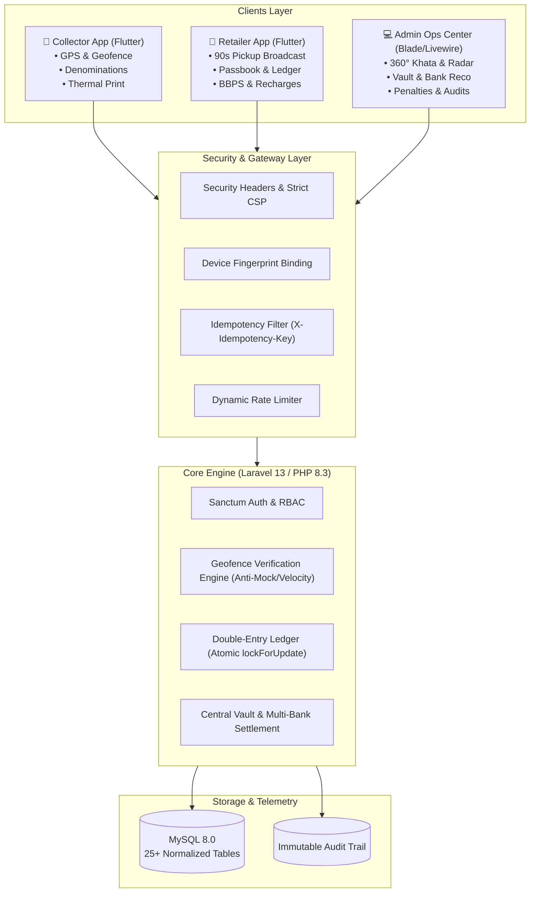

# 🛡️ Guru Ji Cash Logistics Platform

[](https://laravel.com)
[](https://flutter.dev)
[](https://mysql.com)
[]()
[]()

**Guru Ji Cash Logistics** is an enterprise-grade, high-security cash collection, float management, and retailer operations suite. Designed specifically for FMCG and distributor logistics, it replaces manual cash handling with an automated, tamper-proof, double-entry financial ledger and real-time GPS telemetry.

---

## 📑 Table of Contents

- [Architectural Overview](#-architectural-overview)
- [System Ecosystem](#-system-ecosystem)
  - [1. Backend & Admin Portal (Laravel)](#1-backend--admin-control-center-laravel)
  - [2. Collector Mobile App (Flutter)](#2-collector-mobile-app-flutter)
  - [3. Retailer Mobile App (Flutter)](#3-retailer-merchant-app-flutter)
- [Enterprise Security & Risk Mitigation](#-enterprise-security--risk-mitigation)
- [Database & Financial Engine](#-database--financial-engine)
- [Local Development Setup](#-local-development-setup)
- [Deployment (Hostinger / Apache / Cloud)](#-deployment)
- [Documentation & Resources](#-documentation--resources)

---

## 🏛️ Architectural Overview



---

## 🚀 System Ecosystem

### 1. Backend & Admin Control Center (`backend-laravel`)
- **Framework:** Laravel 13.x running on PHP 8.3+.
- **Frontend Stack:** Native Blade templates, Tailwind CSS, Alpine.js, and Livewire v4.
- **Key Modules:**
  - **360° Operations Desk:** Real-time visibility into total daily cash collected, pending pickups, and active field collectors.
  - **Moving Fleet Radar:** Leaflet-powered interactive geospatial map tracking live collector locations and telemetry.
  - **90-Second Pickup Dispatch:** Broadcast race management system handling fast response field requests.
  - **Central Vault & Bank Reconciliation:** End-of-day handoff reconciliation against physical deposit slips and multi-bank accounts.
  - **Penalties & Exception Ledger:** Automated rule enforcement for delayed drops, out-of-zone violations, or shortages.
  - **Security Audit Logs:** Tamper-proof, append-only security logs monitoring all financial and state mutations.

### 2. Collector Mobile App (`collector_app`)
- **Platform:** Cross-platform Flutter (Android & iOS).
- **Features:**
  - **Shift & Duty Lifecycle:** Daily cash float checkout, route synchronization, and end-of-day vault deposit.
  - **Anti-Spoof Geofence Verification:** Physics-based velocity checking, mock location rejection, and GPS accuracy sanitization.
  - **Denomination Calculator:** Fast currency counter breakdown (₹2000, ₹500, ₹200, ₹100, ₹50, ₹20, ₹10, coins).
  - **Offline Bluetooth Printing:** ESC/POS thermal receipt printing with physical receipt generation for merchants.
  - **90-Second Pickup Race:** Rapid broadcast claim screen with race condition locks.

### 3. Retailer Merchant App (`retailer_app`)
- **Platform:** Cross-platform Flutter.
- **Features:**
  - **Instant Cash Pickup Request:** Request collector visits with targeted amount and denomination breakdown.
  - **Live Collector Radar:** Live GPS tracking showing assigned collector's ETA and approach path.
  - **Dual Verification Handshake:** Dynamic OTP and PIN verification prior to physical cash handover.
  - **Passbook & Digital Ledger:** Real-time balance ledger detailing settlements, collections, and credits.
  - **Utility BBPS Integration:** Integrated bill payment and mobile recharge engine.

---

## 🔐 Enterprise Security & Risk Mitigation

| Security Layer | Implementation |
|---|---|
| **Content Security Policy (CSP)** | Military-grade OWASP compliant headers eliminating unauthorized script, style, and frame injections. |
| **Device Hardware Binding** | Multi-factor hardware fingerprinting ensuring collectors and merchants can only authenticate from authorized devices. |
| **Financial Idempotency** | Mandatory `X-Idempotency-Key` headers on ledger APIs preventing double-spending or duplicate debit/credit executions. |
| **Immutable Audit Logs** | Boot-level model protection disabling updates or deletions on audit trails (`AuditLog::updating` throws exception). |
| **Atomic Concurrency** | Pessimistic database locking (`lockForUpdate()`) preventing race conditions during pickup acceptance or wallet debits. |
| **GPS Telemetry Hardening** | Velocity filter flags teleportation (>120 km/h) and rejects emulator mock-location APIs. |

---

## 💳 Database & Financial Engine

The platform operates on a strict **Double-Entry Bookkeeping Ledger**:
- Every rupee collected from a retailer immediately credits the retailer's khata ledger while simultaneously debiting the collector's physical float transit balance.
- Hand-in at the end of the day moves funds from Collector Transit Float into Central Vault.
- Bank deposits transition vault balances into Verified Bank Assets upon teller slip verification.
- **Database Schema:** 25+ relational MySQL tables fully indexed with foreign keys, soft deletes, and spatial coordinate support.

---

## 🛠️ Local Development Setup

### Prerequisites
- PHP `>= 8.2` (PHP 8.3 recommended) with extensions: `pdo_mysql`, `curl`, `mbstring`, `openssl`, `bcmath`
- Apache / Nginx & MySQL 8.0 (e.g. XAMPP)
- Composer `>= 2.7`
- Flutter SDK `>= 3.19`

### 1. Backend Setup
```bash
cd backend-laravel

# Install PHP dependencies
composer install

# Environment configuration
cp .env.example .env
php artisan key:generate

# Configure your DB credentials in .env (DB_DATABASE, DB_USERNAME, DB_PASSWORD)

# Run database migrations and seeders
php artisan migrate --seed

# Run verify test suite to validate business logic
php artisan test
```

### 2. Admin Portal Access
Default test super-admin credentials:
- **URL:** `http://localhost/guruji/backend-laravel/public/login` (or via `php artisan serve`)
- **Email:** `admin@rockvanta.com`
- **Password:** `Admin@2026#CMS`

### 3. Collector App Setup
```bash
cd collector_app
flutter pub get
flutter run
```

### 4. Retailer App Setup
```bash
cd retailer_app
flutter pub get
flutter run
```

---

## 🌐 Deployment

For complete production deployment instructions including Hostinger Cloud, Apache VirtualHosts, queue workers, and background crons, refer to:
👉 [**Hostinger Cloud Deployment Guide**](docs/HOSTINGER_DEPLOYMENT_GUIDE.md)

---

## 📚 Documentation & Resources

- 🏗️ [System Architecture Blueprint](docs/SYSTEM_ARCHITECTURE.md)
- 🔒 [Cybersecurity Hardening Manual](docs/CYBERSECURITY_HARDENING.md)
- ☁️ [Hostinger Cloud Deployment & Crons](docs/HOSTINGER_DEPLOYMENT_GUIDE.md)

---

## 📄 License & Proprietary Notice

Copyright © 2026 Guruji Cash Logistics. All Rights Reserved.  
Unauthorized copying, modification, distribution, or deployment of this software is strictly prohibited.
