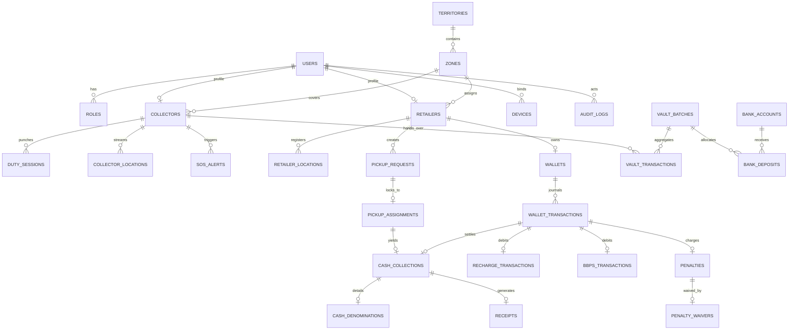
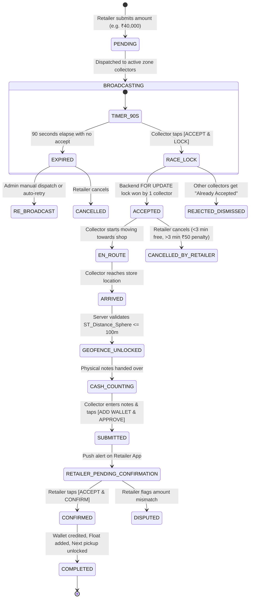

# DISTRIBUTOR CASH COLLECTION & RETAILER OPERATIONS PLATFORM
## Master System Architecture & Technical Specification (Production Blueprint)

---

### Executive Document Control
- **Document ID:** CMS-ARCH-2026-V1
- **Platform:** Cash Collection, Field Logistics & Retailer Operations Management Platform
- **Authority:** Senior Full-Stack Architect, MySQL Database Architect, UI/UX Designer & Cybersecurity Lead
- **Primary Specification Reference:** `docs/spec.pdf` (Executive Specification CMS-SPEC-2026-V1)
- **Architectural Overrides:**
  1. Exactly **3 Roles**: `ADMIN`, `COLLECTOR`, `RETAILER`.
  2. **NO Distributor** role, panel, dashboard, database entity, wallet, ledger, or APIs.
  3. Web Frontend: **Laravel Blade + Tailwind CSS + Alpine.js** (Livewire for interactive tables/modals).
  4. Mobile Apps: **Flutter (Dart)** for Collector App & Retailer App.
  5. Backend & API: **Laravel 11.x (PHP 8.2+)** REST API with Sanctum.
  6. Database: **MySQL 8.0** with Spatial Functions (`ST_Distance_Sphere`).
  7. Hosting: **Hostinger Cloud** (Native LAMP/LEMP, zero Docker, zero Kubernetes, no mandatory Redis/Node.js backend).
  8. UI Aesthetics: **Light background**, modern enterprise fintech look, high readability, micro-interactions, conversion-optimized design.

---

## 1. Final System Architecture

```
+----------------------------------------------------------------------------------------------------+
|                                    CENTRAL OPERATIONS CONTROL                                      |
|                                                                                                    |
|                                         +------------------+                                       |
|                                         |   SYSTEM ADMIN   |                                       |
|                                         +--------+---------+                                       |
|                                                  |                                                 |
|                                                  v                                                 |
|                                       +----------------------+                                     |
|                                       |  Laravel Web Panel   |                                     |
|                                       | (Blade/Tailwind/     |                                     |
|                                       |  Alpine/Livewire)    |                                     |
|                                       +----------+-----------+                                     |
+--------------------------------------------------|-------------------------------------------------+
                                                   | HTTPS (JSON REST API & Blade SSR)
                                                   v
+----------------------------------------------------------------------------------------------------+
|                                LARAVEL AUTHORITATIVE BACKEND CORE                                  |
|                                                                                                    |
|   +--------------------------------------------------------------------------------------------+   |
|   | Routing: /api/v1/{auth, admin, collector, retailer, pickups, wallet, gps, vault, banks}    |   |
|   +--------------------------------------------------------------------------------------------+   |
|   | Middleware: Sanctum Auth | DeviceBinding | RoleGate | IdempotencyCheck | RateLimiter        |   |
|   +--------------------------------------------------------------------------------------------+   |
|   | Core Services:                                                                             |   |
|   |  - PickupDispatchEngine (90s broadcast, first-to-accept race lock)                         |   |
|   |  - GeofenceVerificationService (Haversine & ST_Distance_Sphere <= 100m, Anti-Mock GPS)     |   |
|   |  - CashDenominationService (Currency count calculation & bundle validation)                |   |
|   |  - DoubleEntryWalletLedgerService (Paise-level integer accounting, atomic state locks)     |   |
|   |  - CollectorFloatManager (Real-time bag tracking, hard limit lock at Rs 1,00,000)          |   |
|   |  - VaultHandoverService (Evening note count verification, multi-bank split allocation)     |   |
|   |  - MasterReconciliationService (360-degree cash vs wallet vs bank vs in-transit audit)     |   |
|   |  - NotificationService (FCM push, high-priority sirens, daily 09:00 AM cron anti-spam)     |   |
|   +--------------------------------------------------------------------------------------------+   |
|   | Queues & Scheduling: Laravel Database Queue Worker & Crontab Scheduler                    |   |
|   +--------------------------------------------------------------------------------------------+   |
+--------------------------------------------------+-------------------------------------------------+
                                                   |
                        +--------------------------+--------------------------+
                        |                                                     |
                        v                                                     v
+-----------------------------------------------+     +-----------------------------------------------+
|         COLLECTOR MOBILE APP (Flutter)        |     |          RETAILER MOBILE APP (Flutter)        |
|                                               |     |                                               |
| - Android Device Bound (IMEI / Keystore)      |     | - Merchant Request Desk (1-Click Pickup)      |
| - GPS Telemetry Engine (10s continuous pings) |     | - Live Collector Radar (Map, ETA, Bike speed) |
| - 90s Broadcast Siren & Race Acceptance Lock  |     | - Cash Handover Verification (Zero-OTP)       |
| - In-App Google Maps Navigation               |     | - [ACCEPT & CONFIRM] Instant Wallet Unlock    |
| - 100m Geofence Detection & Note Desk         |     | - Daily 1-Time Outstanding Banner             |
| - Bluetooth Thermal Printer (ESC/POS)         |     | - Recharges (Jio/Airtel/Vi) & BBPS Utilities  |
| - Float Meter & Vault Handover Desk           |     | - Passbook Ledger & WhatsApp PDF Receipts     |
| - Silent SOS Trigger (3-click panic shield)   |     | - Team/Staff Operator Access                  |
+-----------------------------------------------+     +-----------------------------------------------+
                        \                                                     /
                         \                                                   /
                          +------------------------+------------------------+
                                                   |
                                                   v
+----------------------------------------------------------------------------------------------------+
|                                    DATA & INFRASTRUCTURE LAYER                                     |
|                                                                                                    |
|  +---------------------------+  +----------------------------+  +-------------------------------+  |
|  |     MySQL 8.0 Storage     |  |   Google Maps API Suite    |  |     Firebase Cloud Messaging  |  |
|  | - InnoDB Transactions     |  | - Places & Geocoding       |  | - High-Priority Push Alerts   |  |
|  | - Spatial Indexes (GIS)   |  | - Directions API           |  | - Collector Siren Channels    |  |
|  | - Row-Level Locks (FOR UP)|  | - Maps JavaScript & Flutter|  | - Daily Outstanding Broadcast |  |
|  +---------------------------+  +----------------------------+  +-------------------------------+  |
|                                                                                                    |
|  +---------------------------+  +----------------------------+  +-------------------------------+  |
|  | Optional Real-time Layer  |  | Utility & Recharge Layer   |  | Hostinger Cloud Environment   |  |
|  | - Laravel Reverb WS       |  | - RechargeProviderInterface|  | - Apache / Nginx + PHP 8.2+   |  |
|  | - Automatic AJAX Polling  |  | - BBPSProviderInterface    |  | - Cron Runner (artisan sched) |  |
|  |   Fallback (5-10s ping)   |  | - Mock/Sandbox in dev      |  | - Zero Docker, native LAMP    |  |
|  +---------------------------+  +----------------------------+  +-------------------------------+  |
+----------------------------------------------------------------------------------------------------+
```

---

## 2. Component Architecture

### Backend (Laravel 11 Core)
- **HTTP Layer:** FormRequests for strict validation, API Resources for JSON serialization, custom Middlewares (`EnsureDeviceBound`, `EnsureActiveDuty`, `EnforceIdempotency`, `EnforceRole:admin|collector|retailer`).
- **Domain Services:**
  - `PickupBroadcastService`: Dispatches events to eligible active collectors within territory/radius, tracks 90s countdown window.
  - `PickupLockService`: Executes `SELECT ... FOR UPDATE` atomic transactions to guarantee single-winner first-accept logic.
  - `GeofencingService`: Validates distance using `ST_Distance_Sphere` between collector's current coordinates and retailer's verified coordinates (must be $\le 100\text{ m}$).
  - `CashDenominationEngine`: Computes note values across ₹500, ₹200, ₹100, ₹50, ₹20, ₹10 denominations and enforces mathematical integrity against collected amount.
  - `WalletLedgerService`: Manages immutable double-entry journal entries in integer paise.
  - `FloatControlService`: Tracks cash held by collector in transit; blocks job acceptance if $\ge \text{₹}1,00,000$.
  - `VaultSettlementService`: Handles evening note verification, generates batch receipts, and allocates amounts to multi-bank accounts (HDFC, SBI, ICICI).
  - `ReconciliationEngine`: Calculates:
    $$\Delta = \text{Cash Collected} - (\text{Cash In Transit} + \text{Vault Cash} + \text{Bank Deposited})$$
- **Queue & Scheduling:**
  - Queue Driver: `database` (with option for `redis` if provisioned).
  - Crons: `0 9 * * *` (09:00 AM IST) for Daily Outstanding Reminders with 24-hr anti-spam guard; `* * * * *` for broadcast expiry checking.

### Mobile Frontend (Flutter Clean Architecture)
- State Management: **Riverpod** with code generation (`riverpod_generator`) or **Bloc**; immutable state models via `freezed`.
- Networking: **Dio** with interceptors for JWT/Sanctum bearer tokens, automatic device header injection (`X-Device-Id`, `X-App-Version`), and exponential backoff retry.
- Hardware & Platform Channels:
  - `geolocator`: High-accuracy GPS positioning with mock-provider detection.
  - `flutter_blue_plus`: Bluetooth Low Energy / Classic thermal printer discovery and raw ESC/POS byte streaming.
  - `flutter_secure_storage`: Android Keystore encrypted storage for auth tokens and device UUID.
  - `firebase_messaging`: Background message handlers and custom audio playback for incoming pickup broadcasts.

---

## 3. Database ERD (Entity Relationship Diagram)



---

## 4. Complete Database Tables (MySQL 8.0 Schemas)

All financial fields use `BIGINT` representing **paise** (1 INR = 100 paise) to eliminate floating-point rounding errors. Spatial data uses MySQL `POINT` and `ST_Distance_Sphere`.

### 1. `users`
| Column | Type | Constraints | Description |
|---|---|---|---|
| `id` | BIGINT UNSIGNED | PK, AUTO_INCREMENT | Unique user identifier |
| `name` | VARCHAR(150) | NOT NULL | User's full name |
| `email` | VARCHAR(191) | UNIQUE, NULLABLE | Optional email |
| `mobile` | VARCHAR(20) | UNIQUE, NOT NULL, INDEX | Primary 10-digit mobile number |
| `password` | VARCHAR(255) | NOT NULL | Bcrypt/Argon2 hashed password |
| `role` | ENUM | NOT NULL, INDEX | `'ADMIN'`, `'COLLECTOR'`, `'RETAILER'` |
| `status` | ENUM | DEFAULT `'ACTIVE'`, INDEX | `'ACTIVE'`, `'INACTIVE'`, `'SUSPENDED'`, `'BLOCKED'` |
| `remember_token` | VARCHAR(100) | NULLABLE | Session token |
| `created_at` | TIMESTAMP | DEFAULT CURRENT_TIMESTAMP | Created timestamp |
| `updated_at` | TIMESTAMP | ON UPDATE CURRENT_TIMESTAMP | Updated timestamp |
| `deleted_at` | TIMESTAMP | NULLABLE | Soft delete timestamp |

### 2. `roles` & `permissions` & `role_user`
Standard Spatie-compatible RBAC tables storing fine-grained permissions for Admin, Collector, and Retailer roles.

### 3. `devices`
| Column | Type | Constraints | Description |
|---|---|---|---|
| `id` | BIGINT UNSIGNED | PK, AUTO_INCREMENT | |
| `user_id` | BIGINT UNSIGNED | FK -> users.id, INDEX | Bound user |
| `device_uuid` | VARCHAR(191) | NOT NULL | Android Keystore/App generated UUID |
| `imei_hash` | VARCHAR(255) | NULLABLE | SHA-256 hashed hardware identifier |
| `device_model` | VARCHAR(100) | NOT NULL | e.g. "Samsung Galaxy M34" |
| `os_version` | VARCHAR(50) | NOT NULL | Android OS version |
| `app_version` | VARCHAR(30) | NOT NULL | Installed app build version |
| `fcm_token` | TEXT | NULLABLE | Current Firebase Cloud Messaging push token |
| `is_verified` | BOOLEAN | DEFAULT FALSE | Verified by SMS OTP or Admin |
| `is_active` | BOOLEAN | DEFAULT TRUE | Device active state |
| `last_active_at`| TIMESTAMP | NULLABLE | Heartbeat timestamp |
| `created_at` | TIMESTAMP | | |
| `updated_at` | TIMESTAMP | | |

### 4. `territories` & `zones`
- `territories`: `id`, `name` (e.g., "Rohtak Urban", "Jhajjar"), `state`, `code`, `is_active`.
- `zones`: `id`, `territory_id` (FK), `name` (e.g., "Ward 1", "Ward 4", "Station Road"), `boundary_polygon` (GEOMETRY/POLYGON, NULLABLE), `is_active`.

### 5. `collectors`
| Column | Type | Constraints | Description |
|---|---|---|---|
| `id` | BIGINT UNSIGNED | PK, AUTO_INCREMENT | |
| `user_id` | BIGINT UNSIGNED | UNIQUE, FK -> users.id | Associated user account |
| `collector_code`| VARCHAR(50) | UNIQUE, NOT NULL | e.g. "COL-104" |
| `bike_number` | VARCHAR(50) | NULLABLE | Vehicle registration number |
| `zone_id` | BIGINT UNSIGNED | FK -> zones.id, INDEX | Primary operating zone |
| `float_limit_paise` | BIGINT UNSIGNED | DEFAULT 10000000 | Max cash limit (default ₹1,00,000 = 10,000,000 paise) |
| `current_float_paise`| BIGINT UNSIGNED| DEFAULT 0 | Real-time cash held in bag |
| `duty_status` | ENUM | DEFAULT `'OFF_DUTY'`, INDEX | `'OFF_DUTY'`, `'ON_DUTY'`, `'ON_JOB'`, `'EMERGENCY'` |
| `battery_percent` | TINYINT UNSIGNED| DEFAULT 100 | Last reported battery level |
| `current_lat` | DECIMAL(10,8) | NULLABLE | Current latitude |
| `current_lng` | DECIMAL(11,8) | NULLABLE | Current longitude |
| `last_location_at` | TIMESTAMP | NULLABLE | Timestamp of last GPS ping |
| `created_at`, `updated_at`, `deleted_at` | | | |

### 6. `retailers`
| Column | Type | Constraints | Description |
|---|---|---|---|
| `id` | BIGINT UNSIGNED | PK, AUTO_INCREMENT | |
| `user_id` | BIGINT UNSIGNED | UNIQUE, FK -> users.id | Associated user account |
| `shop_name` | VARCHAR(191) | NOT NULL, INDEX | Shop trade name |
| `owner_name` | VARCHAR(150) | NOT NULL | Owner full name |
| `zone_id` | BIGINT UNSIGNED | FK -> zones.id, INDEX | Location zone |
| `address` | TEXT | NOT NULL | Physical postal address |
| `latitude` | DECIMAL(10,8) | NOT NULL | Registered shop latitude |
| `longitude` | DECIMAL(11,8) | NOT NULL | Registered shop longitude |
| `location_point` | POINT | NOT NULL, SPATIAL INDEX | Spatial point for fast geofencing |
| `outstanding_paise`| BIGINT UNSIGNED| DEFAULT 0 | Market float balance owed |
| `gstin` | VARCHAR(20) | NULLABLE | GST identification number |
| `pan_number` | VARCHAR(15) | NULLABLE | Merchant PAN |
| `is_kyc_verified`| BOOLEAN | DEFAULT FALSE | KYC compliance flag |
| `is_blocked` | BOOLEAN | DEFAULT FALSE | Account administrative block |
| `last_outstanding_alert_at` | TIMESTAMP | NULLABLE | 24-hr anti-spam reminder tracker |
| `created_at`, `updated_at`, `deleted_at` | | | |

### 7. `duty_sessions`
| Column | Type | Constraints | Description |
|---|---|---|---|
| `id` | BIGINT UNSIGNED | PK, AUTO_INCREMENT | |
| `collector_id` | BIGINT UNSIGNED | FK -> collectors.id, INDEX | |
| `punch_in_at` | TIMESTAMP | NOT NULL | Duty start timestamp |
| `punch_in_lat` | DECIMAL(10,8) | NOT NULL | Starting latitude |
| `punch_in_lng` | DECIMAL(11,8) | NOT NULL | Starting longitude |
| `punch_in_odometer_km` | DECIMAL(8,2) | NULLABLE | Starting bike odometer |
| `punch_out_at`| TIMESTAMP | NULLABLE | Duty end timestamp |
| `punch_out_lat`| DECIMAL(10,8)| NULLABLE | Ending latitude |
| `punch_out_lng`| DECIMAL(11,8)| NULLABLE | Ending longitude |
| `punch_out_odometer_km`| DECIMAL(8,2)| NULLABLE | Ending bike odometer |
| `total_collected_paise` | BIGINT UNSIGNED | DEFAULT 0 | Day's total collected cash |
| `status` | ENUM | DEFAULT `'ACTIVE'` | `'ACTIVE'`, `'COMPLETED'`, `'TERMINATED'` |
| `created_at`, `updated_at` | | | |

### 8. `collector_locations` & `gps_events`
- `collector_locations`: `id`, `collector_id` (FK), `latitude`, `longitude`, `coordinates` (POINT), `speed_kmh`, `battery_percent`, `accuracy_meters`, `is_mock_detected`, `created_at` (INDEX).
- Partitioning/Retention: Kept for 30 days, pruned by scheduled cron.

### 9. `pickup_requests`
| Column | Type | Constraints | Description |
|---|---|---|---|
| `id` | BIGINT UNSIGNED | PK, AUTO_INCREMENT | |
| `request_code` | VARCHAR(64) | UNIQUE, NOT NULL, INDEX | e.g. "REQ-20260930-8912" |
| `retailer_id` | BIGINT UNSIGNED | FK -> retailers.id, INDEX | Shop requesting cash pickup |
| `zone_id` | BIGINT UNSIGNED | FK -> zones.id, INDEX | Zone of pickup |
| `requested_amount_paise`| BIGINT UNSIGNED| NOT NULL | Requested amount (e.g. 4,000,000 paise = ₹40,000) |
| `status` | ENUM | NOT NULL, DEFAULT `'PENDING'`, INDEX | Current operational status |
| `broadcast_started_at` | TIMESTAMP | NULLABLE | 90s countdown start timestamp |
| `broadcast_expires_at` | TIMESTAMP | NULLABLE, INDEX | 90s countdown end timestamp |
| `shop_lat` | DECIMAL(10,8) | NOT NULL | Captured shop latitude at request |
| `shop_lng` | DECIMAL(11,8) | NOT NULL | Captured shop longitude at request |
| `notes` | VARCHAR(255) | NULLABLE | Optional merchant note |
| `created_at`, `updated_at`, `deleted_at` | | | |

### 10. `pickup_assignments`
| Column | Type | Constraints | Description |
|---|---|---|---|
| `id` | BIGINT UNSIGNED | PK, AUTO_INCREMENT | |
| `pickup_request_id` | BIGINT UNSIGNED | UNIQUE, FK -> pickup_requests.id | Exactly one assignment per request |
| `collector_id` | BIGINT UNSIGNED | FK -> collectors.id, INDEX | Winning collector |
| `accepted_at` | TIMESTAMP | NOT NULL | Timestamp of race lock victory |
| `arrived_at` | TIMESTAMP | NULLABLE | Timestamp when collector reached shop |
| `geofence_verified_at`| TIMESTAMP| NULLABLE | Timestamp when server verified $\le 100\text{m}$ |
| `distance_at_arrival_m`| DECIMAL(8,2)| NULLABLE | Recorded distance in meters at arrival |
| `status` | ENUM | NOT NULL, DEFAULT `'ASSIGNED'` | `'ASSIGNED'`, `'EN_ROUTE'`, `'ARRIVED'`, `'IN_COUNT'`, `'COMPLETED'`, `'CANCELLED'` |
| `cancellation_reason` | VARCHAR(255) | NULLABLE | |
| `created_at`, `updated_at` | | | |

### 11. `cash_collections`
| Column | Type | Constraints | Description |
|---|---|---|---|
| `id` | BIGINT UNSIGNED | PK, AUTO_INCREMENT | |
| `collection_code`| VARCHAR(64) | UNIQUE, NOT NULL, INDEX | e.g. "COLXN-20260930-1049" |
| `pickup_assignment_id`| BIGINT UNSIGNED | UNIQUE, FK -> pickup_assignments.id | Associated assignment |
| `collector_id` | BIGINT UNSIGNED | FK -> collectors.id, INDEX | Receiving field officer |
| `retailer_id` | BIGINT UNSIGNED | FK -> retailers.id, INDEX | Paying merchant |
| `requested_amount_paise`| BIGINT UNSIGNED| NOT NULL | Original requested amount |
| `collected_amount_paise`| BIGINT UNSIGNED| NOT NULL | Actual physical cash received |
| `shortfall_amount_paise`| BIGINT UNSIGNED| DEFAULT 0 | $\max(0, \text{requested} - \text{collected})$ |
| `is_partial` | BOOLEAN | DEFAULT FALSE | Partial collection flag |
| `collector_approved_at`| TIMESTAMP | NOT NULL | Collector "[ADD WALLET & APPROVE]" timestamp |
| `retailer_confirmed_at`| TIMESTAMP | NULLABLE | Retailer "[ACCEPT & CONFIRM]" timestamp |
| `status` | ENUM | NOT NULL, DEFAULT `'PENDING_RETAILER_CONFIRMATION'`, INDEX | State of settlement |
| `created_at`, `updated_at` | | | |

### 12. `cash_denominations`
| Column | Type | Constraints | Description |
|---|---|---|---|
| `id` | BIGINT UNSIGNED | PK, AUTO_INCREMENT | |
| `cash_collection_id`| BIGINT UNSIGNED | UNIQUE, FK -> cash_collections.id | Associated collection |
| `count_500` | INT UNSIGNED | DEFAULT 0 | Number of ₹500 notes |
| `count_200` | INT UNSIGNED | DEFAULT 0 | Number of ₹200 notes |
| `count_100` | INT UNSIGNED | DEFAULT 0 | Number of ₹100 notes |
| `count_50` | INT UNSIGNED | DEFAULT 0 | Number of ₹50 notes |
| `count_20` | INT UNSIGNED | DEFAULT 0 | Number of ₹20 notes |
| `count_10` | INT UNSIGNED | DEFAULT 0 | Number of ₹10 notes |
| `count_coins` | INT UNSIGNED | DEFAULT 0 | Coin total in INR |
| `total_notes` | INT UNSIGNED | NOT NULL | Total physical note count |
| `calculated_amount_paise` | BIGINT UNSIGNED | NOT NULL | Must strictly match `collected_amount_paise` |
| `created_at`, `updated_at` | | | |

### 13. `wallets` & `wallet_transactions`
- `wallets`: `id`, `retailer_id` (UNIQUE, FK -> retailers.id), `balance_paise` (BIGINT UNSIGNED, DEFAULT 0), `locked_balance_paise` (BIGINT UNSIGNED, DEFAULT 0), `currency` (VARCHAR(3) DEFAULT 'INR'), `created_at`, `updated_at`.
- `wallet_transactions`:
  | Column | Type | Constraints | Description |
  |---|---|---|---|
  | `id` | BIGINT UNSIGNED | PK, AUTO_INCREMENT | |
  | `transaction_ref` | VARCHAR(64) | UNIQUE, NOT NULL, INDEX | e.g. "TXN-WT-20260930-4921" |
  | `wallet_id` | BIGINT UNSIGNED | FK -> wallets.id, INDEX | Associated wallet |
  | `retailer_id` | BIGINT UNSIGNED | FK -> retailers.id, INDEX | Merchant reference |
  | `type` | ENUM | NOT NULL, INDEX | `'CREDIT_CASH_COLLECTION'`, `'DEBIT_RECHARGE'`, `'DEBIT_BBPS'`, `'DEBIT_PENALTY'`, `'CREDIT_WAIVER_REFUND'`, `'CREDIT_MANUAL_ADJUSTMENT'`, `'DEBIT_MANUAL_ADJUSTMENT'` |
  | `amount_paise` | BIGINT UNSIGNED | NOT NULL | Transaction quantum in paise |
  | `opening_balance_paise`| BIGINT UNSIGNED| NOT NULL | Balance before transaction |
  | `closing_balance_paise`| BIGINT UNSIGNED| NOT NULL | Balance after transaction |
  | `status` | ENUM | NOT NULL, DEFAULT `'PENDING'`, INDEX | `'PENDING'`, `'COMPLETED'`, `'FAILED'`, `'REVERSED'` |
  | `source_id` | BIGINT UNSIGNED | NULLABLE | ID of collection/recharge/penalty |
  | `source_type` | VARCHAR(100) | NULLABLE | Polymorphic relation class |
  | `idempotency_key` | VARCHAR(100) | UNIQUE, NULLABLE, INDEX | Prevents duplicate charge/credit |
  | `created_at`, `updated_at` | | | |

### 14. `recharge_transactions` & `bbps_transactions`
- `recharge_transactions`: `id`, `retailer_id`, `operator` (`'JIO'`, `'AIRTEL'`, `'VI'`, `'BSNL'`), `mobile_number`, `circle`, `amount_paise`, `operator_ref_id`, `status` (`'PROCESSING'`, `'SUCCESS'`, `'FAILED'`), `response_payload` (JSON), `created_at`, `updated_at`.
- `bbps_transactions`: `id`, `retailer_id`, `biller_id`, `biller_category` (`'ELECTRICITY'`, `'WATER'`, `'GAS'`, `'DTH'`, `'FASTAG'`), `consumer_number`, `amount_paise`, `bbps_ref_id`, `status`, `response_payload` (JSON), `created_at`, `updated_at`.

### 15. `penalties` & `penalty_waivers`
- `penalties`: `id`, `retailer_id`, `pickup_request_id` (FK), `amount_paise` (e.g. 5,000 paise = ₹50), `collector_share_paise` (₹35 = 3,500 paise), `admin_share_paise` (₹15 = 1,500 paise), `reason`, `status` (`'APPLIED'`, `'WAIVED'`, `'DEDUCTED'`), `created_at`, `updated_at`.
- `penalty_waivers`: `id`, `penalty_id` (FK), `admin_user_id` (FK), `waiver_reason` (TEXT), `approved_at` (TIMESTAMP), `created_at`.

### 16. `vaults`, `vault_batches` & `vault_transactions`
- `vaults`: `id`, `name` (e.g. "Central Rohtak Vault Desk"), `current_cash_paise`, `created_at`, `updated_at`.
- `vault_batches`: `id`, `batch_code` (e.g. "VB-20260930-01"), `admin_user_id` (FK), `total_cash_counted_paise`, `total_collectors_settled`, `status` (`'OPEN'`, `'CLOSED'`, `'DEPOSITED_TO_BANKS'`), `closed_at`, `created_at`.
- `vault_transactions`: `id`, `vault_batch_id` (FK), `collector_id` (FK), `amount_handed_over_paise`, `denomination_breakdown` (JSON), `collector_float_before_paise`, `collector_float_after_paise` (must be 0 after successful sign-off), `digital_signoff_by_admin_id` (FK), `verified_by_cash_machine` (BOOLEAN), `created_at`.

### 17. `bank_accounts` & `bank_deposits`
- `bank_accounts`: `id`, `bank_name` (e.g. "HDFC Bank", "State Bank of India", "ICICI Bank"), `account_name`, `account_number_masked` (e.g. "XXXX-XXXX-9012"), `ifsc_code`, `branch`, `account_type` (`'CURRENT'`, `'OD'`), `is_active`, `created_at`.
- `bank_deposits`: `id`, `vault_batch_id` (FK), `bank_account_id` (FK), `allocated_amount_paise`, `deposit_date` (DATE), `utr_number` (VARCHAR(100), UNIQUE, INDEX), `deposit_slip_url` (VARCHAR(255)), `reconciliation_status` (`'PENDING'`, `'MATCHED'`, `'DISCREPANCY'`), `verified_by_admin_id` (FK), `created_at`.

### 18. `notifications` & `broadcasts`
- `notifications`: `id`, `user_id` (FK), `title`, `body`, `type` (`'PICKUP_BROADCAST'`, `'ASSIGNMENT'`, `'CASH_COUNTED'`, `'CONFIRMATION_REQUIRED'`, `'WALLET_CREDITED'`, `'OUTSTANDING_ALERT'`, `'SOS'`), `payload` (JSON), `is_read`, `created_at`.
- `broadcasts`: `id`, `admin_user_id` (FK), `title`, `message` (TEXT), `priority` (`'NORMAL'`, `'URGENT'`, `'CRITICAL'`), `target_role` (`'ALL'`, `'RETAILER'`, `'COLLECTOR'`), `is_flash_modal` (BOOLEAN DEFAULT TRUE), `starts_at`, `expires_at`, `created_at`.

### 19. `receipts`
- `receipts`: `id`, `receipt_number` (UNIQUE, INDEX), `cash_collection_id` (FK), `qr_verification_token` (VARCHAR(128)), `thermal_payload_escpos` (MEDIUMTEXT), `pdf_storage_path` (VARCHAR(255)), `whatsapp_delivered_at` (TIMESTAMP NULLABLE), `printed_at` (TIMESTAMP NULLABLE), `created_at`.

### 20. `sos_alerts`
- `sos_alerts`: `id`, `collector_id` (FK), `device_id` (FK), `latitude`, `longitude`, `battery_percent`, `cash_holding_paise`, `active_pickup_id` (NULLABLE), `status` (`'TRIGGERED'`, `'ACKNOWLEDGED'`, `'RESOLVED'`), `acknowledged_by_admin_id` (NULLABLE), `resolved_notes` (TEXT), `created_at`, `updated_at`.

### 21. `documents` & `audit_logs`
- `documents`: `id`, `user_id` (FK), `document_type` (`'GST'`, `'KYC_AADHAR'`, `'KYC_PAN'`, `'SHOP_PHOTO'`, `'COLLECTOR_ID'`, `'BIKE_RC'`), `file_path`, `mime_type`, `file_size_bytes`, `verified_by_admin_id` (NULLABLE), `is_approved`, `created_at`.
- `audit_logs`: `id`, `actor_user_id` (FK), `actor_role`, `action` (e.g. `'FIRST_ACCEPT_LOCK'`, `'CASH_APPROVE'`, `'RETAILER_CONFIRM'`, `'FLOAT_RESET'`, `'PENALTY_WAIVED'`), `entity_type`, `entity_id`, `before_state` (JSON), `after_state` (JSON), `ip_address`, `user_agent`, `device_id`, `correlation_id`, `created_at` (INDEX).

---

## 5. API Architecture

### Base URL & Standards
- Prefix: `/api/v1`
- Standard Response Envelope:
```json
{
    "success": true,
    "message": "Resource retrieved successfully",
    "data": {},
    "errors": []
}
```
- Error Response Envelope:
```json
{
    "success": false,
    "message": "Validation failed / Unauthorized / Conflict",
    "data": null,
    "errors": [
        {"field": "collected_amount_paise", "message": "Denominations sum (3500000) does not match entered total (4000000)"}
    ]
}
```
- Idempotency Header: `X-Idempotency-Key: <UUIDv4>` enforced on all write APIs (Pickups, Approvals, Confirmations, Recharges).

### API Endpoint Map

#### A. Authentication & Device (`/api/v1/auth`)
| Method | URI | Description | Auth & Middleware |
|---|---|---|---|
| `POST` | `/login` | Mobile/Password login | Guest, Throttle: 5/min |
| `POST` | `/device/bind` | Register & bind device hardware hash | Sanctum Auth |
| `POST` | `/device/verify` | Verify OTP for new device binding | Sanctum Auth |
| `POST` | `/logout` | Revoke active token & detach FCM | Sanctum Auth |
| `GET` | `/me` | Get profile, permissions & status | Sanctum Auth |

#### B. Retailer Portal & Mobile (`/api/v1/retailer`)
| Method | URI | Description | Auth & Middleware |
|---|---|---|---|
| `POST` | `/pickups/request` | Create on-demand pickup request | Role: RETAILER, LockCheck |
| `GET` | `/pickups/active` | Get active pickup with collector radar & ETA | Role: RETAILER |
| `POST` | `/pickups/{id}/cancel` | Cancel pickup (3-min free window / ₹50 penalty) | Role: RETAILER |
| `POST` | `/pickups/{id}/accept-and-confirm` | 1-Tap finalize cash collection & unlock wallet | Role: RETAILER, Idempotent |
| `GET` | `/wallet/balance` | Real-time wallet & outstanding balance | Role: RETAILER |
| `GET` | `/wallet/passbook` | Date-filtered transaction ledger | Role: RETAILER |
| `POST` | `/recharge/execute` | Execute mobile prepaid recharge via wallet | Role: RETAILER, Idempotent |
| `POST` | `/bbps/pay-bill` | Pay utility bill via BBPS abstraction | Role: RETAILER, Idempotent |
| `GET` | `/receipts/{id}/pdf` | Secure signed download URL for receipt PDF | Role: RETAILER |
| `GET` | `/broadcasts/active` | Active flash modal broadcasts | Role: RETAILER |

#### C. Collector Mobile (`/api/v1/collector`)
| Method | URI | Description | Auth & Middleware |
|---|---|---|---|
| `POST` | `/duty/punch-in` | Punch-in duty with GPS & start odometer | Role: COLLECTOR, DeviceBound |
| `POST` | `/duty/punch-out` | Punch-out duty with closing odometer | Role: COLLECTOR, DutyActive |
| `POST` | `/gps/ping` | Stream 10s continuous GPS telemetry | Role: COLLECTOR, DutyActive |
| `GET` | `/pickups/broadcasts` | Incoming 90s broadcasts for assigned zone | Role: COLLECTOR, DutyActive |
| `POST` | `/pickups/{id}/accept` | First-to-accept race lock | Role: COLLECTOR, FloatCheck |
| `POST` | `/pickups/{id}/arrived` | Signal arrival at shop | Role: COLLECTOR |
| `POST` | `/pickups/{id}/verify-geofence` | Server Haversine verify distance $\le 100\text{m}$ | Role: COLLECTOR, AntiMock |
| `POST` | `/pickups/{id}/submit-cash` | Submit denominations & [ADD WALLET & APPROVE] | Role: COLLECTOR, GeofenceValid |
| `GET` | `/float/meter` | Current bag float vs ₹1,00,000 limit | Role: COLLECTOR |
| `POST` | `/vault/handover` | Handover cash to Central Vault Desk | Role: COLLECTOR |
| `POST` | `/sos/trigger` | Emergency panic trigger (sends live alerts) | Role: COLLECTOR |

#### D. Admin Control Panel (`/api/v1/admin`)
| Method | URI | Description | Auth & Middleware |
|---|---|---|---|
| `GET` | `/dashboard/kpis` | 4-Pill master KPI cards + Live Desk counts | Role: ADMIN |
| `GET` | `/radar/live-fleet` | Active moving collector coordinates & cash | Role: ADMIN |
| `GET` | `/reconciler/360-ledger` | 360-degree daily cash reconciliation matrix | Role: ADMIN |
| `POST` | `/retailers/bulk-import` | Upload Excel/CSV with queued job dispatch | Role: ADMIN |
| `POST` | `/broadcasts` | Create instant flash modal notification | Role: ADMIN |
| `POST` | `/penalties/{id}/waive`| 1-Click waiver for retailer cancellation charge | Role: ADMIN |
| `POST` | `/vault/batches/{id}/sign-off` | Digital sign-off & collector float reset to 0 | Role: ADMIN |
| `POST` | `/banks/deposits/allocate`| Split vault cash into multi-bank accounts | Role: ADMIN |
| `GET` | `/reports/export` | Stream Excel/CSV/PDF for any financial ledger | Role: ADMIN |

---

## 6. Role / Permission Matrix

| Module / Operation | Admin | Collector | Retailer |
|---|:---:|:---:|:---:|
| **User & Device Management** | Full CRUD, Reset Device | View Self, Bind Device | View Self, Bind Staff |
| **Zone & Territory Assignment** | Full CRUD | View Assigned Zones | Assigned to 1 Zone |
| **Pickup Request Creation** | Create/Cancel/Reassign | Forbidden | Create Own (1 Active Lock) |
| **Pickup Race Acceptance** | Override Assignment | Accept via 90s Race | Forbidden |
| **100m Geofence Validation** | View Real-Time Distance | Trigger Server Validation | View Collector Proximity |
| **Cash & Denomination Entry** | Audit / View Logs | Enter & Calculate Notes | View Note Count on Screen |
| **[Add Wallet & Approve]** | Super-Approve in dispute | Submit Physical Count | Forbidden |
| **[Accept & Confirm]** | Override in Dispute | Forbidden | 1-Tap Confirm to Unlock |
| **Wallet Ledger & Balance** | Full Audit, Manual Adjust | View Bag Float Only | View Balance, Passbook |
| **Recharge & BBPS** | Monitor Volumes / Spreads | Forbidden | Execute via Balance |
| **Float Limit Enforcement** | Configure Limit (₹1L) | Subject to Hard Lock | Unaffected |
| **Vault Handover & Sign-Off** | Digital Sign-off & Bank Split | Submit Cash & Machine Count | Forbidden |
| **Bank Deposits & UTR** | Create, Allocate & Match | Forbidden | Forbidden |
| **360° Reconciliation** | Full Reconciliation Desk | Forbidden | Forbidden |
| **Emergency SOS Siren** | Monitor & Resolve Red Alert | Trigger Panic Shield | Forbidden |
| **Broadcast & Popups** | Create & Dispatch | Receive | Receive Flash Modal |
| **Daily Outstanding Reminder** | Trigger / View Cron Logs | Forbidden | Receive 1 Daily Push/Card |

---

## 7. Admin Panel Sitemap (Laravel Blade + Tailwind CSS)

```
ADMIN WEB PANEL (cpanel/hostinger root: /admin)
├── Login (/login)
├── 1. Dashboard & Live Khata (/admin/dashboard)
│   ├── 4-Pill Live KPIs: Cash Received, Wallet Credited, Retailer Udhar, Cash in Transit
│   ├── Visual Fleet Radar (Google Maps Live Telemetry with 10s ping & battery %)
│   ├── Quick Desks: Active Pickups, Pending Confirmation, SOS Alerts (Audio Siren)
│   └── 360° Real-Time Cash Audit Khata Table
├── 2. Operations & Fleet (/admin/operations)
│   ├── Live Radar Full Map (/admin/operations/map)
│   ├── Pickup Requests Desk (/admin/operations/pickups)
│   │   ├── Incoming Queue, 90s Broadcast Race Monitor
│   │   └── Manual Reassign / Dispute Resolution Modal
│   └── SOS Red Alert Command Center (/admin/operations/sos)
├── 3. User & Entity CRUD
│   ├── Collectors Desk (/admin/collectors) [Add, Edit, Device Reset, Float Limit, Suspend]
│   ├── Retailers Desk (/admin/retailers) [Add, GPS Pinning, KYC, Block/Unblock, QR Code]
│   └── Bulk Retailer Excel/CSV Onboarding (/admin/retailers/import)
├── 4. Geography & Zones (/admin/territories)
│   ├── Territories (Cities / Districts)
│   └── Zones (Wards / Polygons with Collector Mapping)
├── 5. Financial Desk & Ledger (/admin/finances)
│   ├── 360° Master Reconciler Desk (/admin/finances/reconcile)
│   ├── Retailer Wallet Passbook (/admin/finances/wallets)
│   ├── Retailer Outstanding & Market Float (/admin/finances/outstanding)
│   ├── Collector Float Monitor (/admin/finances/collector-floats)
│   └── Auto-Penalty & Waiver Desk (/admin/finances/penalties)
├── 6. Central Vault & Multi-Bank Desk (/admin/vault)
│   ├── Evening Vault Handover Desk (/admin/vault/handover)
│   ├── Bank Accounts Master (/admin/vault/banks) [HDFC, SBI, ICICI accounts]
│   ├── Bank Deposit Allocation & Slip Upload (/admin/vault/deposits)
│   └── UTR Bank Reconciliation Matcher (/admin/vault/reconcile-utr)
├── 7. Communications & Notices (/admin/communications)
│   ├── 1-Click Flash Broadcast Modal Creator (/admin/communications/broadcasts)
│   └── Daily 09:00 AM Outstanding Alert Engine (/admin/communications/reminders)
├── 8. Reports & Audit (/admin/reports)
│   ├── Daily Collection Report, Collector-wise, Retailer-wise, Territory-wise
│   ├── Cash-in-Transit, Vault Settlement, Penalty, Recharge/BBPS Reports
│   ├── Export Center (Excel, CSV, PDF)
│   └── Immutable Security Audit Logs (/admin/audit-logs)
└── 9. System & Security Settings (/admin/settings)
```

### UI/UX Theme Specifications (Light Background)
- **Background:** Crisp Light `#F8FAFC` (Slate 50) and `#FFFFFF` (Pure White cards).
- **Typography:** Modern Google Fonts (`Inter` or `Plus Jakarta Sans`), weights 400, 500, 600, 700.
- **Accents:**
  - Emerald (`#059669` / `#10B981`) for Cash Received, Settled, and Success states.
  - Indigo/Navy (`#1E293B` / `#4F46E5`) for primary actions and financial headers.
  - Amber (`#D97706`) for Cash in Transit and Pending Confirmation states.
  - Rose/Red (`#E11D48`) for SOS alerts, 100m geofence lock, and high cash warnings.
- **Card Design:** Rounded-xl, soft multi-layer shadow (`0 1px 3px 0 rgb(0 0 0 / 0.07)`), crisp 1px borders (`#E2E8F0`).
- **Interactive:** Alpine.js reactive countdowns, Livewire instant table filtering, smooth toast notifications.

---

## 8. Collector App Sitemap (Flutter Android)

```
COLLECTOR FLUTTER APP
├── 1. Splash & Device Handshake (Checks IMEI / Keystore Hardware Binding)
├── 2. Login & Device Verification (Mobile + Password + SMS OTP if new device)
├── 3. Geofenced Duty Punch-In Desk (GPS location + Bike Odometer photo/KM input)
├── 4. Home Dashboard
│   ├── Live Bag Float Meter (₹82,500 / ₹1,00,000 with visual progress bar)
│   ├── Duty Status Toggle (ON DUTY / OFF DUTY)
│   ├── Active Accepted Job Card (Quick Access)
│   └── Floating Panic Shield Button (3-Tap Silent SOS)
├── 5. Broadcast Feed Desk (90s Countdown Siren Race Alert)
│   ├── Full-screen loud audio push notification
│   ├── Shop Name, Ward, Distance (km), Cash Amount (₹40,000)
│   └── [ACCEPT & LOCK] button vs [PASS] button
├── 6. In-Transit Navigation Desk
│   ├── Google Maps Turn-by-Turn Directions to Shop
│   ├── 1-Tap Masked Direct Call to Retailer
│   └── Live Proximity Distance Meter (e.g. "Distance: 142m - Locked")
├── 7. 100m Geofenced Collection Desk (Hardware Unlock at <= 100m)
│   ├── GPS Lock Status Indicator (🟢 GPS: 28m • GEOFENCE UNLOCKED)
│   ├── Smart Denomination Calculator (Keypad for 500, 200, 100, 50, 20, 10)
│   ├── Partial Collection Toggle (Modify amount e.g. ₹50k -> ₹30k with prompt)
│   ├── Total Count & Bundle Validator (e.g. "81 Notes = ₹40,000")
│   └── [ADD WALLET & APPROVE] Submission Button (Zero-OTP)
├── 8. Receipt & Thermal Print Desk
│   ├── Bluetooth Thermal Printer Auto-Connect (ESC/POS 58mm/80mm)
│   ├── Physical Slip Print Trigger (2 copies: 1 Retailer, 1 Bag)
│   └── Digital WhatsApp PDF Auto-Trigger Status
├── 9. Float & Vault Desk
│   ├── Day-end Cash Summary & Shop Handover List
│   └── Central Vault Desk Submission (QR Handshake with Admin)
├── 10. Duty Punch-Out Desk (Ending Odometer + Zero Float Validation)
└── 11. Profile, Notifications & Bluetooth Printer Setup
```

---

## 9. Retailer App Sitemap (Flutter Android)

```
RETAILER FLUTTER APP
├── 1. Splash & Auth (Mobile + Password Login, Staff Operator sub-profiles)
├── 2. Merchant Home & Liquidity Dashboard
│   ├── Wallet Balance Display (Instant Digital Settlement)
│   ├── Market Float / Outstanding Tracker (Udhar Due)
│   ├── 1-Click [REQUEST CASH PICKUP] Desk (Anti-Duplicate Locked if pending)
│   ├── Emergency Admin Flash Pop-up Modal (e.g. "Bank Holiday Pickups till 8 PM")
│   └── Daily 09:00 AM Outstanding Banner (1 Notice/Day Anti-Spam Card)
├── 3. Live Pickup Tracking Radar
│   ├── Assigned Collector Identity: Name, Photo, Mobile, COL ID
│   ├── Live Google Map with Collector Bike Marker & Speed
│   └── Dynamic Distance & ETA Counter (e.g. "500m door • 2 min away")
├── 4. Collection Verification & Acceptance Desk (Zero-OTP)
│   ├── Collector Submitted Amount Banner (e.g. "Collector Submitted ₹40,000 - 81 Notes")
│   ├── [ACCEPT & CONFIRM] Giant Button (Finalizes credit in 1 second)
│   └── Report Discrepancy Button (Triggers Admin dispute halt)
├── 5. Merchant Utility & Recharge Suite (Unlocked via reloaded wallet balance)
│   ├── Mobile Prepaid Recharge (Jio, Airtel, Vi, BSNL)
│   └── BBPS Bill Payments (Electricity, Water, Gas Cylinder, DTH, FASTag)
├── 6. Passbook & Khata Statement
│   ├── Date-wise Ledger (Cash handed over vs Wallet credited vs Utility debited)
│   └── Download / Share WhatsApp PDF Tax Invoice & Collection Receipts
└── 7. Profile, Staff Operator Accounts & Helpdesk
```

---

## 10. Pickup State Machine



### Critical Race Condition Prevention (`PickupLockService`)
```php
public function acceptPickup(int $pickupId, int $collectorId): PickupAssignment
{
    return DB::transaction(function () use ($pickupId, $collectorId) {
        // Enforce pessimistic row locking on the request
        $pickup = PickupRequest::where('id', $pickupId)
            ->lockForUpdate()
            ->firstOrFail();

        if ($pickup->status !== 'BROADCASTING' && $pickup->status !== 'PENDING') {
            throw new PickupAlreadyClaimedException("This pickup has already been accepted by another collector.");
        }

        // Validate collector float limit before binding
        $collector = Collector::where('id', $collectorId)->lockForUpdate()->firstOrFail();
        if (($collector->current_float_paise + $pickup->requested_amount_paise) > $collector->float_limit_paise) {
            throw new FloatLimitExceededException("Cannot accept: bag cash limit of ₹1,00,000 would be exceeded.");
        }

        // Atomic transition
        $pickup->status = 'ACCEPTED';
        $pickup->save();

        $assignment = PickupAssignment::create([
            'pickup_request_id' => $pickup->id,
            'collector_id'      => $collector->id,
            'accepted_at'       => now(),
            'status'            => 'ASSIGNED',
        ]);

        return $assignment;
    });
}
```

---

## 11. Geofence Architecture (Server-Side Hard Lock)

### 100-Meter Spatial Calculation
The client app calculates distance purely for UI feedback (e.g. changing button color from disabled grey to active emerald). **Authorization to submit cash requires a server-side cryptographic challenge and spatial distance computation.**

```sql
-- MySQL 8.0 ST_Distance_Sphere Calculation
SELECT ST_Distance_Sphere(
    POINT(col.current_lng, col.current_lat),
    POINT(ret.longitude, ret.latitude)
) AS distance_meters
FROM collectors col
JOIN pickup_assignments pa ON pa.collector_id = col.id
JOIN pickup_requests pr ON pr.id = pa.pickup_request_id
JOIN retailers ret ON ret.id = pr.retailer_id
WHERE pa.id = :assignment_id;
```

### Server Rules:
1. `distance_meters <= 100.00`: Allowed.
2. `distance_meters > 100.00`: **HTTP 403 Forbidden** with message: *"You are 142m away from the shop. Move within 100m to unlock cash desk."*
3. Location Age Check: Reject any GPS ping older than 30 seconds to block replay attacks.
4. Accuracy Threshold: Reject if `accuracy_meters > 35m`.
5. Anti-Mock Signals: Reject if Android `isFromMockProvider()` is true.

---

## 12. Wallet & Ledger Architecture

### Double-Entry Accounting Ledger
The wallet balance is an aggregate state backed by an immutable ledger. Every financial event generates matching credit and debit ledger entries.

$$\text{Current Balance} = \text{Opening Balance} + \sum \text{Credits} - \sum \text{Debits}$$

### Transaction States
- `PENDING_RETAILER_CONFIRMATION`: Amount is held in escrow; not spendable by retailer.
- `COMPLETED`: Retailer tapped `[ACCEPT & CONFIRM]`. Balance immediately added to spendable wallet.
- `REVERSED`: Disputed or cancelled.

### Atomic Balance Lock Implementation
```php
public function finalizeCollectionWalletCredit(CashCollection $collection): WalletTransaction
{
    return DB::transaction(function () use ($collection) {
        $wallet = Wallet::where('retailer_id', $collection->retailer_id)
            ->lockForUpdate()
            ->firstOrFail();

        $amountPaise = $collection->collected_amount_paise;
        $openingBalance = $wallet->balance_paise;
        $closingBalance = $openingBalance + $amountPaise;

        // Create immutable transaction ledger
        $txn = WalletTransaction::create([
            'transaction_ref'       => 'TXN-WT-' . date('YmdHis') . '-' . Str::upper(Str::random(6)),
            'wallet_id'             => $wallet->id,
            'retailer_id'           => $collection->retailer_id,
            'type'                  => 'CREDIT_CASH_COLLECTION',
            'amount_paise'          => $amountPaise,
            'opening_balance_paise' => $openingBalance,
            'closing_balance_paise' => $closingBalance,
            'status'                => 'COMPLETED',
            'source_id'             => $collection->id,
            'source_type'           => CashCollection::class,
            'idempotency_key'       => 'COLXN-CREDIT-' . $collection->id,
        ]);

        // Update materialized wallet balance
        $wallet->balance_paise = $closingBalance;
        $wallet->save();

        // Increment collector float
        $collector = Collector::where('id', $collection->collector_id)->lockForUpdate()->firstOrFail();
        $collector->current_float_paise += $amountPaise;
        $collector->save();

        return $txn;
    });
}
```

---

## 13. Collector Float Architecture

1. **Safety Cap:** ₹1,00,000 (10,000,000 paise).
2. **Real-Time Calculation:**
   $$\text{Float} = \sum \text{Completed Collections Today} - \sum \text{Vault Handovers Today}$$
3. **Hard Lockout Trigger:**
   - If $\text{Float} \ge \text{₹}1,00,000$, collector's app turns red: *"Safety Cap Reached. Proceed to Central Vault Desk to deposit cash."*
   - Backend automatically excludes collector from 90s broadcasts.
   - Collector cannot accept any job until Admin registers a Vault Handover.

---

## 14. Vault Architecture (Evening Closing Desk)

1. **Physical Cash Counting Machine:** Cash is counted at the Central Hub in the presence of Admin and Collector.
2. **Denomination Reconciliation:** System compares collector's in-app denominations against machine tally.
3. **Multi-Bank Allocation:**
   Admin decides split across company accounts:
   - e.g. Total ₹4,85,000 $\rightarrow$ ₹3,00,000 into HDFC Current Account + ₹1,85,000 into SBI Current Account.
4. **Digital Sign-Off:**
   Admin clicks *"Sign-Off & Reset Float"*.
   - Generates `VaultTransaction` and `VaultBatch`.
   - Collector's `current_float_paise` drops to **₹0.00**.
   - Duty punch-out is now unlocked.

---

## 15. Bank & 360-Degree Reconciliation Architecture

### Master Financial Equation
$$\text{Total Market Cash Out} = \text{Cash in Transit (Bags)} + \text{Vault Cash} + \text{Bank Deposited Cash} + \text{Pending Retailer Shortfall}$$

### Discrepancy Detection Algorithm
$$\text{Discrepancy} = \sum \text{Retailer Requests} - \left( \sum \text{Verified Collections} + \sum \text{Cancelled} + \sum \text{Active In-Transit} \right)$$
- If $\text{Discrepancy} \ne 0$, an alert banner is triggered in the Admin 360° Khata Desk with exact audit references.
- **UTR Matcher:** Matches Bank Statement CSV uploads against `bank_deposits.utr_number`.

---

## 16. Notification Architecture

- **Firebase Cloud Messaging (FCM):**
  - High-priority channels with custom MP3 siren audio (`res/raw/siren_alert.mp3`) for the 90-second collector race.
  - Silent data messages for collector location sync.
- **Daily 09:00 AM Outstanding Cron:**
  - Command: `php artisan reminders:daily-outstanding`
  - Targets retailers with `outstanding_paise > 0`.
  - **Strict 24-Hour Anti-Spam Guard:** Checks `retailers.last_outstanding_alert_at`. If dispatched within past 24 hours, skipped.
- **Instant WhatsApp PDF Delivery:**
  - Upon Retailer `[ACCEPT & CONFIRM]`, dispatches job `SendWhatsAppReceiptJob` with formatted digital PDF link.

---

## 17. GPS Architecture & Anti-Mock Telemetry

1. **Telemetry Frequency:** 10-second intervals during `ON_DUTY` and active pickup.
2. **Payload:**
   `{ lat: 28.8955, lng: 76.6066, speed_kmh: 32.4, accuracy_m: 12.0, battery: 84, is_mock: false, timestamp: 1727715600 }`
3. **Defensive Detection Layers:**
   - Client: Android `Location.isFromMockProvider()` & `Settings.Secure.ALLOW_MOCK_LOCATION`.
   - Server: Speed anomaly detection (if distance traveled implies speed $> 130\text{ km/h}$, flag as GPS Teleportation anomaly).
   - Battery level tracking to monitor battery drain and unexpected power cuts.

---

## 18. Security Architecture (OWASP Aligned)

1. **Authentication & Session Security:**
   - Laravel Sanctum tokens with device fingerprint validation.
   - Tokens tied to SHA-256 hashed hardware identifier (`X-Device-Id`).
2. **Authorization & RBAC:**
   - Laravel Policies for every model (`PickupRequestPolicy`, `WalletPolicy`, `CollectorPolicy`).
   - Zero IDOR: Collectors can only view assignments matching `collector_id == auth()->user()->collector->id`.
   - Retailers can only view requests matching `retailer_id == auth()->user()->retailer->id`.
3. **Data Protection:**
   - Passwords hashed with Bcrypt (cost 12).
   - KYC documents stored in non-public storage `storage/app/private/documents/` served only via temporary signed URLs.
4. **Idempotency Protection:**
   - Redis or MySQL-backed idempotency filter caching unique `X-Idempotency-Key` headers for 120 seconds.

---

## 19. Hostinger Cloud Deployment Architecture

1. **Hosting Profile:** Hostinger Cloud / Shared cPanel / hPanel Linux.
2. **Directory Hardening:**
   - Web root maps strictly to `/public_html` pointing to Laravel `/public/`.
   - Root application code placed in `/home/uXXXXX/guruji-backend/` outside web root.
   - `.env` and `storage/` completely shielded from direct HTTP access.
3. **Background Process Management:**
   - Scheduled Cron: `* * * * * cd /home/uXXXXX/guruji-backend && php artisan schedule:run >> /dev/null 2>&1`
   - Queue Worker: Database queue worker run via crontab watchdog:
     `* * * * * pgrep -f "artisan queue:work" > /dev/null || php /home/uXXXXX/guruji-backend/artisan queue:work --stop-when-empty >> /dev/null 2>&1`
4. **No Docker / No Node.js Backend:**
   - Zero container dependencies.
   - Built assets (Tailwind CSS, Alpine.js) compiled before deployment or via npm on deployment script, served as static assets from `public/build/`.

---

## 20. Phased Development Roadmap (Phases 1–24)

- **Phase 1:** Master Architecture & Project Scaffold (Laravel 11 backend + 2 Flutter apps).
- **Phase 2:** Complete MySQL 8.0 migrations, foreign keys, spatial indices, seeders.
- **Phase 3:** Authentication, Sanctum tokens, device binding, and RBAC policies.
- **Phase 4:** Admin Panel Foundation (Blade, Tailwind CSS light theme, Alpine.js, Livewire).
- **Phase 5:** Collector Flutter App core (Splash, Auth, Device Binding, Riverpod).
- **Phase 6:** Retailer Flutter App core (Splash, Auth, Merchant Dashboard).
- **Phase 7:** Pickup Request creation & validation (Retailer 1-click on-demand).
- **Phase 8:** 90-Second Broadcast & First-to-Accept atomic database row lock (`lockForUpdate`).
- **Phase 9:** GPS continuous telemetry & Server-Side 100m Geofence Lock.
- **Phase 10:** Smart Denomination Calculator & Note Bundle Validation.
- **Phase 11:** Double-entry Wallet Ledger & Transaction journal in paise.
- **Phase 12:** Retailer `[ACCEPT & CONFIRM]` desk & anti-duplicate request unfreeze.
- **Phase 13:** Collector Float Meter & ₹1,00,000 hard safety limit lock.
- **Phase 14:** Central Vault Evening Handover & Multi-Bank Allocation Desk.
- **Phase 15:** 360-Degree Financial Reconciliation & Discrepancy Matrix.
- **Phase 16:** Firebase Cloud Messaging (FCM) high-priority sirens & alerts.
- **Phase 17:** Bluetooth Thermal Printer integration (ESC/POS 58mm/80mm).
- **Phase 18:** Mobile Recharge & BBPS Utility provider abstraction layer.
- **Phase 19:** Comprehensive Financial Reports (Excel, CSV, PDF export engine).
- **Phase 20:** Silent SOS Panic Shield & Admin Flash Pop-up Broadcasts.
- **Phase 21:** Immutable Security Audit Logs & Session tracking.
- **Phase 22:** Security hardening (OWASP, IDOR, Rate Limiting, Anti-Mock).
- **Phase 23:** Automated Test Suite (Unit, Feature, Concurrency, and Geofence tests).
- **Phase 24:** Hostinger Cloud Deployment bundle, `.env.example`, and operational documentation.

---

## 21. Analysis of Ambiguities & Risks in the Specification

| Ambiguity / Ground Risk in PDF | Technical Resolution & Production Rule |
|---|---|
| **Distributor Mentions in PDF:** PDF diagrams frequently mention "Distributor credits wallet" and "Distributor vault". | **Strict Override:** All distributor capabilities are absorbed into the `ADMIN` role. No distributor entity exists in DB or code. |
| **PostGIS in PDF vs MySQL Requirement:** PDF page 1/5 mentions PostGIS, but stack requires MySQL 8.0 on Hostinger. | **Resolution:** Use MySQL 8.0 native spatial GIS functions (`POINT`, `ST_Distance_Sphere`, `SPATIAL INDEX`), which provide exact spherical distance calculation without requiring PostgreSQL. |
| **Basement No-Network (Offline Token):** PDF page 6 mentions offline cryptographic tokens for basement shops. | **Operational Risk:** Pure offline cash collection allows float manipulation. **Rule:** Support offline cached shop details and encrypted QR handshake, but financial wallet credit remains locked until collector device syncs with server. |
| **Thermal Printer Variability:** Field collectors use diverse 58mm/80mm Chinese mini Bluetooth printers. | **Resolution:** Standardize on raw ESC/POS byte generator compatible with both 58mm (32 chars/line) and 80mm (48 chars/line) widths. |
| **WhatsApp PDF Delivery API:** PDF mentions automated WhatsApp receipts. | **Resolution:** Create `WhatsAppNotificationProviderInterface` supporting Twilio / Gupshup / Meta Cloud API, with local PDF storage and in-app viewing as primary zero-cost delivery. |
