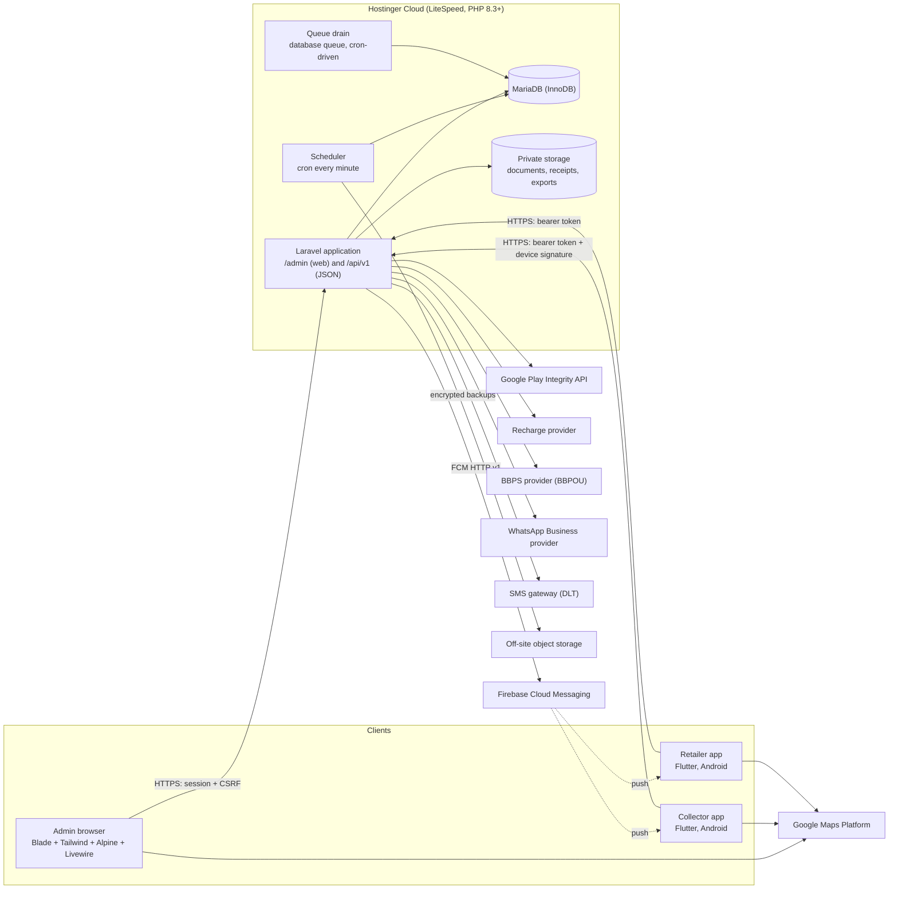
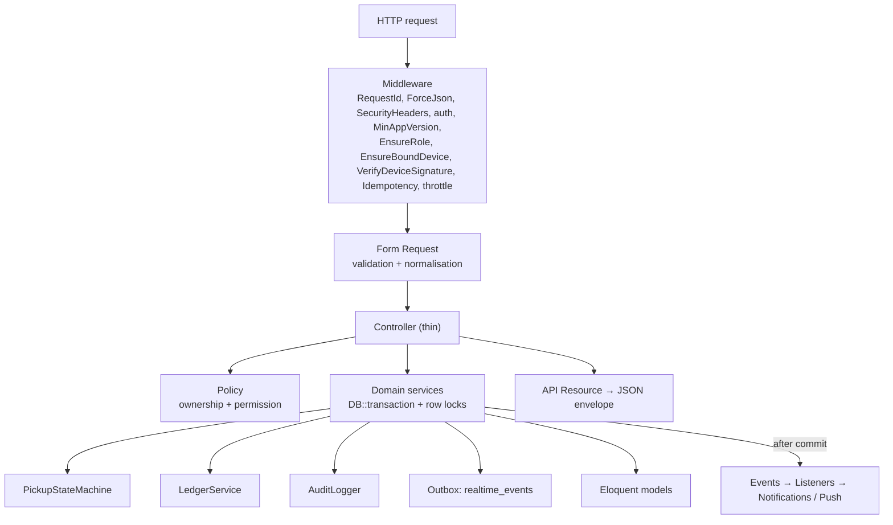
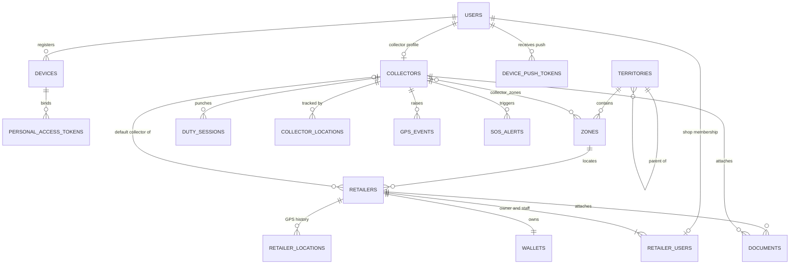
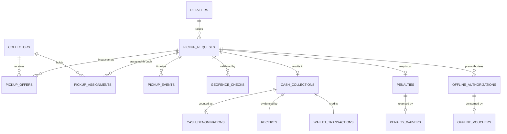
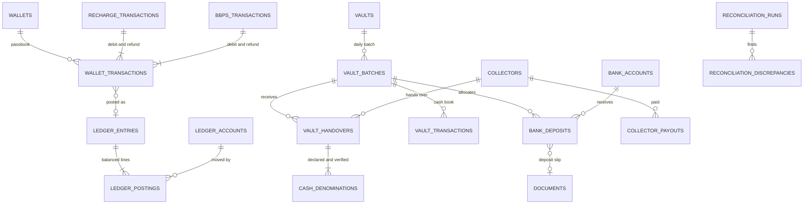
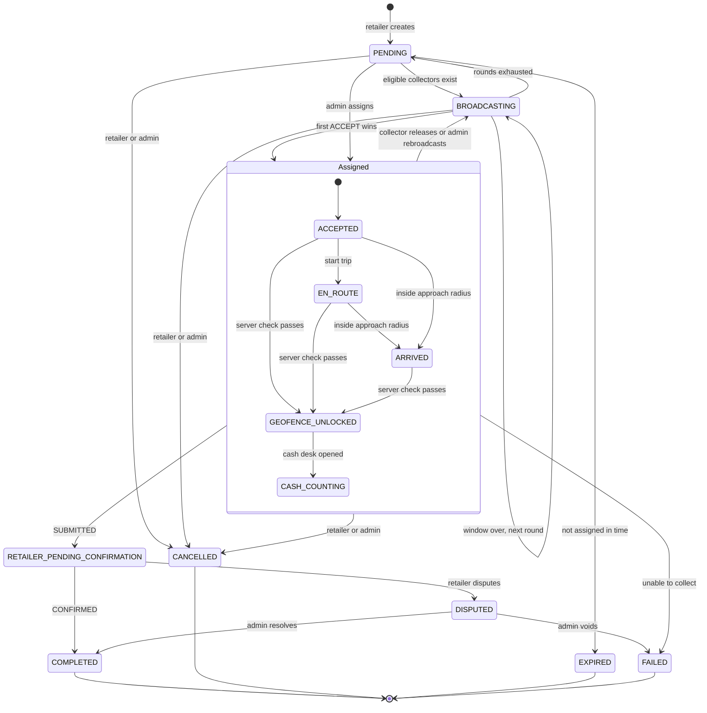
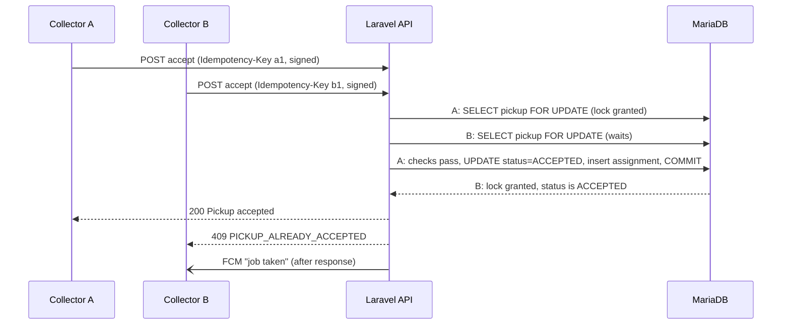
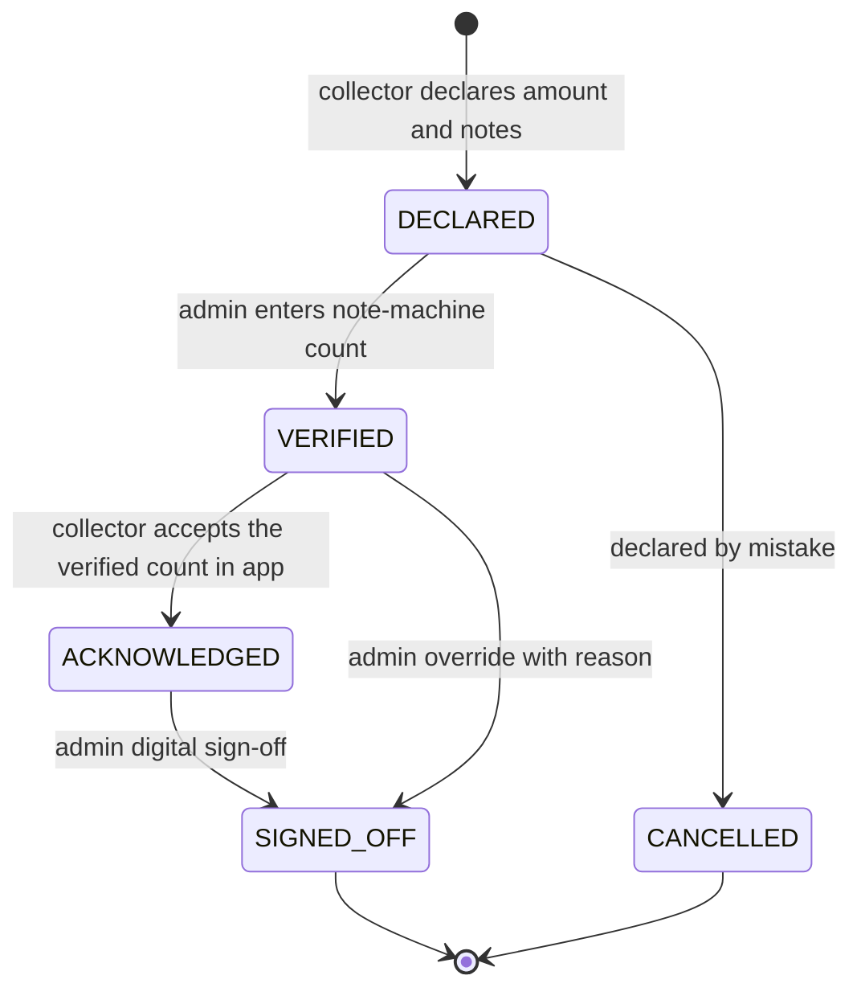
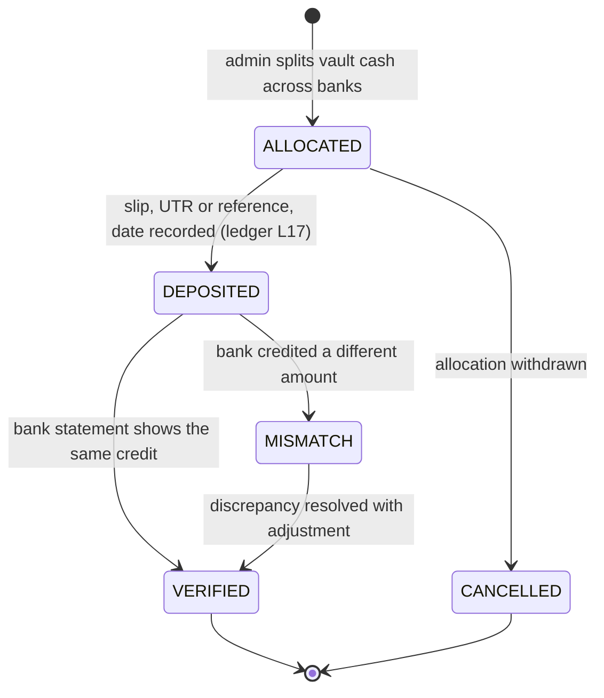
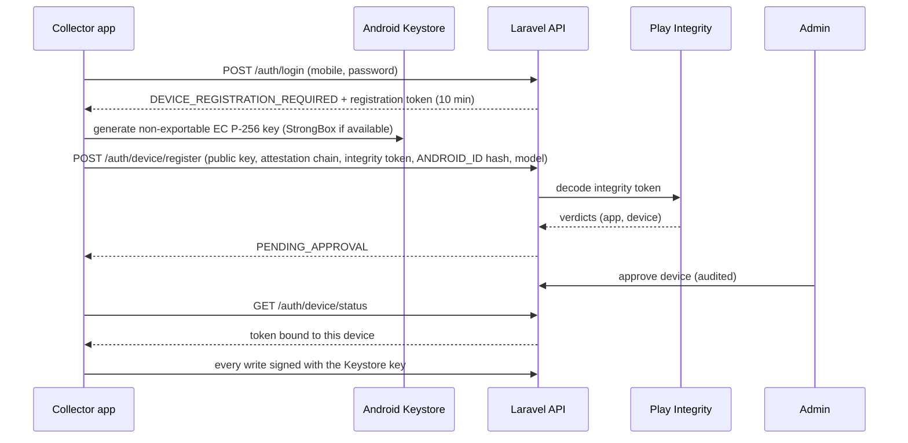

# Cash Collection & Retailer Operations Platform — Architecture Specification

| | |
|---|---|
| **Document** | ARCH-2026-09-30, version 0.1 — **DRAFT for approval** |
| **Client** | Guru Ji Enterprises (Jhajjar) |
| **Functional source** | *Executive Specification & System Architecture — Distributor Cash Collection & Retailer Operations Platform* (CMS-SPEC-2026-V1, 6 pages) |
| **Binding decisions** | Master Development Prompt (final architecture decisions) + decisions recorded in §0.2 |
| **Precedence** | Master prompt fixed decisions → decisions in §0.2 → PDF functional requirements → defaults proposed in this document |
| **Status of code** | None written. Implementation starts only after this document is approved. |

---

## Contents

0. [Decisions, scope and conventions](#0-decisions-scope-and-conventions)
1. [Final system architecture](#1-final-system-architecture)
2. [Component architecture](#2-component-architecture)
3. [Database ERD](#3-database-erd)
4. [Database tables](#4-database-tables)
5. [API architecture](#5-api-architecture)
6. [Role / permission matrix](#6-role--permission-matrix)
7. [Admin panel sitemap](#7-admin-panel-sitemap)
8. [Collector app sitemap](#8-collector-app-sitemap)
9. [Retailer app sitemap](#9-retailer-app-sitemap)
10. [Pickup state machine](#10-pickup-state-machine)
11. [Geofence architecture](#11-geofence-architecture)
12. [Wallet / ledger architecture](#12-wallet--ledger-architecture)
13. [Collector float architecture](#13-collector-float-architecture)
14. [Vault architecture](#14-vault-architecture)
15. [Bank / reconciliation architecture](#15-bank--reconciliation-architecture)
16. [Notification architecture](#16-notification-architecture)
17. [GPS architecture](#17-gps-architecture)
18. [Security architecture](#18-security-architecture)
19. [Hostinger deployment architecture](#19-hostinger-deployment-architecture)
20. [Development roadmap](#20-development-roadmap)
21. [Risks and ambiguities](#21-risks-and-ambiguities)
- [Appendix A — Settings and defaults](#appendix-a--settings-and-defaults)
- [Appendix B — API error codes](#appendix-b--api-error-codes)
- [Appendix C — Critical and security test matrix](#appendix-c--critical-and-security-test-matrix)
- [Appendix D — Edge-case handling matrix](#appendix-d--edge-case-handling-matrix)

---

## 0. Decisions, scope and conventions

### 0.1 Fixed decisions (master prompt — not negotiable)

- Exactly three roles: **ADMIN, COLLECTOR, RETAILER**. No Distributor role, panel, dashboard, entity, wallet, ledger, API, table, permission, controller, model, middleware or UI.
- Everything the PDF assigns to the "Distributor" is performed by **Admin**: crediting retailer wallets, the vault handover desk, float reset, sub-network retailer management.
- Web = **Laravel Blade + Tailwind CSS + Alpine.js + Livewire** inside the Laravel app. No Next.js, no React admin, no required SPA, no Node.js backend, no Docker/Kubernetes.
- Mobile = **Flutter + Dart** (Collector app, Retailer app), Android first.
- Laravel is the only backend. Google Maps (the PDF's "Mapbox" label is superseded). FCM for push. Bluetooth thermal printing.
- No PostgreSQL/PostGIS — geospatial work uses the MySQL-family spatial functions (see §0.3).
- Deployable directly on **Hostinger Cloud**; Redis is optional, never required.

### 0.2 Decisions confirmed on 2026-09-30

| # | Question | Decision |
|---|---|---|
| D1 | Hosting target | **Hostinger Cloud with MariaDB.** SQL must run on MariaDB 10.6+ and MySQL 8.0. Real-time uses FCM + AJAX polling; queue is cron-driven. Reverb stays switchable via `.env` for a future VPS move. |
| D2 | Where the retailer wallet lives | **Internal wallet.** This system owns the wallet ledger. The balance is spent on Recharge and BBPS inside the Retailer app. AEPS/DMT run on another platform and are **out of scope**; the PDF's NPCI/UIDAI biometric guard therefore does not apply. |
| D3 | Collection vs outstanding (udhar) | **A confirmed collection loads the wallet 1:1** (PDF: "+₹40k Loaded"). Udhar is created only by Admin credit disbursals (and penalties when the wallet is short). Udhar is settled by the retailer's **[PAY]** from wallet or by an Admin entry. A partial-collection shortfall is informational, not a debt. |
| D4 | Retailer shop staff (PDF §3.A.3) | **Staff logins under the RETAILER role.** Extra user accounts linked to the same shop, marked OWNER or STAFF. Staff may raise requests and Accept & Confirm but cannot spend the wallet. No fourth role. |

### 0.3 Deviations forced by verified facts (flagged, not silent)

| Master prompt says | Fact | Resolution |
|---|---|---|
| "MySQL 8.0" | Hostinger Web/Cloud plans run **MariaDB**, not MySQL 8 ([Hostinger support](https://www.hostinger.com/support/1583226-which-database-management-system-is-used-at-hostinger/)). | Target MariaDB (version confirmed with `SELECT VERSION()` on the account in Phase 1; minimum 10.6). SQL stays portable to MySQL 8: no SRID-dependent geography, no MySQL-8-only syntax. |
| "Laravel Reverb where supported" | Hostinger Web/Cloud "only allow outgoing connections via WebSocket"; apps cannot bind a listening port, so Reverb cannot run there ([Laracasts thread quoting Hostinger](https://laracasts.com/discuss/channels/laravel/update-on-laravel-reverb-implementation-issues-with-shared-hosting)). | Real-time = FCM push + cursor-based AJAX polling. Broadcasting code stays behind Laravel's broadcaster so `BROADCAST_CONNECTION=reverb` works unchanged on a VPS. |
| "Laravel Queues" (workers) | No supervisor / long-running processes on Cloud plans. | Database queue drained by the scheduler every minute (`queue:work --stop-when-empty`). Time-critical pushes (pickup offers, SOS) are sent **in-request after the response is flushed**, never via the cron-drained queue. |
| PDF "IMEI Lock" | Android 10+ does not let ordinary apps read IMEI. | Device binding = hardware-backed Android Keystore key pair + request signing + Play Integrity verdict + ANDROID_ID as a secondary signal + Admin approval (§18.3). |
| PDF "PostGIS 100 m check" | PostGIS excluded. | Authoritative 100 m decision is computed server-side in PHP (haversine); MariaDB spatial (`POLYGON`, `ST_Contains`) is used for zone polygons (§11). |

### 0.4 PDF requirements carried into scope that the master prompt did not list

| PDF item | Treatment |
|---|---|
| Retailer team / operator staff (p.4 §A.3) | In scope per D4. |
| Automated WhatsApp PDF receipt (p.3 #16, p.4 #11) | In scope behind `WhatsAppProviderInterface`; `log` driver until a WhatsApp Business provider is chosen (§21 A25). |
| Two printed slips (p.6 Phase 3) | Retailer copy + Collector copy. |
| Silent SOS via power button ×3, streamed to Admin **and nearby collectors** (p.3 #17) | In scope; power-button trigger is best-effort (§17.8, §21 A22). |
| 1-tap "masked" call (p.3 #9) | Tap-to-call in v1; true number masking needs a telephony provider (§21 A24). |
| Per-retailer penalty slab ₹50–₹200 and ₹35/₹15 split (p.2 #16) | In scope; needs a collector-payable ledger account (§12). |
| Tally/Excel export (p.2 #5) | Excel/CSV/PDF in scope; Tally XML format open (§21 A28). |
| Default collector per retailer (p.2 #9) | In scope; semantics open (§21 A19). |
| Note-counting machine verification at vault (p.2 #15) | Manual entry of machine totals (§21 A29). |
| Offline cryptographic tokens for basement shops (p.5, p.6 #3) | In scope as **offline capture only**, never offline settlement (§12.9). |
| Duty suspension, bike speed/battery on live map, polygon zones | In scope. |

### 0.5 Out of scope

AEPS and DMT transactions, biometric (RD service) capture, NPCI/UIDAI integration (D2). Distributor anything. Retailer **web** portal (the PDF mentions "Merchant Web/App"; the master prompt defines a Flutter app only — §21 A36). iOS builds (Flutter keeps the option open; not planned). Automated police dispatch (no API exists — §21 A23).

### 0.6 Conventions used throughout

| Topic | Convention |
|---|---|
| Money | Integer **paise** in `BIGINT` columns named `*_paise`. ₹40,000 = `4000000`. No floats anywhere in money paths (PHP `int`, Dart `int`). Display with Indian grouping (₹1,00,000). |
| Time | Stored in **UTC** (`DATETIME(6)` for event times). App timezone `UTC`, DB session `+00:00`. Displayed in **Asia/Kolkata**. Server clock is authoritative; device clocks are recorded but never trusted. |
| Business date | The IST calendar date of the server timestamp (`business_date` columns). Used by reports, reconciliation and day close. |
| Identifiers | Internal `BIGINT UNSIGNED` auto-increment keys never leave the server for business entities. APIs expose a `public_id` (ULID) plus human-readable numbers (`PU-20260930-000123`, `WTX-…`, `RCPT/2026-27/000123`). |
| Coordinates | `DECIMAL(10,7)` latitude/longitude. Spatial columns use SRID 0 with x = longitude, y = latitude (portable across MariaDB and MySQL 8). |
| Naming | Tables plural snake_case; enums as `VARCHAR(40)` backed by PHP enums (portable, readable in SQL, no `ALTER` for new values). |

---

## 1. Final system architecture

### 1.1 Topology



One Laravel application serves three surfaces:

| Surface | Path | Auth | Consumers |
|---|---|---|---|
| Admin web panel | `/admin/*` | Session cookie + CSRF + optional TOTP 2FA | Admin users |
| Admin JSON (live widgets, maps, AJAX actions) | `/api/v1/admin/*` | Same session (Sanctum stateful) | Admin panel only |
| Mobile API | `/api/v1/*` | Sanctum bearer token; collector requests also carry a device signature | Collector app, Retailer app |
| Webhooks | `/api/v1/webhooks/*` | Provider signature / shared secret | Recharge, BBPS, WhatsApp providers |

### 1.2 Principles that every component obeys

1. **Server authority.** Role, user, collector, retailer, amount, balance, GPS verdict, job ownership and status are derived or validated on the server. Client values are inputs to validation, never facts.
2. **One door per invariant.** Every pickup status change goes through `PickupStateMachine`; every money movement goes through `LedgerService::post()`; every audit record through `AuditLogger`. No controller writes these tables directly.
3. **Atomicity.** A business action (for example "submit collection") runs in one database transaction: state change + ledger postings + wallet passbook row + audit record + outbox event commit together or not at all.
4. **Idempotency.** Every state-changing mobile call carries an `Idempotency-Key`. Domain rows carry unique business keys as a second line of defence.
5. **Real-time is a convenience.** Push and polling only tell clients to re-read state. No financial decision depends on a push arriving.
6. **Portable SQL.** Nothing that needs MySQL-8-only or MariaDB-only behaviour.

### 1.3 Real-time strategy on Hostinger Cloud

| Need | Mechanism | Typical latency |
|---|---|---|
| New pickup offer to collectors | FCM high-priority data message sent in-request after the response is flushed + collector app polls `/collector/offers` every 5 s while on duty | 1–5 s |
| "Job taken" dismissal to losing collectors | FCM data message + next offer poll | 1–5 s |
| Retailer sees collector identity, location, ETA | Retailer app polls `/pickups/{id}/tracking` every 10 s while the tracking screen is open | ≤ 10 s |
| Admin dashboard KPIs, live map, SOS siren | Admin page polls `/api/v1/admin/live/*` (5–10 s) using cursors and ETags | 5–10 s |
| Everything else | Cursor-based event feed `/api/v1/events?cursor=` backed by the `realtime_events` outbox | ≤ poll interval |

The broadcast window (90 s) and other timers are evaluated **lazily** on every read or write of the pickup (under the row lock) and also by a one-minute sweep, so a retailer's status poll advances an expired window immediately instead of waiting for cron.

### 1.4 Key design choices and alternatives considered

| Topic | Chosen | Alternatives rejected and why |
|---|---|---|
| Money model | **Double-entry ledger** (`ledger_entries` + `ledger_postings`, every entry sums to zero) with a retailer-facing passbook (`wallet_transactions`) | Single-entry wallet table: simpler, but the 360° reconciliation (collector float ↔ vault ↔ bank ↔ wallets ↔ udhar) would need ad-hoc cross-checks and cannot prove "every rupee is somewhere". |
| First-to-accept lock | **InnoDB row lock** (`SELECT … FOR UPDATE`) + conditional `UPDATE … WHERE status='BROADCASTING'` + unique generated column on active assignment | Redis lock: not available on Cloud. Optimistic version only: correct but noisier retries. Client-side lock: forbidden. |
| Real-time | **FCM + polling**, broadcaster abstraction kept | Pusher/Ably: extra paid vendor and data egress for a small fleet. Reverb: impossible on Cloud. |
| Device binding | **Keystore key pair + signed requests + Play Integrity + Admin approval** | IMEI: unavailable. ANDROID_ID alone: trivially spoofed on rooted devices. |
| Geofence maths | **PHP haversine** on the authoritative path; DB spatial for zone polygons | DB distance functions differ between MariaDB and MySQL 8 (SRID/axis-order behaviour); keeping the decision in tested PHP avoids that. |
| Excel I/O | **OpenSpout via `spatie/simple-excel`** (streaming) | PhpSpreadsheet loads whole files into memory, risky under shared-hosting memory limits. |

---

## 2. Component architecture

### 2.1 Repository layout

```
/backend-laravel          Laravel app: admin panel, API, business logic, scheduler
/collector_app            Flutter app (Android application id fixed in Phase 5)
/retailer_app             Flutter app (Android application id fixed in Phase 5)
/packages/cms_core        Shared Dart package: API client, envelope, models, auth, formatting  (addition to the master structure)
/docs                     Architecture, API reference, deployment, backup and runbooks
```

`/packages/cms_core` is an addition: both apps share the same API envelope, error codes, money formatting and auth flow, and duplicating them would drift.

### 2.2 Laravel application layers



```
backend-laravel/app/
  Enums/                 PickupStatus, CollectionStatus, WalletTxnType, WalletTxnStatus, LedgerAccountCategory, …
  Http/
    Controllers/Admin/   Blade + Livewire pages (session auth)
    Controllers/Api/V1/  Auth, Collector, Retailer, Pickup, Wallet, Recharge, Bbps, Gps, Vault, Sos, Notification, Event, Meta, Admin/*
    Controllers/Webhooks/
    Middleware/          RequestId, ForceJson, SecurityHeaders, MinAppVersion, EnsureRole, EnsureBoundDevice, VerifyDeviceSignature, Idempotency
    Requests/            One Form Request per write endpoint
    Resources/           API Resources (never expose internal ids)
  Livewire/Admin/        Live tables, filter bars, import preview, vault desk
  Models/                Eloquent models (explicit $fillable; money fields never fillable)
  Policies/              One per aggregate (Pickup, Retailer, Collector, Document, WalletTransaction, …)
  Services/
    Auth/                DeviceBindingService, DeviceSignatureVerifier, PlayIntegrityVerifier, TokenService
    Pickup/              PickupRequestService, BroadcastService, AssignmentService, PickupStateMachine, PickupSweeper
    Geo/                 GeoMath, GeofenceService, LocationIngestService, MockLocationHeuristics, ZoneResolver, EtaEstimator
    Cash/                CollectionService, DenominationValidator, OfflineVoucherService, ReceiptService
    Ledger/              LedgerService, AccountResolver, WalletService, BalanceQuery
    Float/               FloatService
    Vault/               VaultHandoverService, BankDepositService
    Reconciliation/      ReconciliationService, DayCloseService, checks/*
    Penalty/             PenaltyService
    Recharge/            RechargeService, RechargeProviderInterface, Providers/MockRechargeProvider
    Bbps/                BbpsService, BBPSProviderInterface, Providers/MockBbpsProvider
    Notify/              PushService (FCM v1), NotificationRouter, RealtimePublisher, WhatsAppProviderInterface, SmsProviderInterface
    Import/              RetailerImportService
    Report/              ReportRegistry, Reports/*, Exporters (Csv, Xlsx, Pdf)
    Audit/               AuditLogger (hash chain)
    Support/             Clock, NumberSequence, Money, Settings
  Events/ Listeners/ Jobs/ Notifications/ Console/Commands/
```

### 2.3 Domain services (responsibilities and dependencies)

| Service | Does | Depends on |
|---|---|---|
| `PickupRequestService` | Create (retailer lock rule), cancel (penalty rules) | PickupStateMachine, BroadcastService, PenaltyService, AuditLogger |
| `BroadcastService` | Compute eligible collectors, create offers, start/advance windows, send offer pushes | FloatService, ZoneResolver, EtaEstimator, PushService |
| `AssignmentService` | Accept (first-to-accept lock), admin assign/reassign, collector release | PickupStateMachine, FloatService |
| `PickupStateMachine` | The only writer of `pickup_requests.status`; validates transition table, writes `pickup_events` | — |
| `GeofenceService` | Arrival detection, unlock check, submit re-check, "unable to collect" claim check | GeoMath, MockLocationHeuristics, Settings |
| `LocationIngestService` | Validate, flag and store GPS batches; update collector last-known position | MockLocationHeuristics |
| `CollectionService` | Submit ("Add Wallet & Approve"), confirm ("Accept & Confirm"), dispute, admin resolve/override | GeofenceService, DenominationValidator, LedgerService, WalletService, ReceiptService |
| `LedgerService` | Post balanced entries under account row locks; reversals; balance cache | — |
| `WalletService` | Passbook rows, available/pending balances, holds for recharge/BBPS, udhar payment | LedgerService |
| `FloatService` | Held / reserved / capacity, eligibility decision | BalanceQuery |
| `VaultHandoverService` | Declare → verify → acknowledge → sign-off; discrepancy resolution | LedgerService |
| `BankDepositService` | Allocation, deposit, verification, mismatch | LedgerService |
| `ReconciliationService` | 360° checks, discrepancy records, day close | BalanceQuery |
| `PenaltyService` | Evaluate, apply, waive/refund | LedgerService, WalletService |
| `RechargeService` / `BbpsService` | Hold → provider call (outside the DB transaction) → settle or reverse; status polling; webhooks | Provider interfaces, WalletService |
| `PushService` | FCM HTTP v1, token hygiene, delivery log | — |
| `AuditLogger` | Append-only, hash-chained audit rows inside the caller's transaction | RequestId context |

### 2.4 Middleware stacks

| Route group | Middleware (in order) |
|---|---|
| `web` admin | `RequestId`, `SecurityHeaders`, session, CSRF, `auth:web`, `EnsureRole:admin`, `2fa` (when enabled), `permission:*` per route |
| `api/v1` public (`/auth/login`, `/meta`) | `RequestId`, `ForceJson`, `SecurityHeaders`, `MinAppVersion`, `throttle:auth` |
| `api/v1` collector | … + `auth:sanctum`, `EnsureRole:collector`, `EnsureBoundDevice`, `VerifyDeviceSignature` (all writes), `Idempotency` (writes), `throttle:collector` |
| `api/v1` retailer | … + `auth:sanctum`, `EnsureRole:retailer`, `EnsureRetailerMembership`, `Idempotency` (writes), `throttle:retailer` |
| `api/v1/admin` | `RequestId`, `ForceJson`, session (Sanctum stateful), `EnsureRole:admin`, `permission:*` |
| `api/v1/webhooks` | `RequestId`, `ForceJson`, `VerifyWebhookSignature:{provider}`, `throttle:webhooks` |

### 2.5 Flutter architecture (both apps)

| Layer | Contents |
|---|---|
| Presentation | Screens, widgets; `go_router` routes; large-touch design system (48 dp minimum targets, high-contrast outdoor theme for the collector app) |
| Application | Riverpod `Notifier`/`AsyncNotifier` per feature; every action exposes loading / success / error / offline / timeout states |
| Domain | Immutable models (`freezed`), `Money` value type (int paise), enums mirroring server enums |
| Data | Repositories → `ApiClient` (Dio) from `cms_core`; local encrypted store (`drift` + SQLCipher) for cache and the offline queue |
| Platform | Kotlin `SecurityBridge` (Keystore key generation and signing, key attestation, Play Integrity token, mock-location / developer-options / root / emulator signals); foreground location service; Bluetooth printer |

Dio interceptors (in `cms_core`): auth header, `X-Request-Id`, `X-App-Version`, `Idempotency-Key` (generated once per user action and reused on retries), collector request signing, server-time offset capture, retry with backoff for idempotent calls only, 401 → session-expired flow, 426 → forced update.

Feature folders follow §68 of the master prompt:

- **Collector:** `auth, device, duty, pickups, gps, cash_collection, wallet, receipt, printer, vault, sos, notifications` (+ `settings`, `profile`)
- **Retailer:** `auth, pickups, tracking, cash_confirmation, wallet, passbook, outstanding, recharge, bbps, receipts, notifications` (+ `staff`, `broadcasts`, `settings`, `profile`)

Key packages: `flutter_riverpod`, `go_router`, `dio`, `flutter_secure_storage`, `firebase_core`, `firebase_messaging`, `flutter_local_notifications`, `google_maps_flutter`, `geolocator`, `flutter_background_service`, `permission_handler`, `device_info_plus`, `battery_plus`, `connectivity_plus`, `url_launcher`, `drift` + `sqlcipher_flutter_libs`, `freezed`, `json_serializable`, `intl` (en_IN), `print_bluetooth_thermal` + `esc_pos_utils_plus`, `share_plus`. Exact versions are pinned in Phase 5.

### 2.6 Blade component library (admin)

`x-dashboard-card`, `x-data-table` (server-side sort/filter/paginate), `x-status-badge`, `x-modal`, `x-confirm-dialog` (typed confirmation for money actions), `x-alert`, `x-toast`, `x-pagination`, `x-filter-bar`, `x-map-container` (Google Maps JS, polls a JSON endpoint), `x-collector-status`, `x-pickup-status`, `x-wallet-summary`, `x-cash-summary`, `x-float-meter`, `x-transaction-table`, `x-timeline`, `x-audit-timeline`, `x-money` (₹ Indian grouping), `x-datetime-ist`, `x-siren` (SOS audio, enabled by one click per session because browsers block autoplay).

---

## 3. Database ERD

Attributes are listed in §4; the diagrams show relationships only. There is no distributor entity anywhere in the model.

### 3.1 Identity, actors and geography



### 3.2 Pickup and cash



### 3.3 Ledger, vault, bank and reconciliation



Each retailer wallet, retailer receivable (udhar), collector cash (float), collector payable, vault and bank account has exactly one row in `ledger_accounts` (§12.2).

---

## 4. Database tables

**Patterns used below**

- **Marker columns** enforce "at most one active row" in the database itself, portable to MariaDB 10.6+ and MySQL 8:
  `open_slot TINYINT AS (CASE WHEN status IN ('COMPLETED','CANCELLED','EXPIRED','FAILED') THEN NULL ELSE 1 END) STORED` with `UNIQUE (retailer_id, open_slot)`. Unique indexes ignore `NULL`, so closed rows are unlimited while a second open row fails with a duplicate-key error.
- **Immutable tables** (`ledger_entries`, `ledger_postings`, `audit_logs`, `pickup_events`, `geofence_checks`, `collector_locations`): models throw on update/delete. `BEFORE UPDATE/DELETE` triggers that `SIGNAL` an error are added if the Hostinger database user has the `TRIGGER` privilege (verified in Phase 2).
- **Soft deletes** only on `users`, `collectors`, `retailers`, `documents`. Financial rows are never deleted — they are reversed.
- All tables have `created_at`/`updated_at` unless marked append-only. All foreign keys are `ON DELETE RESTRICT` unless noted.

### 4.1 Identity and access

| Table | Key columns | Constraints and indexes |
|---|---|---|
| `users` | id, public_id, name, mobile (E.164), email, password, role (`admin`/`collector`/`retailer`), status (ACTIVE/BLOCKED/PENDING), is_super_admin, must_change_password, two_factor_secret (encrypted), two_factor_confirmed_at, failed_login_count, locked_until, last_login_at, last_login_ip, deleted_at | UNIQUE mobile, UNIQUE email, INDEX (role, status). `role` is set at creation and never changed. |
| `roles`, `permissions`, `model_has_roles`, `model_has_permissions`, `role_has_permissions` | spatie/laravel-permission tables (these implement the master prompt's `roles`, `permissions`, `role_user`) | Exactly three roles seeded; creating roles is disabled in code and UI. |
| `personal_access_tokens` | Sanctum columns + device_id, expires_at, last_used_ip | Token stored hashed; INDEX device_id. |
| `devices` | id, public_id, user_id, platform, fingerprint_hash, public_key_pem, key_hardware_backed, attestation_ok, last_integrity_verdict (JSON), model, manufacturer, os_version, app_version, status (PENDING_APPROVAL/ACTIVE/REVOKED), active_marker (generated), approved_by_user_id, approved_at, revoked_by_user_id, revoked_at, revoke_reason, last_seen_at | UNIQUE (user_id, active_marker): one active device per user. UNIQUE (fingerprint_hash, active_marker): one phone cannot be active for two collectors. |
| `device_push_tokens` | id, user_id, device_id, token, platform, last_seen_at | UNIQUE token. |
| `request_nonces` | device_id, nonce, expires_at | PK (device_id, nonce). Pruned hourly. |
| `idempotency_keys` | id, user_id, idem_key, method, route, request_hash, status (IN_PROGRESS/COMPLETED), response_status, response_body, locked_until, expires_at | UNIQUE (user_id, idem_key). Retained 48 h. |
| Laravel infrastructure | `sessions`, `password_reset_tokens`, `cache`, `cache_locks`, `jobs`, `job_batches`, `failed_jobs` | Database drivers (no Redis required). |

### 4.2 Geography

| Table | Key columns | Constraints and indexes |
|---|---|---|
| `territories` | id, parent_id, type (CITY/AREA/WARD), name, code, status | UNIQUE code; self-FK parent_id. Administrative hierarchy only. |
| `zones` | id, territory_id, name, code, boundary (`POLYGON`, SRID 0), boundary_geojson (JSON, for map rendering), color, status | UNIQUE code; SPATIAL INDEX (boundary). Operational polygons ("Ward 4", "Rural East") used for retailer placement and broadcast. |
| `collector_zones` | collector_id, zone_id, is_primary | PK (collector_id, zone_id). |

### 4.3 Actors

| Table | Key columns | Constraints and indexes |
|---|---|---|
| `collectors` | id, public_id, user_id, collector_code (COL-104), employee_id, vehicle_type, vehicle_number, float_limit_paise (default 10000000 paise = ₹1,00,000), float_balance_paise (cache of ledger), duty_status (OFF_DUTY/ON_DUTY), status (ACTIVE/SUSPENDED/INACTIVE), current_duty_session_id, last_lat, last_lng, last_accuracy_m, last_speed_kmh, last_bearing, last_battery_pct, last_location_at, gps_state (OK/STALE/DISABLED/PERMISSION_DENIED/MOCK_SUSPECTED), risk_score, emergency_contact_name, emergency_contact_mobile, deleted_at | UNIQUE user_id, collector_code, employee_id; INDEX (status, duty_status); INDEX (last_lat, last_lng). |
| `retailers` | id, public_id, retailer_code, shop_name, owner_name, mobile, alt_mobile, address, landmark, city, pincode, lat, lng, zone_id, territory_id, default_collector_id, gstin, pan_encrypted, kyc_status (PENDING/VERIFIED/REJECTED), status (ACTIVE/BLOCKED/INACTIVE), penalty_amount_paise (nullable override), penalty_collector_share_paise (nullable override), deleted_at | UNIQUE retailer_code, mobile, gstin; INDEX (zone_id, status). Only Admin can change lat/lng. |
| `retailer_users` | id, retailer_id, user_id, shop_role (OWNER/STAFF), can_request, can_confirm, can_spend, can_manage_staff, status, owner_marker (generated), created_by_user_id | UNIQUE user_id (one shop per login); UNIQUE (retailer_id, owner_marker): exactly one active owner. |
| `retailer_locations` | id, retailer_id, lat, lng, source (IMPORT/ADMIN/ONBOARDING), reason, changed_by_user_id, effective_from, created_at | Append-only GPS history. |

### 4.4 Duty and GPS

| Table | Key columns | Constraints and indexes |
|---|---|---|
| `duty_sessions` | id, collector_id, device_id, status (OPEN/CLOSED/FORCE_CLOSED), open_marker (generated), punch_in_at, punch_in_lat, punch_in_lng, punch_in_accuracy_m, punch_in_zone_id, vehicle_number, odometer_start_km, float_at_punch_in_paise, punch_out_at, punch_out_lat, punch_out_lng, punch_out_accuracy_m, odometer_end_km, float_at_punch_out_paise, open_jobs_at_punch_out, vault_status_at_punch_out, closed_by_user_id, close_reason | UNIQUE (collector_id, open_marker): one open session per collector. |
| `collector_locations` | id, collector_id, duty_session_id, device_id, pickup_id, sos_alert_id, lat, lng, accuracy_m, speed_mps, bearing, altitude_m, fix_time (device), received_at (server), is_mocked, battery_pct, flags (bitmask: STALE, TELEPORT, LOW_ACCURACY, MOCK, LATE_UPLOAD, CLOCK_SKEW) | INDEX (collector_id, received_at); INDEX (pickup_id). Append-only; retention 90 days (setting). |
| `gps_events` | id, collector_id, device_id, type (GPS_DISABLED, PERMISSION_DENIED, MOCK_DETECTED, TELEPORT, STALE, DEV_OPTIONS_ON, ROOT_DETECTED, EMULATOR, INTEGRITY_FAIL, SERVICE_KILLED, RESTORED), severity, payload (JSON), occurred_at, acknowledged_by_user_id, acknowledged_at | INDEX (collector_id, occurred_at); INDEX (type, occurred_at). |

### 4.5 Pickups

| Table | Key columns | Constraints and indexes |
|---|---|---|
| `pickup_requests` | id, public_id, pickup_no, retailer_id, created_by_user_id, requested_amount_paise, target_lat, target_lng (snapshot of the registered shop location), request_lat, request_lng, request_accuracy_m (retailer phone at request time), zone_id, status, open_slot (generated), collector_id, broadcast_round, offer_expires_at, pending_since, accepted_at, en_route_at, arrived_at, unlocked_at, counting_started_at, submitted_at, completed_at, cancelled_at, cancelled_by_user_id, cancel_reason, failed_reason, expired_at, version | UNIQUE pickup_no; **UNIQUE (retailer_id, open_slot)** enforces one open request per retailer; INDEX (status, offer_expires_at); INDEX (collector_id, status); INDEX (retailer_id, created_at); CHECK requested_amount_paise > 0. `requested_amount_paise` is never updated. |
| `pickup_offers` | id, pickup_id, collector_id, round, distance_m, eta_s, status (OFFERED/PASSED/ACCEPTED/SUPERSEDED/EXPIRED), offered_at, responded_at, push_status | UNIQUE (pickup_id, collector_id, round); INDEX (collector_id, status). Only collectors with an offer row may accept. |
| `pickup_assignments` | id, pickup_id, collector_id, assigned_via (BROADCAST_ACCEPT/ADMIN_ASSIGN/ADMIN_REASSIGN), assigned_by_user_id, assigned_at, released_at, release_reason, active_marker (generated) | **UNIQUE (pickup_id, active_marker)**: at most one active assignment per pickup. |
| `pickup_events` | id, pickup_id, event, from_status, to_status, actor_user_id, actor_role, payload (JSON), occurred_at | INDEX (pickup_id, id). Append-only timeline, including the SUBMITTED, CONFIRMED and PARTIAL events. |
| `geofence_checks` | id, pickup_id, collector_id, device_id, purpose (ARRIVAL/UNLOCK/SUBMIT/FAIL_CLAIM/OFFLINE_SYNC), lat, lng, accuracy_m, fix_time, received_at, distance_m (DECIMAL 9,2), result (PASS/FAIL), fail_reasons (JSON), unlock_token_hash, unlock_expires_at | INDEX (pickup_id, id); UNIQUE unlock_token_hash. Append-only. |
| `offline_authorizations` | id, pickup_id, collector_id, device_id, nonce, max_amount_paise, issued_at, expires_at, consumed_at | UNIQUE nonce. |
| `offline_vouchers` | id, voucher_uuid, offline_authorization_id, pickup_id, collector_id, device_id, payload (JSON), device_signature, verification_code, captured_elapsed_ms, received_at, result (ACCEPTED/REJECTED), reject_reason | UNIQUE voucher_uuid; UNIQUE offline_authorization_id (single use). |

### 4.6 Cash and receipts

| Table | Key columns | Constraints and indexes |
|---|---|---|
| `cash_collections` | id, public_id, collection_no, pickup_id, retailer_id, collector_id, requested_amount_paise (snapshot), collected_amount_paise, shortfall_paise, other_amount_paise (coins), note_count, collection_type (FULL/PARTIAL), partial_reason, status (PENDING_RETAILER_CONFIRMATION/CONFIRMED/DISPUTED/VOIDED), source (ONLINE/OFFLINE_VOUCHER), client_txn_uuid, submit_geofence_check_id, submitted_at, confirmed_at, confirmed_by_user_id, confirmed_via (RETAILER_APP/ADMIN_OVERRIDE/ADMIN_DISPUTE_RESOLUTION), dispute_reason, retailer_claimed_amount_paise, submit_entry_id, confirm_entry_id | UNIQUE pickup_id; UNIQUE client_txn_uuid; UNIQUE collection_no; CHECK collected_amount_paise > 0; CHECK shortfall_paise = requested − collected. |
| `cash_denominations` | id, owner_type (COLLECTION/HANDOVER_DECLARED/HANDOVER_VERIFIED), owner_id, denomination_paise, count, line_total_paise | UNIQUE (owner_type, owner_id, denomination_paise); CHECK line_total_paise = denomination_paise × count. |
| `receipts` | id, public_id, receipt_no, pickup_id, collection_id, retailer_id, collector_id, status (PROVISIONAL/FINAL/VOID), verification_code, pdf_path (private disk), pdf_sha256, print_count, last_printed_at, whatsapp_status, whatsapp_message_id, finalized_at | UNIQUE receipt_no; UNIQUE collection_id. |
| `number_sequences` | name, next_value, updated_at | PK name (for example `RCPT/2026-27`); incremented under a row lock so numbers never repeat. |

### 4.7 Ledger, wallet, services and penalties

| Table | Key columns | Constraints and indexes |
|---|---|---|
| `ledger_accounts` | id, code, category, type (ASSET/LIABILITY/INCOME/EXPENSE/EQUITY), owner_type, owner_id, balance_paise (signed cache), allow_negative, status | UNIQUE code; UNIQUE (category, owner_type, owner_id). |
| `ledger_entries` | id, public_id, entry_no, type, business_date, reference_type, reference_id, reverses_entry_id, idempotency_key, narration, source (COLLECTOR_APP/RETAILER_APP/ADMIN_WEB/SYSTEM/PROVIDER_CALLBACK), created_by_user_id, approved_by_user_id, posted_at | UNIQUE entry_no; UNIQUE idempotency_key; UNIQUE reverses_entry_id (an entry is reversed at most once); INDEX (business_date, type). Immutable. |
| `ledger_postings` | id, entry_id, account_id, amount_paise (signed: + debit, − credit), balance_after_paise, posted_at | INDEX (account_id, id); INDEX (entry_id). Immutable. Postings of one entry sum to zero. |
| `wallets` | id, retailer_id, wallet_account_id, receivable_account_id, status (ACTIVE/FROZEN) | UNIQUE retailer_id. |
| `wallet_transactions` | id, public_id, txn_no, wallet_id, retailer_id, type, direction (CREDIT/DEBIT), amount_paise, status, balance_after_paise, ledger_entry_id, reference_type, reference_id, related_txn_id, description, source, created_by_user_id, completed_at | UNIQUE txn_no; UNIQUE (reference_type, reference_id, type); INDEX (wallet_id, created_at); INDEX (status, type). The retailer passbook. |
| `recharge_transactions` | id, public_id, txn_no, retailer_id, initiated_by_user_id, provider, operator_code, circle_code, subscriber_number, amount_paise, status (INITIATED/PROCESSING/SUCCESS/FAILED/REFUNDED), provider_ref, operator_ref, idempotency_key, debit_txn_id, refund_txn_id, request_payload, response_payload (both redacted JSON), status_checks, last_status_check_at | UNIQUE txn_no; UNIQUE (provider, provider_ref); INDEX (status, last_status_check_at). |
| `bbps_transactions` | id, public_id, txn_no, retailer_id, initiated_by_user_id, provider, category, biller_id, customer_params_encrypted, bill_fetch_ref, bill_amount_paise, ccf_paise, amount_paise, status, provider_ref, bbps_txn_ref, debit_txn_id, refund_txn_id, payloads (redacted), status_checks, last_status_check_at | Same pattern as recharge. |
| `penalties` | id, pickup_id, retailer_id, collector_id, amount_paise, collector_share_paise, admin_share_paise, reason, charged_to (WALLET/RECEIVABLE), status (APPLIED/WAIVED/REFUNDED), ledger_entry_id | UNIQUE pickup_id; CHECK collector_share + admin_share = amount. |
| `penalty_waivers` | id, penalty_id, type (WAIVE/REFUND), reason, approved_by_user_id, ledger_entry_id, created_at | UNIQUE penalty_id. |
| `collector_payouts` | id, collector_id, amount_paise, method (CASH_FROM_VAULT/BANK_TRANSFER/SALARY_OFFSET), reference, ledger_entry_id, paid_by_user_id, paid_at | Payouts of the collectors' penalty share. |

### 4.8 Vault and bank

| Table | Key columns | Constraints and indexes |
|---|---|---|
| `vaults` | id, code, name, address, lat, lng, status | UNIQUE code. One "Central Vault" is seeded; the model allows more hubs later. |
| `vault_batches` | id, vault_id, business_date, batch_no, status (OPEN/CLOSED), opening_balance_paise, closing_balance_paise, closed_by_user_id, closed_at | UNIQUE (vault_id, business_date). |
| `vault_handovers` | id, public_id, handover_no, vault_batch_id, collector_id, duty_session_id, expected_amount_paise (ledger snapshot), declared_amount_paise, verified_amount_paise, difference_paise, status (DECLARED/VERIFIED/ACKNOWLEDGED/SIGNED_OFF/CANCELLED), discrepancy_resolution (NONE/RECOVER_FROM_COLLECTOR/WRITE_OFF/OVERAGE_SUSPENSE), resolution_note, declared_at, verified_by_user_id, verified_at, acknowledged_at, signed_off_by_user_id, signed_off_at, ledger_entry_id, client_txn_uuid | UNIQUE handover_no; UNIQUE client_txn_uuid; INDEX (collector_id, status). |
| `vault_transactions` | id, vault_id, vault_batch_id, direction (IN/OUT), type (HANDOVER_IN/BANK_DEPOSIT_OUT/OVERAGE_IN/COLLECTOR_PAYOUT_OUT/ADJUSTMENT), amount_paise, reference_type, reference_id, ledger_entry_id, created_by_user_id, created_at | The vault cash book; INDEX (vault_batch_id). Append-only. |
| `bank_accounts` | id, bank_name, account_name, account_number_encrypted, account_number_hash, account_number_last4, ifsc, branch, account_type (CURRENT/SAVINGS/CC/OD), ledger_account_id, status | UNIQUE (ifsc, account_number_hash). The UI shows only the masked number. |
| `bank_deposits` | id, public_id, deposit_no, vault_batch_id, bank_account_id, amount_paise, status (ALLOCATED/DEPOSITED/VERIFIED/MISMATCH/CANCELLED), allocated_by_user_id, allocated_at, deposited_by_user_id, deposit_date, utr_reference, slip_document_id, bank_credited_amount_paise, bank_credited_on, verified_by_user_id, verified_at, ledger_entry_id | UNIQUE deposit_no; **UNIQUE (bank_account_id, utr_reference)** blocks duplicate UTRs. |

### 4.9 Reconciliation

| Table | Key columns | Constraints and indexes |
|---|---|---|
| `reconciliation_runs` | id, business_date, trigger (SCHEDULED/MANUAL), status, started_at, finished_at, triggered_by_user_id, summary (JSON) | INDEX business_date. |
| `reconciliation_discrepancies` | id, run_id, business_date, type, subject_type, subject_id, expected_paise, actual_paise, difference_paise, details (JSON), status (OPEN/INVESTIGATING/RESOLVED/WRITTEN_OFF), resolution_note, resolution_entry_id, resolved_by_user_id, resolved_at | UNIQUE (business_date, type, subject_type, subject_id) so re-runs update rather than duplicate. |
| `business_day_closes` | business_date (PK), closed_by_user_id, closed_at, summary (JSON), open_discrepancies | A closed day rejects new entries dated inside it. |

### 4.10 Communication and safety

| Table | Key columns | Constraints and indexes |
|---|---|---|
| `notifications` | Laravel database notifications (uuid id, type, notifiable, data JSON, read_at) | The in-app inbox and the source of truth when push fails. |
| `notification_deliveries` | id, notification_id, channel (FCM/WHATSAPP/SMS/MAIL), target, status (SENT/FAILED/INVALID_TOKEN), provider_message_id, error, attempts, created_at | INDEX (notification_id). |
| `broadcasts` | id, public_id, title, message, priority (INFO/IMPORTANT/EMERGENCY), audience (ALL_RETAILERS/SELECTED_RETAILERS), show_as_popup, starts_at, ends_at, status (SCHEDULED/ACTIVE/ENDED/CANCELLED), created_by_user_id | INDEX (status, starts_at). |
| `broadcast_recipients` | broadcast_id, retailer_id | PK (broadcast_id, retailer_id). Used for SELECTED_RETAILERS. |
| `broadcast_reads` | broadcast_id, user_id, delivered_at, read_at, acknowledged_at | PK (broadcast_id, user_id). |
| `outstanding_reminders` | id, retailer_id, reminder_date (IST), amount_paise, sent_at, channels (JSON) | UNIQUE (retailer_id, reminder_date) plus a 24-hour check on sent_at. |
| `sos_alerts` | id, public_id, collector_id, device_id, duty_session_id, pickup_id, trigger (IN_APP_BUTTON/POWER_BUTTON), client_event_uuid, lat, lng, accuracy_m, battery_pct, cash_holding_paise (server snapshot), status (ACTIVE/ACKNOWLEDGED/RESOLVED/FALSE_ALARM), triggered_at, acknowledged_by_user_id, acknowledged_at, resolved_by_user_id, resolved_at, resolution_note | UNIQUE client_event_uuid; INDEX status. |
| `sos_notified_collectors` | sos_alert_id, collector_id, distance_m, notified_at | PK (sos_alert_id, collector_id). |
| `realtime_events` | id (cursor), audience_type (ADMIN/COLLECTOR/RETAILER), audience_id, event, payload (JSON), created_at | INDEX (audience_type, audience_id, id). Pruned after 24 h. |

### 4.11 Documents, audit, settings, imports and exports

| Table | Key columns | Constraints and indexes |
|---|---|---|
| `documents` | id, public_id, documentable_type, documentable_id, category (GST/KYC_AADHAAR_MASKED/PAN/SHOP_PHOTO/ID_PROOF/EMPLOYEE_DOC/VEHICLE_RC/DRIVING_LICENCE/DEPOSIT_SLIP/IMPORT_FILE/OTHER), original_name, stored_path, mime, size_bytes, sha256, encrypted, status (UPLOADED/VERIFIED/REJECTED), uploaded_by_user_id, verified_by_user_id, verified_at, deleted_at | INDEX (documentable_type, documentable_id). Files live on the private disk only. |
| `audit_logs` | id, occurred_at, actor_user_id, actor_role, actor_type (USER/SYSTEM/SCHEDULER/PROVIDER), action, entity_type, entity_id, before (JSON), after (JSON), ip, user_agent, device_id, request_id, meta (JSON), prev_hash, hash | INDEX (entity_type, entity_id); INDEX (actor_user_id, occurred_at); INDEX (action, occurred_at); UNIQUE hash. Append-only, hash-chained (§18.7). |
| `settings` | key, value (JSON), type, group, description, updated_by_user_id, updated_at | PK key. Every change is audited. |
| `import_batches` | id, type (RETAILERS), document_id, status (UPLOADED/VALIDATING/VALIDATED/IMPORTING/COMPLETED/FAILED/CANCELLED), total_rows, valid_rows, invalid_rows, duplicate_rows, imported_rows, options (JSON), uploaded_by_user_id, committed_by_user_id | — |
| `import_rows` | id, import_batch_id, row_number, raw (JSON), normalized (JSON), status (VALID/INVALID/DUPLICATE/IMPORTED/FAILED), errors (JSON), created_retailer_id | INDEX (import_batch_id, status). |
| `report_exports` | id, report_key, filters (JSON), format (CSV/XLSX/PDF), status, file_path, row_count, requested_by_user_id, expires_at | Queued exports, downloadable by the requester only. |

Mapping to the master prompt's table list: `role_user` → spatie's `model_has_roles`; `vaults`, `vault_batches`, `vault_transactions` are kept and joined by `vault_handovers` for the handover workflow; `notifications`, `broadcasts`, `documents`, `audit_logs`, `sos_alerts`, `gps_events`, `receipts`, `settings` and the rest keep their names. Added: ledger, idempotency, offers, events, reconciliation, import, export and support tables listed above.

---

## 5. API architecture

### 5.1 Conventions

| Topic | Rule |
|---|---|
| Base path | `/api/v1`. No `/api/v1/distributor/*` exists. |
| Format | JSON only (`ForceJson` middleware). UTF-8. Money as integer `*_paise`; clients format for display. |
| Identifiers | `public_id` (ULID) in URLs and payloads; internal ids never leave the server. |
| Envelope | Always `{ "success", "message", "data", "errors" }`, plus additive `code` and `meta` fields. |
| Errors | `errors` is a list of `{ "field", "code", "message" }`. The top-level `code` is machine-readable (Appendix B). |
| HTTP status | 200/201 success · 401 unauthenticated / token expired · 403 forbidden / device not bound · 404 not found **or not yours** (no existence leaks) · 409 state conflict (already accepted, request in progress) · 422 validation or business-rule failure · 426 app update required · 429 rate limited · 5xx server. |
| Server time | Every response carries `meta.server_time` (UTC). Apps derive a clock offset for countdowns and never use the device clock for business logic. |
| Pagination | Lists: `?page=&per_page=` (max 100) with `meta.pagination`. Feeds (events, GPS, passbook exports): cursor-based. |
| Versioning | Breaking changes → `/api/v2`. Apps send `X-App-Version`; below `min_app_version` the API answers 426. |
| Documentation | OpenAPI 3.1 generated from routes and Form Requests (Scramble or equivalent), plus a curated `docs/api.md` with flows and examples. |

Success and error examples:

```json
{ "success": true, "code": "OK", "message": "Pickup accepted", 
  "data": { "pickup": { "id": "01J9…", "status": "ACCEPTED", "requested_amount_paise": 4000000 } },
  "errors": [], "meta": { "server_time": "2026-09-30T04:45:12.418Z", "request_id": "c1f…" } }
```

```json
{ "success": false, "code": "PICKUP_ALREADY_ACCEPTED", "message": "Pickup already accepted by another collector.",
  "data": null, "errors": [], "meta": { "server_time": "2026-09-30T04:45:12.901Z", "request_id": "9ab…" } }
```

### 5.2 Required headers

| Header | Who | Purpose |
|---|---|---|
| `Authorization: Bearer <token>` | Mobile | Sanctum token (hashed at rest, expiring, device-bound for collectors). |
| `X-Request-Id` | All | Client-generated UUID; echoed back and stored in audit logs as the correlation id. |
| `X-App-Version` | Mobile | Forced-update check. |
| `Idempotency-Key` | All state-changing mobile calls (marked **I** below) | UUID generated once per user action and reused on every retry of that action. |
| `X-Device-Id`, `X-Timestamp`, `X-Nonce`, `X-Signature` | Collector writes (marked **S** below) | ECDSA P-256 signature by the Keystore key over `METHOD \n PATH \n SHA256(body) \n timestamp \n nonce \n device_id`. Timestamp within ±120 s of server time; nonce single-use per device for 10 minutes. |

### 5.3 Idempotency behaviour

1. The middleware inserts `(user_id, idem_key, request_hash, IN_PROGRESS)`. A duplicate key causes the insert to fail on the unique index; the middleware then reads the existing row:
   - `COMPLETED` with the same `request_hash` → replay the stored status and body (no second execution).
   - `COMPLETED` with a different hash → 422 `IDEMPOTENCY_KEY_REUSED`.
   - `IN_PROGRESS` → 409 `REQUEST_IN_PROGRESS` (client retries after a short delay).
2. After the handler finishes, the response is stored with the row marked `COMPLETED`. 5xx responses are not stored, so a retry re-executes, which is safe because the failed transaction rolled back. An `IN_PROGRESS` row whose `locked_until` (60 s) has passed — for example after a crash — is treated as abandoned and the retry re-executes; if the crashed attempt had in fact committed, the domain keys below make the service return that existing result instead of creating a second one.
3. Domain uniqueness backs this up: `cash_collections.pickup_id`, `cash_collections.client_txn_uuid`, `ledger_entries.idempotency_key`, `vault_handovers.client_txn_uuid`, `sos_alerts.client_event_uuid`, `bank_deposits (bank_account_id, utr_reference)`.

### 5.4 Endpoints

**I** = requires `Idempotency-Key`. **S** = requires device signature (collector).

#### Auth — `/api/v1/auth`

| Method | Path | Actor | I/S | Notes |
|---|---|---|---|---|
| POST | `/auth/login` | Public | — | `{mobile, password, app}`. Retailer → token. Collector with an active bound device → token bound to that device; otherwise `DEVICE_REGISTRATION_REQUIRED` + short-lived registration token. |
| POST | `/auth/device/register` | Collector (registration token) | I | Public key, attestation chain, Play Integrity token, device info → `PENDING_APPROVAL`. |
| GET | `/auth/device/status` | Collector (registration token) | — | Poll approval; returns the full token once `ACTIVE`. |
| POST | `/auth/token/rotate` | Any | S (collector) | Issues a new token, revokes the old one (sliding expiry). |
| POST | `/auth/logout` | Any | — | Revokes the current token and its push token. |
| GET | `/auth/me` | Any | — | Profile, role, shop membership and flags, or collector profile. |
| POST | `/auth/password/change` | Any | — | Also clears `must_change_password`. |
| POST | `/auth/password/forgot` · `/auth/password/reset` | Public | — | SMS OTP when an SMS provider is configured; otherwise Admin-initiated reset (§21 A26). |

#### Meta and events

| Method | Path | Actor | Notes |
|---|---|---|---|
| GET | `/meta` | Public | `server_time`, `min_app_version`, enabled denominations, broadcast window, geofence radius, feature flags. |
| GET | `/events?cursor=` | Any authenticated | Polling feed from `realtime_events`, filtered to the caller's audience. |

#### Collector — `/api/v1/collector`

| Method | Path | I/S | Notes |
|---|---|---|---|
| GET | `/collector/dashboard` | — | Duty state, float meter, active job, today's counts. |
| GET | `/collector/duty/current` | — | Open duty session or null. |
| POST | `/collector/duty/punch-in` | I S | GPS fix, vehicle number, odometer start. Server records time, zone and starting float. |
| POST | `/collector/duty/punch-out` | I S | GPS fix, odometer end. Blocked while a job is active. |
| GET | `/collector/float` | — | Held, reserved, limit, available capacity. |
| GET | `/collector/float/history` | — | Postings on the collector's cash account. |
| GET | `/collector/offers` | — | Live offers with `expires_at`, distance, ETA. |
| POST | `/collector/offers/{offer}/pass` | S | Declines one offer. |
| GET | `/collector/jobs` · `/collector/jobs/{pickup}` | — | Active and past jobs; details include shop contact and target coordinates. |

#### Pickups — `/api/v1/pickups` (actions scoped by role and ownership)

| Method | Path | Actor | I/S | Notes |
|---|---|---|---|---|
| POST | `/pickups` | Retailer (can_request) | I | `{requested_amount_paise, request_fix}`. 409 `PREVIOUS_PICKUP_OPEN` while a cycle is open. |
| GET | `/pickups/{pickup}` | Retailer of the shop · offered/assigned collector | — | Lazily advances expired windows. |
| GET | `/pickups/{pickup}/tracking` | Retailer of the shop | — | Collector name, code, mobile, vehicle, last location, distance, ETA, last update time. |
| GET | `/pickups/{pickup}/cancel-preview` | Retailer | — | The penalty that would apply now. |
| POST | `/pickups/{pickup}/cancel` | Retailer (can_request) | I | Applies penalty rules (§12.7). |
| POST | `/pickups/{pickup}/accept` | Collector with an open offer | I S | First-to-accept lock (§10.4). |
| POST | `/pickups/{pickup}/start-trip` | Assigned collector | I S | → `EN_ROUTE`. |
| POST | `/pickups/{pickup}/geofence/unlock` | Assigned collector | I S | Current fix → server check → unlock token (+ offline authorization). |
| POST | `/pickups/{pickup}/counting` | Assigned collector | I S | → `CASH_COUNTING` (needs a valid unlock). |
| POST | `/pickups/{pickup}/collection` | Assigned collector | I S | **Add Wallet & Approve**: fix, unlock token, denominations, collected amount, partial reason, `client_txn_uuid`. |
| POST | `/pickups/{pickup}/offline-vouchers` | Assigned collector | I S | Sync an offline capture (§12.9). |
| POST | `/pickups/{pickup}/release` | Assigned collector | I S | Hands the job back with a reason (before submission only). |
| POST | `/pickups/{pickup}/unable-to-collect` | Assigned collector | I S | Shop closed / retailer absent / no cash. Requires a passing geofence check. |
| POST | `/pickups/{pickup}/confirm` | Retailer (can_confirm) | I | **Accept & Confirm**. |
| POST | `/pickups/{pickup}/dispute` | Retailer (can_confirm) | I | `{reason, claimed_amount_paise}`. |
| GET | `/pickups/{pickup}/receipt` · `/receipt.pdf` | Shop users · assigned collector | — | JSON for thermal print; PDF streamed through a policy-checked controller. |
| POST | `/pickups/{pickup}/receipt/printed` | Assigned collector | S | Records a print. |

#### Retailer — `/api/v1/retailer`

| Method | Path | Actor | I | Notes |
|---|---|---|---|---|
| GET | `/retailer/dashboard` | Shop users | — | Wallet available and pending, outstanding, open pickup and lock reason, active pop-ups. |
| GET | `/retailer/pickups` | Shop users | — | History. |
| GET | `/retailer/outstanding` | Owner | — | Udhar balance and reminder history. |
| POST | `/retailer/outstanding/pay` | Owner (can_spend) | I | Pays udhar from the wallet. |
| GET/POST/PATCH/DELETE | `/retailer/staff[/{user}]` | Owner (can_manage_staff) | I (POST) | Add, update, deactivate staff logins. |
| GET | `/retailer/broadcasts/active` | Shop users | — | Pop-up notices currently in force. |
| POST | `/retailer/broadcasts/{broadcast}/acknowledge` | Shop users | — | Read receipt. |

#### Wallet, Recharge, BBPS — `/api/v1/wallet`, `/api/v1/recharge`, `/api/v1/bbps`

| Method | Path | Actor | I | Notes |
|---|---|---|---|---|
| GET | `/wallet` | Owner | — | Available, pending confirmation, outstanding. |
| GET | `/wallet/passbook` | Owner | — | Filters: from, to, type. Opening and closing balance per period. |
| GET | `/wallet/transactions/{txn}` | Owner | — | Detail with references. |
| GET | `/recharge/operators` · `/recharge/plans` | Owner | — | Plans only if the provider supports them. |
| POST | `/recharge` | Owner (can_spend) | I | Hold → provider → settle or reverse. |
| GET | `/recharge/{txn}` · `/recharge/history` | Owner | — | — |
| GET | `/bbps/categories` · `/bbps/billers` | Owner | — | — |
| POST | `/bbps/bills/fetch` | Owner | — | Bill fetch where the biller supports it. |
| POST | `/bbps/payments` | Owner (can_spend) | I | Hold → provider → settle or reverse. |
| GET | `/bbps/payments/{txn}` · `/bbps/history` | Owner | — | — |

#### GPS, Vault, SOS, Notifications

| Method | Path | Actor | I/S | Notes |
|---|---|---|---|---|
| POST | `/gps/batch` | Collector | S | Up to 60 fixes per call (§17.3). |
| POST | `/gps/events` | Collector | S | GPS off, permission revoked, mock detected, service killed. |
| GET | `/vault/summary` | Collector | — | Expected cash (server), open handover. |
| POST | `/vault/handovers` | Collector | I S | Declare amount and denominations. |
| POST | `/vault/handovers/{handover}/acknowledge` | Collector | I S | Accept the Admin-verified count. |
| GET | `/vault/handovers` | Collector | — | History. |
| POST | `/sos` | Collector | I S | `client_event_uuid`, fix, battery, trigger type. |
| POST | `/sos/{alert}/cancel` | Collector | S | Requests FALSE_ALARM; Admin still reviews. |
| GET | `/sos/nearby` | Collector | — | Active SOS of colleagues within the alert radius. |
| GET | `/notifications` | Any | — | In-app inbox. |
| POST | `/notifications/{id}/read` · `/read-all` | Any | — | — |
| POST/DELETE | `/notifications/push-tokens[/{token}]` | Any | — | FCM token registration. |

#### Admin JSON — `/api/v1/admin`, `/api/v1/banks`, `/api/v1/reports` (session-authenticated, permission-checked)

The admin panel is server-rendered Blade/Livewire. These JSON endpoints serve live widgets, maps and in-page actions:

| Area | Endpoints |
|---|---|
| Live | `GET /admin/live/summary`, `/admin/live/collectors`, `/admin/live/pickups`, `/admin/live/alerts` |
| Pickups | `POST /admin/pickups/{p}/assign`, `/reassign`, `/rebroadcast`, `/cancel`, `/confirm-override`, `/dispute/resolve` (all I; override and resolve need re-entered password) |
| Collectors and devices | `POST /admin/devices/{d}/approve`, `/revoke`; `POST /admin/collectors/{c}/suspend`, `/force-punch-out` |
| Wallet and ledger | `POST /admin/retailers/{r}/credit-disbursals`, `/admin/retailers/{r}/adjustments` (I; step-up; maker-checker above threshold), `GET /admin/ledger/accounts/{a}/statement` |
| Vault | `GET /admin/vault/handovers`, `POST /admin/vault/handovers/{h}/verify`, `/sign-off`, `POST /admin/vault/batches/{b}/close`, `POST /admin/collectors/{c}/payouts` |
| Banks | `GET/POST/PATCH /banks/accounts`, `POST /banks/deposits` (allocate), `POST /banks/deposits/{d}/deposited`, `/verify` |
| Reconciliation | `POST /admin/reconciliation/runs`, `GET /admin/reconciliation/discrepancies`, `POST /admin/reconciliation/discrepancies/{d}/resolve`, `POST /admin/reconciliation/day-close` |
| Penalties | `POST /admin/penalties/{p}/waive` |
| SOS | `POST /admin/sos/{s}/acknowledge`, `/resolve` |
| Reports | `GET /reports/{key}` (preview, paginated), `POST /reports/{key}/exports` (queued CSV/XLSX/PDF) |
| Imports and documents | `POST /admin/imports/retailers`, `GET /admin/imports/{batch}`, `POST /admin/imports/{batch}/commit`; `POST /admin/documents`, `GET /admin/documents/{d}/download` |

#### Webhooks — `/api/v1/webhooks`

`POST /webhooks/recharge/{provider}`, `POST /webhooks/bbps/{provider}`, `POST /webhooks/whatsapp`. Each verifies the provider's signature or shared secret and is idempotent on the provider reference. A webhook can only move a transaction forward along its state machine; the provider status is re-queried before any refund.

---

## 6. Role / permission matrix

Three roles only. Admin users can be given a subset of admin permissions (presets below); this does not create new roles. Retailer OWNER/STAFF is a shop-membership attribute, not a role.

| Capability | Admin | Collector | Retailer owner | Retailer staff |
|---|---|---|---|---|
| Log in to admin panel | ✔ | — | — | — |
| Log in to collector app (bound device only) | — | ✔ | — | — |
| Log in to retailer app | — | — | ✔ | ✔ |
| Create / cancel own shop's pickup | — | — | ✔ | ✔ (can_request) |
| View own shop's pickups, collector identity and tracking | ✔ (all) | — | ✔ | ✔ |
| Receive offers, accept, pass | — | ✔ (eligible only) | — | — |
| Geofence unlock, submit collection, release, unable-to-collect | — | ✔ (assigned job only) | — | — |
| Accept & Confirm / Dispute | — | — | ✔ | ✔ (can_confirm) |
| Assign, reassign, rebroadcast, cancel any pickup | `pickups.manage` | — | — | — |
| Confirm on behalf of retailer, resolve disputes | `pickups.override` | — | — | — |
| View wallet balance and passbook | `ledger.view` | — | ✔ | — (default, §21 A37) |
| Recharge, BBPS, pay udhar | — | — | ✔ (can_spend) | — |
| Credit disbursal (udhar), manual wallet adjustment | `wallet.adjust` | — | — | — |
| Waive / refund penalty | `penalties.manage` | — | — | — |
| Punch in/out, send GPS, trigger SOS | — | ✔ | — | — |
| View own float and float history | ✔ (all) | ✔ (own) | — | — |
| Declare / acknowledge vault handover | — | ✔ (own) | — | — |
| Verify handover | `vault.operate` | — | — | — |
| Vault sign-off (moves collector float) | `vault.signoff` | — | — | — |
| Bank accounts; deposits | `banks.manage`; `deposits.manage` | — | — | — |
| Reconciliation, discrepancy resolution, day close | `reconciliation.manage` | — | — | — |
| Live operations and live map | `live.view` | — | — | — |
| Acknowledge / resolve SOS | `sos.manage` | ✔ (see nearby SOS) | — | — |
| Broadcasts and notifications | `broadcasts.manage` | — | receive | receive |
| Manage shop staff | — | — | ✔ | — |
| Collectors, retailers, territories, zones | `collectors.manage`, `retailers.manage`, `zones.manage` | — | — | — |
| Approve / revoke collector devices | `devices.manage` | — | — | — |
| Documents: upload / download | `documents.manage` / `documents.view` | — | — | — |
| Reports; exports | `reports.view`; `reports.export` | — | — | — |
| Audit logs | `audit.view` | — | — | — |
| Users; permissions; settings; bulk import | `users.manage`; `permissions.manage` (super admin only); `settings.manage`; `imports.manage` | — | — | — |

**Row-level scoping (enforced by policies, never by client input):** a collector sees only their own offers, jobs, float, handovers and SOS; retailer users see only their own shop; the retailer sees the assigned collector's live location only while the pickup is between `ACCEPTED` and `RETAILER_PENDING_CONFIRMATION`.

**Admin permission presets** (applied to ADMIN users): *Super Admin* (everything, including permissions), *Operations* (live, pickups, collectors, retailers, zones, SOS, broadcasts), *Vault & Finance* (vault, banks, deposits, reconciliation, ledger, wallet adjustments, reports), *Viewer* (read-only views and reports).

---

## 7. Admin panel sitemap

```
/admin/login ...................... 1  Login (+ TOTP challenge, forgot password)
/admin ............................ 2  Dashboard (KPI cards, queues, alerts, recent transactions and audit)
/admin/collectors ................. 3  Collectors: list · create · detail tabs [Profile, Device, Duty sessions,
                                       GPS track replay, Jobs, Float ledger, Handovers, Payouts, Documents, Audit]
/admin/devices ....................    Device approvals and revocations (linked from Collectors)
/admin/retailers .................. 4  Retailers: list · create · detail tabs [Profile & GPS pin, Shop logins,
                                       Wallet & passbook, Outstanding, Pickups, Collector history, Penalties, Documents, Audit]
/admin/pickups .................... 5  Pickup Requests: pending queue · broadcasting · active · history · detail
                                       [timeline, offers, geofence checks, assignment, collection, receipt]
/admin/live ....................... 6  Live Operations board (queue, active jobs, collector status, alerts)
/admin/live/map ................... 7  Live GPS Map (collectors, retailers, zones overlay, SOS focus)
/admin/territories ................ 8  Territories (city → area → ward)
/admin/zones ...................... 9  Zones (polygon editor on Google Maps, collector assignment)
/admin/collections ................ 10 Cash Collections (list, denominations, disputes queue)
/admin/ledger ..................... 11 Wallet Ledger (date-wise ledger, account statements, credit disbursal,
                                       adjustments, recharge/BBPS monitor)
/admin/outstanding ................ 12 Outstanding (udhar by retailer, ageing, reminder log)
/admin/float ...................... 13 Collector Float (held / reserved / limit, high-cash alerts)
/admin/vault ...................... 14 Vault desk (pending handovers, verify, sign-off, batches, cash book, payouts)
/admin/banks ...................... 15 Bank Accounts
/admin/deposits ................... 16 Bank Deposits (allocate, record deposit + slip + UTR, verify)
/admin/reconciliation ............. 17 Reconciliation (360° view, runs, discrepancies, day close)
/admin/penalties .................. 18 Penalties (applied, waived, refunded)
/admin/notifications .............. 19 Notifications (send, delivery log)
/admin/broadcasts ................. 20 Broadcasts (pop-up notices, targeting, read status)
/admin/sos ........................ 21 SOS Alerts (active with siren, history)
/admin/documents .................. 22 Documents (search, verify, download — audited)
/admin/reports .................... 23 Reports (16 reports, filters, exports)
/admin/audit ...................... 24 Audit Logs (filter, entity timeline, chain verification status)
/admin/users ...................... 25 Users (admin users; links to collector and retailer logins)
/admin/permissions ................ 26 Roles & Permissions (3 fixed roles, admin permission presets)
/admin/settings ................... 27 Settings (operations, geofence, float, penalty, notifications, integrations)
/admin/imports ....................    Bulk retailer import (upload, preview, commit) — reached from Retailers
/admin/profile ....................    Own password, 2FA
```

---

## 8. Collector app sitemap

```
1 Splash ─► 2 Login ─► 3 Device Verification (register / waiting for approval)
                   └─► 4 Duty Punch-In (GPS, vehicle, odometer) ─► 5 Home Dashboard
5 Home Dashboard
├── 6 Cash Float Meter ─► 19 Cash Float History
├── 7 Available Jobs  (+ full-screen incoming offer: siren, 90 s countdown, [ACCEPT & LOCK] / [Pass])
│    └── 8 Job Details
│         ├── 10 Retailer Details (tap-to-call)
│         ├── 9  Navigation (in-app map + open Google Maps turn-by-turn)
│         ├── 11 GPS Status (distance to shop, accuracy, freshness, [Unlock Cash Desk])
│         └── 12 Cash Collection (unlocked only after server check)
│              ├── 13 Denomination Calculator
│              ├── 14 Partial Collection (reason)
│              └── 15 Add Wallet & Approve ─► 16 Receipt ─► 17 Bluetooth Printer (2 copies)
├── 18 Job History ─► 16 Receipt (reprint)
├── 20 Vault Handover (declare, see verified count, acknowledge)
├── 21 SOS (also a persistent button on every screen)
├── 22 Notifications
├── 23 Profile (duty summary, Punch-Out)
└── 24 Settings (printer pairing, permission checks, battery-optimisation guide, logout)
```

---

## 9. Retailer app sitemap

```
1 Splash ─► 2 Login ─► 3 Dashboard
3 Dashboard  (Admin pop-up modal on top while active · Outstanding card with [PAY] · lock banner)
├── 4 Create Pickup (locked with the reason while a cycle is open)
├── 5 Pickup Status
│    ├── 6 Assigned Collector (name, ID, mobile [Call], vehicle)
│    ├── 7 Live Collector Tracking (map, distance, ETA, last update)
│    └── 8 Cash Confirmation ─► 9 Accept & Confirm  |  Dispute
├── 10 Wallet ─► 11 Passbook ─► transaction detail
├── 12 Outstanding ─► pay from wallet
├── 13 Recharge
├── 14 BBPS
├── 15 Transaction History (pickups, recharge, BBPS)
├── 16 Receipt (view, download PDF, share)
├── 17 Notifications
├── 18 Admin Broadcast (list; pop-up modal)
├── 19 Profile ─► 21 Shop Staff (owner only; addition from PDF §3.A.3)
└── 20 Settings
```

Staff logins see only screens 1–9, 16–18 and 20 by default (§21 A37).

---

## 10. Pickup state machine

### 10.1 States

Stored in `pickup_requests.status` and written only by `PickupStateMachine`:

`PENDING, BROADCASTING, ACCEPTED, EN_ROUTE, ARRIVED, GEOFENCE_UNLOCKED, CASH_COUNTING, RETAILER_PENDING_CONFIRMATION, DISPUTED, COMPLETED, CANCELLED, EXPIRED, FAILED`

Three names from the master prompt are **events, not resting states**, recorded in `pickup_events`. The reasons:

| Master status | Implemented as | Why |
|---|---|---|
| `SUBMITTED` | Event on the transition into `RETAILER_PENDING_CONFIRMATION` | Submission and "awaiting retailer" happen in the same transaction; a separate resting state could never be observed. |
| `CONFIRMED` | Event on the transition into `COMPLETED` | Confirmation, wallet credit, receipt finalisation and unlocking the next request are one atomic step (PDF p.4 #7: "1-sec me credit finalize"). |
| `PARTIAL` | `cash_collections.collection_type = PARTIAL` + `PARTIAL` event | A partial collection still has to go through retailer confirmation, so it is an attribute of the collection, not an alternative lifecycle. |



### 10.2 Transition table (the diagram's edges with their guards)

| From | To | Trigger / actor | Guards (all server-side) | Side effects in the same transaction |
|---|---|---|---|---|
| — | PENDING | Retailer `POST /pickups` | Retailer ACTIVE; user can_request; no open pickup (row lock on retailer + unique `open_slot`); amount within limits; shop has a GPS pin | Snapshot target location, resolve zone, `PICKUP_CREATED` event, audit |
| PENDING | BROADCASTING | System at creation, sweep, or admin rebroadcast | ≥ 1 eligible collector (§10.3) | Offer rows, `offer_expires_at = now + 90 s`, round + 1; pushes after commit |
| BROADCASTING | BROADCASTING / PENDING | Lazy check on any read/write, or the one-minute sweep | `now ≥ offer_expires_at` | Old offers → EXPIRED; next round (wider radius) or PENDING + Admin alert + retailer message |
| BROADCASTING | ACCEPTED | Collector `accept` | Open offer for this collector and round; window open; collector eligible under lock | Assignment row, other offers SUPERSEDED, identity pushed to retailer and Admin |
| PENDING | ACCEPTED | Admin `assign` | Collector eligible (Admin may override zone, **not** float cap, duty or device) | Assignment `ADMIN_ASSIGN`, audit with reason |
| ACCEPTED | EN_ROUTE | Collector `start-trip` (or first movement > 50 m) | Assigned collector | — |
| ACCEPTED / EN_ROUTE | ARRIVED | GPS ingest | Fix within approach radius (default 250 m) | "Collector is arriving" to retailer |
| ACCEPTED / EN_ROUTE / ARRIVED | GEOFENCE_UNLOCKED | Collector `geofence/unlock` | All checks of §11.2 pass | Unlock token (15 min), offline authorization |
| GEOFENCE_UNLOCKED | CASH_COUNTING | Collector `counting` | Valid unlock token | — |
| GEOFENCE_UNLOCKED / CASH_COUNTING | RETAILER_PENDING_CONFIRMATION | Collector `collection` (**Add Wallet & Approve**) | Geofence re-check passes; denominations sum exactly; collected ≤ requested; unlock token valid | Collection, denominations, ledger L2, pending passbook row, provisional receipt, `SUBMITTED` (+ `PARTIAL`) event; push to retailer |
| ACCEPTED…CASH_COUNTING | BROADCASTING | Collector `release` / Admin rebroadcast | Before submission only | Assignment released with reason; new round |
| ACCEPTED…CASH_COUNTING | ACCEPTED (new collector) | Admin `reassign` | New collector eligible | Old assignment released, new one created; both collectors and retailer notified |
| ARRIVED / GEOFENCE_UNLOCKED / CASH_COUNTING | FAILED | Collector `unable-to-collect` / Admin | Passing FAIL_CLAIM geofence check (a "shop closed" excuse must be made at the shop) | Retailer notified; lock released |
| PENDING / BROADCASTING / ACCEPTED…CASH_COUNTING | CANCELLED | Retailer / Admin | Not yet submitted | Penalty evaluation (§12.7); lock released |
| PENDING | EXPIRED | Sweep | `pending_since + pending_max_minutes` passed | Retailer notified; lock released |
| RETAILER_PENDING_CONFIRMATION | COMPLETED | Retailer `confirm` / Admin `confirm-override` | Caller belongs to the shop and can_confirm (or Admin with `pickups.override`, reason and password) | Ledger L3, passbook row COMPLETED, receipt FINAL, PDF + WhatsApp queued, `CONFIRMED` + `COMPLETED` events; lock released |
| RETAILER_PENDING_CONFIRMATION | DISPUTED | Retailer `dispute` | Same as confirm | Collection DISPUTED; Admin alert |
| DISPUTED | COMPLETED / FAILED | Admin resolve | `pickups.override` | Ledger L4/L5 as needed; audit before/after |

Once cash has been handed over (`RETAILER_PENDING_CONFIRMATION`), the retailer cannot cancel, only confirm or dispute.

### 10.3 Broadcast eligibility

A collector receives an offer only if, at broadcast time, all of the following hold:

- User and collector are ACTIVE; duty session OPEN; bound device ACTIVE; no active SOS; no handover in progress.
- Last location is fresh (≤ 120 s) and not flagged as mock.
- Zone rule (setting `broadcast_mode`, default `ZONE_OR_RADIUS`): assigned to the retailer's zone, **or** within `broadcast_radius_km` (default 5 km; round 2 doubles it) of the shop.
- Active jobs < `max_concurrent_jobs` (default 1).
- Float check passes (§13.3).

The retailer's default collector, if eligible, is always included and listed first (§21 A19). Distance uses haversine; ETA = distance × 1.3 road factor ÷ `avg_speed_kmh` (default 20). No paid routing API by default (§21 A34).

### 10.4 First-to-accept lock (exactly one winner)

```php
DB::transaction(function () use ($pickupId, $collectorId) {
    $pickup = PickupRequest::whereKey($pickupId)->lockForUpdate()->firstOrFail();   // 1. serialise on the pickup row
    $this->sweeper->advanceIfExpired($pickup);                                       // 2. timers evaluated under the lock
    if ($pickup->status !== PickupStatus::Broadcasting) {
        throw new PickupAlreadyTaken();                                              //    → 409 PICKUP_ALREADY_ACCEPTED
    }
    $offer = $pickup->openOfferFor($collectorId) ?? throw new NoOpenOffer();         // 3. only offered collectors may accept
    $collector = Collector::whereKey($collectorId)->lockForUpdate()->firstOrFail();  // 4. lock collector (float, concurrency)
    $this->float->assertCanTake($collector, $pickup);                                //    → 422 FLOAT_LIMIT_REACHED, …
    $won = PickupRequest::whereKey($pickup->id)
        ->where('status', PickupStatus::Broadcasting)                                 // 5. conditional update (second guard)
        ->update(['status' => PickupStatus::Accepted, 'collector_id' => $collectorId,
                  'accepted_at' => now(), 'version' => DB::raw('version + 1')]);
    if ($won !== 1) throw new PickupAlreadyTaken();
    PickupAssignment::create([...]);                                                  // 6. UNIQUE(pickup_id, active_marker) = third guard
    $offer->accept(); $pickup->supersedeOtherOffers();                               // 7. offers, events, audit, outbox
}, attempts: 3);                                                                      // deadlock retry
```



**Lock order (deadlock prevention), used by every service:** pickup → collector → cash_collection → ledger accounts in ascending id → wallet rows. Transactions stay short; no network calls inside them.

### 10.5 Retailer lock rule ("next pickup unlocked only after Accept & Confirm")

- Open statuses: everything except `COMPLETED, CANCELLED, EXPIRED, FAILED`.
- Enforced three ways: the create service locks the retailer row and checks for an open pickup; the database rejects a second open row (`UNIQUE (retailer_id, open_slot)`); the app hides the button (convenience only).
- The dashboard returns the lock reason, for example `AWAITING_YOUR_CONFIRMATION` or `COLLECTOR_EN_ROUTE`, so the app can explain *why* it is locked.

### 10.6 Timers (all server-side; Appendix A holds the defaults)

| Timer | Default | Evaluated |
|---|---|---|
| Offer window | 90 s | Lazily on every read/write of the pickup and by the one-minute sweep |
| Broadcast rounds | 2 (second round doubles the radius) | Same |
| Pending before expiry | 60 min | Sweep |
| Unlock token lifetime | 15 min | At submit |
| Offline authorization lifetime | 60 min | At voucher sync |
| Confirmation reminders to retailer | +5 min, +30 min; Admin alert at +60 min | Sweep |
| Free cancellation window | 180 s from creation | At cancel |

---

## 11. Geofence architecture

### 11.1 Rule

The collector may open the cash desk and submit a collection only when the server has verified a fresh, accurate, non-mock position **≤ 100.0 m** from the retailer's registered shop location. 150 m → blocked. 101 m → blocked. 100 m → eligible, subject to every other check. The radius is a code-level constant (`config/cms.php`), not an admin setting, so it cannot be loosened from the UI.

### 11.2 Server checks, in order (unlock and submit)

| # | Check | Failure code |
|---|---|---|
| 1 | Caller is the collector on the pickup's active assignment | 404 `NOT_FOUND` |
| 2 | Pickup status allows the action (unlock: ACCEPTED/EN_ROUTE/ARRIVED; submit: GEOFENCE_UNLOCKED/CASH_COUNTING) | 409 `INVALID_PICKUP_STATE` |
| 3 | Request signed by the collector's ACTIVE device; token bound to that device | 403 `DEVICE_NOT_BOUND` / 401 `SIGNATURE_INVALID` |
| 4 | Duty session OPEN | 422 `NOT_ON_DUTY` |
| 5 | Coordinates valid (range, not 0,0) | 422 `GPS_INVALID` |
| 6 | Fix not mocked; device signals clean (mock provider, emulator, root, Play Integrity per `integrity_enforcement`) | 422 `MOCK_LOCATION_DETECTED` (+ `gps_events`, Admin alert) |
| 7 | Freshness: `fix_age_ms` (monotonic clock on device) ≤ 30 000 and the fix's device time is consistent with the signed request time | 422 `GPS_STALE` |
| 8 | Accuracy ≤ `max_gps_accuracy_m` (default 50 m) | 422 `GPS_ACCURACY_LOW` |
| 9 | Plausible movement from the last accepted fix (implied speed ≤ 150 km/h) | 422 `LOCATION_IMPLAUSIBLE` |
| 10 | Haversine distance to the target ≤ 100.0 m | 422 `GEOFENCE_OUT_OF_RANGE` (response includes `distance_m`) |
| 11 | Submit only: unlock token valid, unexpired, same pickup and collector | 422 `UNLOCK_EXPIRED` |

Every attempt, pass or fail, is written to `geofence_checks` with the distance, accuracy and reasons.

### 11.3 Distance calculation

`GeoMath::haversineMeters(lat1, lng1, lat2, lng2)` with Earth radius 6 371 008.8 m, computed in PHP double precision. Against the WGS-84 ellipsoid its error is below 0.5 % (≤ 0.5 m at 100 m), far below GPS error. The comparison uses the raw value (`<= 100.0`); the stored value is rounded to 0.01 m. The target is the shop location **snapshotted on the pickup at creation**, so an Admin GPS edit during an active job does not move the goalposts (the Admin can explicitly re-apply it, with an audit record).

### 11.4 Unlock, then re-check at submit

- A passing unlock returns a random 32-byte token (stored as SHA-256) valid for 15 minutes, and moves the pickup to `GEOFENCE_UNLOCKED`.
- The submit call repeats checks 1–11 with a new fix. A collector who unlocked at 80 m and walked to 130 m is blocked at submit ("You moved away from the shop") and must unlock again. This covers "entered then left the geofence".

### 11.5 Arrival detection and "unable to collect"

- GPS ingest compares each fix of a collector with an active job against the target; entering the approach radius (250 m) moves the pickup to `ARRIVED` and tells the retailer the collector is arriving. This is informational and grants nothing.
- `unable-to-collect` (shop closed, retailer absent, no cash) requires a passing geofence check with purpose `FAIL_CLAIM`. This directly addresses the PDF's "false excuses" problem (p.1 Problem #2): the claim can only be made at the shop.

### 11.6 Client side (convenience only)

The app shows live distance, accuracy and a disabled "Unlock Cash Desk" button until its own estimate is within range. The button only *asks* the server; the server's answer is the only thing that unlocks the cash desk.

### 11.7 Zones (MariaDB spatial)

Zone polygons are stored as `POLYGON` (SRID 0, x = longitude, y = latitude). Point-in-zone lookup:

```sql
SELECT id FROM zones WHERE status = 'ACTIVE' AND ST_Contains(boundary, POINT(:lng, :lat)) LIMIT 1;
```

`ST_Contains` on SRID-0 geometry behaves identically on MariaDB and MySQL 8. Planar containment is accurate enough at city scale. Zone polygons are drawn in the admin panel with the Google Maps drawing tools and saved as GeoJSON plus WKT.

### 11.8 Honest limits

GPS error means a collector standing 90 m away can occasionally read 110 m (blocked) or the reverse. The accuracy threshold limits, but cannot remove, this. A determined attacker on a rooted device can defeat client-side mock detection; the server heuristics (§17.7), device integrity and audit trail make that detectable and costly, not impossible.

---

## 12. Wallet / ledger architecture

### 12.1 Principles

- **Double-entry.** Every money movement is a `ledger_entry` whose `ledger_postings` sum to zero. Balances are never "set"; they are the sum of postings. The cached `ledger_accounts.balance_paise` is updated in the same transaction under a row lock, and nightly reconciliation proves the cache equals the sum.
- **Integer paise** everywhere; amounts on lines are positive integers with a debit/credit side.
- **Only `LedgerService::post()` writes** postings. It refuses to run outside a DB transaction, rejects unbalanced entries, locks the involved accounts in ascending id order, enforces `allow_negative = false` accounts, rejects entries dated in a closed business day, and is idempotent on `idempotency_key`.
- **Reversal, never edit.** Corrections are new entries (`reverses_entry_id` is unique, so an entry can be reversed only once).
- **Passbook ≠ ledger.** `wallet_transactions` is the retailer-readable passbook with states such as `PENDING_RETAILER_CONFIRMATION`; the ledger holds the accounting truth. Each completed passbook row points to its ledger entry.

### 12.2 Chart of accounts

| Code pattern | Category | Type | Meaning | Negative allowed |
|---|---|---|---|---|
| `RW:{retailer}` | RETAILER_WALLET | Liability | Spendable wallet balance owed to the retailer | No |
| `RR:{retailer}` | RETAILER_RECEIVABLE | Asset | Udhar — what the retailer owes | No (credit balance means over-paid; flagged) |
| `CC:{collector}` | COLLECTOR_CASH | Asset | Cash in the collector's bag = **float** | No |
| `CP:{collector}` | COLLECTOR_PAYABLE | Liability | Penalty share owed to the collector | Yes (clawback) |
| `CS:{collector}` | COLLECTOR_SHORTAGE | Asset | Vault shortage recoverable from the collector | No |
| `VAULT:{vault}` | VAULT_CASH | Asset | Cash in the central vault | No |
| `BANK:{account}` | BANK | Asset | Company bank account (per the system's records) | Yes |
| `SUSP:COLLECTION` | COLLECTION_SUSPENSE | Liability | Cash collected, awaiting retailer confirmation | No |
| `SUSP:OVERAGE` | CASH_OVERAGE | Liability | Unexplained excess cash found at the vault | No |
| `CLR:RECHARGE`, `CLR:BBPS` | SERVICE_CLEARING | Liability | Retailer funds on hold while the provider processes | No |
| `PF:{provider}` | PROVIDER_FLOAT | Asset | Prefunded balance held with a recharge/BBPS provider | Yes |
| `INC:PENALTY` | PENALTY_INCOME | Income | Admin share of penalties | Yes |
| `EXP:CASH_SHORTAGE` | CASH_SHORTAGE | Expense | Written-off shortages, counterfeit rejections | Yes |
| `EXP:ADJUSTMENT` | ADJUSTMENT | Expense | Manual goodwill credits and corrections | Yes |
| `EQ:OPENING` | OPENING_BALANCE | Equity | Migration of opening balances | Yes |

### 12.3 Posting rules

| # | Business event | Debit | Credit | Passbook row |
|---|---|---|---|---|
| L1 | Admin credit disbursal (udhar) ₹X | `RR:r` X | `RW:r` X | CREDIT_DISBURSAL · COMPLETED |
| L2 | Collection submitted (Add Wallet & Approve) ₹C | `CC:c` C | `SUSP:COLLECTION` C | COLLECTION_CREDIT · PENDING_RETAILER_CONFIRMATION (no balance effect yet) |
| L3 | Retailer Accept & Confirm | `SUSP:COLLECTION` C | `RW:r` C | same row → COMPLETED |
| L4 | Dispute resolved at a different amount C′ | if C′ > C: `CC:c` (C′−C) / `SUSP` · if C′ < C: `SUSP` / `CC:c` (C−C′), then L3 for C′ | — | row amount follows the resolution; audit before/after |
| L5 | Collection voided (cash returned to retailer) | `SUSP:COLLECTION` C | `CC:c` C | row → CANCELLED |
| L6 | Recharge / BBPS initiated ₹A | `RW:r` A | `CLR:*` A | RECHARGE_DEBIT / BBPS_DEBIT · PROCESSING (balance reduced) |
| L7 | Provider confirms success | `CLR:*` A | `PF:p` A | → COMPLETED |
| L8 | Provider confirms failure | `CLR:*` A | `RW:r` A | debit → REVERSED + REFUND row COMPLETED |
| L9 | Retailer pays udhar from wallet [PAY] ₹P | `RW:r` P | `RR:r` P | UDHAR_PAYMENT · COMPLETED |
| L10 | Penalty ₹50 charged to wallet | `RW:r` 50 | `CP:c` 35 · `INC:PENALTY` 15 | PENALTY_DEBIT · COMPLETED |
| L11 | Penalty when wallet < penalty | `RR:r` 50 | `CP:c` 35 · `INC:PENALTY` 15 | none (udhar increases; shown on Outstanding) |
| L12 | Penalty waived / refunded | reverse of L10 or L11 | | PENALTY_REVERSAL |
| L13 | Vault sign-off; verified count equals expected float E | `VAULT:v` E | `CC:c` E | — |
| L14 | …verified = E − S (shortage), recover from collector | `VAULT:v` E−S · `CS:c` S | `CC:c` E | — |
| L15 | …verified = E − S (shortage), written off | `VAULT:v` E−S · `EXP:CASH_SHORTAGE` S | `CC:c` E | — |
| L16 | …verified = E + O (overage) | `VAULT:v` E+O | `CC:c` E · `SUSP:OVERAGE` O | — |
| L17 | Bank deposit recorded ₹D | `BANK:b` D | `VAULT:v` D | — |
| L18 | Provider float top-up ₹T | `PF:p` T | `BANK:b` T | — |
| L19 | Collector payout of penalty share ₹Y | `CP:c` Y | `VAULT:v` Y (or `BANK:b`) | — |
| L20 | Manual credit / debit to wallet | `EXP:ADJUSTMENT` / `RW:r` | `RW:r` / `EXP:ADJUSTMENT` | MANUAL_CREDIT / MANUAL_DEBIT |
| L21 | Opening balances (go-live) | account | `EQ:OPENING` (or reverse) | ADJUSTMENT |

Worked example from the PDF (p.6): Rahul submits ₹40,000 at Radhe Digital Store (L2: his float rises from ₹42,500 to ₹82,500; retailer sees ₹40,000 pending). The retailer taps Accept & Confirm (L3: wallet +₹40,000, suspense back to 0, next request unlocked).

### 12.4 Balances shown to users

| Figure | Definition |
|---|---|
| Wallet available (retailer) | Credit balance of `RW:r` (spendable for Recharge, BBPS, [PAY]) |
| Pending confirmation (retailer) | Σ passbook rows in `PENDING_RETAILER_CONFIRMATION` |
| Outstanding / udhar (retailer) | Debit balance of `RR:r` |
| Passbook | `wallet_transactions` for a date range, with opening balance (balance before the first row) and closing balance (`balance_after_paise` of the last completed row) |
| Collector float | Debit balance of `CC:c` |
| Cash in transit | Σ of all `CC:*` |
| Vault balance | Σ of `VAULT:*` |

### 12.5 `LedgerService` contract

```php
$ledger->post(new EntryDraft(
    type: EntryType::CollectionConfirm,
    idempotencyKey: "collection-confirm:{$collection->id}",
    reference: $collection,
    source: Source::RetailerApp,
    actor: $user,
    narration: "Retailer confirmed {$collection->collection_no}",
    lines: [
        Line::debit($accounts->collectionSuspense(), $collection->collected_amount_paise),
        Line::credit($accounts->retailerWallet($retailer), $collection->collected_amount_paise),
    ],
));
```

Posting the same idempotency key twice with the same lines returns the original entry; with different lines it throws. That makes every financial API safe against double taps and retries even if the HTTP idempotency layer were bypassed.

### 12.6 Passbook row states

| Type | Lifecycle |
|---|---|
| COLLECTION_CREDIT | `PENDING_RETAILER_CONFIRMATION` → `COMPLETED` (confirmed) or `CANCELLED` (voided) |
| RECHARGE_DEBIT, BBPS_DEBIT | `PROCESSING` → `COMPLETED` or `REVERSED` (with a linked `REFUND` row) |
| CREDIT_DISBURSAL, UDHAR_PAYMENT, PENALTY_DEBIT, PENALTY_REVERSAL, MANUAL_CREDIT, MANUAL_DEBIT, ADJUSTMENT, REFUND | Created `COMPLETED` |

A retailer's balance is never finalised because an app says so; only the server transitions above change it.

### 12.7 Penalty engine

| Setting | Default | Source |
|---|---|---|
| `free_cancel_seconds` | 180 | PDF p.4 #9 (3-minute free window) |
| `penalty_amount_paise` | 5000 (₹50); per-retailer override ₹50–₹200 | PDF p.2 #16 |
| `penalty_collector_share_paise` | 3500 (₹35); admin share = amount − collector share | PDF p.2 #16, p.5 |
| `penalty_requires_dispatch` | true | Proposed resolution of a PDF inconsistency (§21 A4) |
| `penalty_when_wallet_short` | CHARGE_TO_UDHAR | Proposed (§21 A5) |

Rule evaluated at cancellation, inside the cancel transaction: a penalty applies when the retailer cancels **more than `free_cancel_seconds` after creation** and (if `penalty_requires_dispatch`) **a collector had accepted**. The collector share goes to the accepted collector's `CP` account. `cancel-preview` shows the retailer the exact charge before they confirm. Admin cancellations never create penalties. Waive/refund (Admin, reason required) posts the reversal (L12) and marks the penalty WAIVED or REFUNDED.

### 12.8 Recharge and BBPS (provider abstraction)

```php
interface RechargeProviderInterface
{
    public function operators(): array;
    public function plans(string $operatorCode, ?string $circleCode): array;
    public function recharge(RechargeOrder $order): ProviderResult;          // SUCCESS | FAILED | PENDING, with provider refs
    public function status(string $orderRef, ?string $providerRef): ProviderResult;
}

interface BBPSProviderInterface
{
    public function categories(): array;
    public function billers(string $category): array;
    public function fetchBill(string $billerId, array $customerParams): BillDetails;
    public function pay(BillPaymentOrder $order): ProviderResult;
    public function status(string $orderRef, ?string $providerRef): ProviderResult;
}
```

- Drivers are chosen by `RECHARGE_DRIVER` / `BBPS_DRIVER`. The `mock` driver exists for development and tests; the application **refuses to boot in production with a mock financial driver**.
- Flow: transaction 1 places the hold (L6) and creates the transaction row → commit → provider call **outside** any DB transaction (30 s timeout) → transaction 2 settles (L7) or reverses (L8). An unknown or `PENDING` result stays `PROCESSING`; a status job polls every 5 minutes and a signed webhook can complete it. Money is refunded only on a provider-confirmed failure; items unknown after 48 h go to manual review and appear as reconciliation discrepancies.
- The provider's own order reference is our `txn_no`, so a retried call is recognisable on the provider side as well.

### 12.9 Offline capture (PDF "offline cryptographic tokens" for basement shops)

Offline mode captures a collection; it never settles one.

1. A successful **online** geofence unlock also returns a server-signed offline authorization: `{pickup, collector, device, max_amount = requested, nonce, expires_at = +60 min}`.
2. If the submit call cannot reach the server, the app creates an **offline voucher**: the authorization, denominations, amount, the GPS fixes it has, and the monotonic time elapsed since the authorization was issued, all signed with the device's Keystore key and stored in the encrypted local queue.
3. The printed slips say **"PROVISIONAL — NOT YET CREDITED"** and show a 6-character verification code (a truncated HMAC of the voucher). When the voucher syncs, the retailer's confirmation screen shows the same code to compare with the paper slip.
4. On sync, the server verifies both signatures, the nonce (single use), the expiry, the amount limit and the GPS evidence, then runs exactly the normal submit path (L2) → retailer confirmation as usual.
5. While an authorization is issued but unconsumed and the pickup is still unlocked, the collector receives no new offers, so offline capture cannot be chained.

Retailer confirmation always needs connectivity. There is no offline wallet credit.

### 12.10 Business day close

A day can be closed only when its vault batch is closed, no handover is mid-workflow, a reconciliation run finished after the day's last posting, and every discrepancy is resolved, written off or explicitly carried forward with a note. After closing, entries dated inside that day are rejected; corrections are posted on the next day with a reference to the original.

---

## 13. Collector float architecture

### 13.1 Definitions

| Term | Definition |
|---|---|
| Held (float) | Debit balance of `CC:c` — physical cash the system says is in the bag. Cached on `collectors.float_balance_paise` in the same transaction as each posting. |
| Reserved | Σ requested amounts of the collector's pickups in ACCEPTED…CASH_COUNTING |
| Limit | `collectors.float_limit_paise` (default ₹1,00,000; Admin-editable per collector with `collectors.manage`, audited) |
| Available capacity | Limit − Held − Reserved |

### 13.2 When float changes

- **Up:** only at collection submit (L2) — the moment cash is physically in the bag, before the retailer confirms. Dispute corrections (L4) adjust it.
- **Down:** only at vault sign-off (L13–L16) or a voided collection (L5).
- Nothing else can change it: no field in any API or admin form writes float directly.

### 13.3 Eligibility check (`FloatService::assertCanTake`)

| Mode (`float_cap_mode`) | Rule | Notes |
|---|---|---|
| `PROJECTED` (proposed default) | Held + Reserved + Requested ≤ Limit | A collector at ₹82,500 cannot accept a ₹40,000 job, so the bag can never exceed ₹1,00,000 (the PDF's theft-risk rationale). |
| `CURRENT` (literal PDF text) | Held < Limit | Matches "jobs lock when the bag reaches ₹1,00,000", but a collector at ₹99,000 could still accept and end up holding ₹1,39,000. |

Both modes satisfy critical test 4 (float ≥ ₹1,00,000 → blocked). The choice is §21 A1. The check runs at broadcast (who gets offers), at accept (under the collector row lock) and at Admin assign. Admins cannot bypass it.

### 13.4 Collector UI and Admin alerts

- Float meter on every collector screen header: "₹82,500 / ₹1,00,000", green below 70 %, amber 70–90 %, red at 90 % and above; "Jobs locked — hand over cash at vault" when blocked.
- Admin "High cash holding" alert at ≥ 90 % (setting) and a live list on the Collector Float page.
- Float at punch-in is expected to be ₹0. A non-zero value (cash kept overnight) raises an Admin alert; blocking punch-in is a setting, default off (§21 A16).

---

## 14. Vault architecture

### 14.1 Handover workflow (PDF p.2 #15, p.6 Phase 5)



| Step | Who | What the server does |
|---|---|---|
| Declare | Collector app | Snapshots **expected** = current ledger float; stores declared amount and denominations; blocked while a job is between ACCEPTED and CASH_COUNTING. From here until sign-off the collector gets no offers. |
| Verify | Admin (`vault.operate`) at the vault desk | Stores the note-counting-machine result (denominations and total); computes the difference against expected. |
| Acknowledge | Collector app | Collector accepts the verified count. This is the two-party evidence for later disputes. If the collector's phone is unavailable, the Admin can sign off with a reason. |
| Sign-off | Admin (`vault.signoff`, password re-entry) | If the difference is non-zero, a resolution is mandatory: RECOVER_FROM_COLLECTOR, WRITE_OFF or OVERAGE_SUSPENSE. Posts L13–L16, writes the vault cash book, creates a discrepancy record when the difference is non-zero, and sets the collector's float to ₹0. |

PDF example: Rahul declares ₹94,500. The machine confirms ₹94,500, so L13 posts ₹94,500 into the vault and Rahul's float becomes ₹0.00 on his app. Had the machine found ₹94,000, the Admin would have to choose recovery or write-off for the ₹500; the float still reaches ₹0, and the ₹500 is either a recorded receivable from Rahul or a recorded expense — never silently lost.

### 14.2 Vault batches and cash book

- One `vault_batch` per vault per business date; opening balance = previous closing balance.
- `vault_transactions` is the cash book: HANDOVER_IN, BANK_DEPOSIT_OUT, OVERAGE_IN, COLLECTOR_PAYOUT_OUT, ADJUSTMENT, each linked to its ledger entry.
- Closing the batch requires: no handover in DECLARED/VERIFIED/ACKNOWLEDGED, and optionally a physical count entered by the Admin that must equal the ledger vault balance (a mismatch creates a discrepancy).
- Multiple handovers per collector per day are allowed, for example a midday drop at the ₹1,00,000 cap.

---

## 15. Bank / reconciliation architecture

### 15.1 Bank accounts

Multiple company accounts (HDFC, SBI, ICICI…) with bank, account name, **masked** number (full number encrypted, last four shown), IFSC, branch, type and status. Each has a `BANK:{id}` ledger account. The "bank balance" the system shows is the **ledger balance** (deposits in, provider top-ups out); it is not the bank's live balance (§21 A41).

### 15.2 Deposit workflow



- **Allocation** (PDF: "₹50,000 HDFC + ₹44,500 SBI"): Σ open allocations ≤ vault balance. No ledger effect.
- **Deposited:** requires the deposit slip upload (setting, default required) and a UTR / bank reference that is **unique per bank account** (duplicate → 422 `DUPLICATE_UTR`, audited). Posts L17.
- **Verified:** the Admin records the bank-credited amount and date from the statement. A different amount → MISMATCH + discrepancy. Example: the bank rejects a counterfeit ₹500 note, so ₹49,500 is credited against ₹50,000 deposited; resolution posts ₹500 to `EXP:CASH_SHORTAGE` against `BANK:b`, with the rejected-note slip attached.

### 15.3 360° reconciliation checks

Run nightly at 23:30 IST for the current business date, again at 00:30 IST for the previous date, and on demand.

| ID | Check (identity that must hold) | Discrepancy type when it fails |
|---|---|---|
| R1 | For pickups created on D: Σ requested = Σ collected + Σ partial shortfall + Σ requested of cancelled/expired/failed + Σ requested still open | `REQUEST_IDENTITY_BROKEN` |
| R2 | For collections submitted on D: Σ collected = Σ confirmed (wallet credited) + Σ pending confirmation + Σ disputed + Σ voided | `COLLECTION_IDENTITY_BROKEN` |
| R3 | `SUSP:COLLECTION` balance = Σ collections currently pending or disputed | `SUSPENSE_MISMATCH` |
| R4 | Per collector: cached float = `CC:c` ledger balance = opening + submitted − signed-off − resolutions | `COLLECTOR_FLOAT_MISMATCH` |
| R5 | Cash in transit = Σ `CC:*`; each collector off duty with float > 0 is listed | `CASH_HELD_OFF_DUTY` |
| R6 | Vault: ledger balance = batch opening + handovers − deposits − payouts; = physical count when entered | `VAULT_MISMATCH` |
| R7 | Bank: Σ deposits DEPOSITED per account = Σ `BANK:b` deposit postings; deposits unverified after N days are listed | `BANK_DEPOSIT_MISMATCH`, `DEPOSIT_UNVERIFIED_AGED` |
| R8 | Wallet: each cached `RW:r` = Σ postings; passbook `balance_after` chain is continuous | `WALLET_CACHE_DRIFT` |
| R9 | Udhar: each cached `RR:r` = Σ postings; total outstanding reported | `RECEIVABLE_CACHE_DRIFT` |
| R10 | Ledger integrity: every entry sums to zero; Σ of all postings = 0; audit hash chain intact | `LEDGER_UNBALANCED`, `AUDIT_CHAIN_BROKEN` |
| R11 | Services: clearing balances = Σ PROCESSING recharge/BBPS; items older than the threshold listed | `SERVICE_PENDING_AGED` |

The Reconciliation page shows every line as **Expected / Actual / Difference** for: Cash Requested, Cash Collected, Cash Pending, Wallet Credited, Collector Float, Cash in Transit, Vault Cash, Bank Deposited, Retailer Outstanding. Zero differences show green; anything else links to its discrepancy.

### 15.4 Discrepancy lifecycle

`OPEN → INVESTIGATING → RESOLVED | WRITTEN_OFF`. Each discrepancy stores expected, actual, difference and the ids of the transactions involved. Resolution requires a note and, where money moves, a ledger entry (manual adjustments follow maker-checker when above the threshold, §21 A42). Discrepancies are never deleted or hidden; re-runs update the same row (unique key) instead of duplicating it. The dashboard shows the open count.

---

## 16. Notification architecture

### 16.1 Channels

| Channel | Used for | Implementation |
|---|---|---|
| FCM push | Offers, assignments, confirmations, wallet events, reminders, broadcasts, SOS | FCM HTTP v1 with a service account (OAuth token cached ~55 min); `device_push_tokens`; per-message delivery log |
| In-app inbox | Every user-facing notification | Laravel database notifications. This is the source of truth: apps list it on open and after each poll, so a lost push loses nothing. |
| Admin live alerts | SOS siren, high cash, discrepancies, disputes, no-collector queue | `realtime_events` feed polled by the admin panel |
| WhatsApp | Final receipt PDF to the retailer (PDF p.3 #16, p.4 #11) | `WhatsAppProviderInterface`; `log` driver until a provider is chosen |
| SMS | Password-reset OTP, staff invite, SOS emergency contacts | `SmsProviderInterface` (DLT-registered templates); optional |
| Email | Admin password reset, "export ready" | Laravel mail (Hostinger SMTP or a transactional provider) |

### 16.2 Delivery lanes

| Lane | Examples | How it is sent | Why |
|---|---|---|---|
| **Critical** | New pickup offer, "job taken" dismissal, collector assigned (retailer), confirmation request, SOS, emergency broadcast | In the request, after the HTTP response is flushed (`defer()` / `afterResponse`; LiteSpeed supports finishing the request early). Concurrent FCM calls via a Guzzle pool. | The cron-drained queue can lag up to 60 s, which is too slow for a 90 s race. |
| **Normal** | Wallet credit, receipts and PDFs, WhatsApp, reminders, ordinary broadcasts, report-ready | Database queue drained every minute; 3 attempts with backoff | Not time-critical; retries and failure logs matter more. |

### 16.3 Event → notification matrix

| Domain event | Recipients | Push content | Lane |
|---|---|---|---|
| PickupRequested / PickupBroadcasted | Eligible collectors | Offer: shop, area, amount, distance, ETA, `expires_at`; siren channel; **FCM TTL = remaining window**, so an expired offer is never shown late | Critical |
| PickupAccepted / PickupAssigned | Retailer; Admin feed; losing collectors | Retailer: collector name, ID, mobile, vehicle. Losers: silent "dismiss offer" | Critical |
| Broadcast window over, no collector | Retailer; Admin | "No collector yet — retrying" / "Operations team notified" | Critical |
| CollectorArrived | Retailer | "Rahul (COL-104) is arriving" | Critical |
| GeofenceUnlocked | Admin feed | — | Feed only |
| CashSubmitted / WalletApprovalCreated | Retailer (all shop users with can_confirm) | "Collector submitted ₹40,000 — tap to Accept & Confirm" (high priority) | Critical |
| Confirmation reminder (+5 / +30 min) | Retailer; Admin at +60 min | Reminder | Normal |
| RetailerConfirmed / PickupCompleted | Collector; retailer owner | Collector: "Confirmed". Retailer: "₹40,000 credited", receipt link | Normal |
| Dispute raised | Admin; collector | Alert | Critical |
| Wallet debit / credit / refund, recharge and BBPS results | Retailer owner | Amount and status | Normal |
| Outstanding reminder 09:00 IST | Retailers with udhar | "Outstanding ₹14,500" + [PAY] card | Normal |
| BroadcastCreated | Targeted retailers | Pop-up notice | Critical if EMERGENCY, else Normal |
| SOSTriggered | All admins (siren); collectors within 3 km; emergency contacts (SMS, if configured) | Location, collector, cash held | Critical |
| VaultHandoverCompleted | Collector | "Handover signed off — float ₹0" | Normal |
| Device approved / revoked | Collector | Status | Normal |
| Penalty applied / waived | Retailer; collector (share) | Amount | Normal |
| High float, GPS off, mock detected | Admin feed | — | Feed only |

### 16.4 Android specifics

- Notification channels: `pickup_offers` (max importance, custom siren sound), `job_updates`, `sos` (silent on the victim's phone, loud on admins' and colleagues'), `wallet`, `general`.
- Offers are **data messages** rendered by the app so the countdown uses the server's `expires_at`. Full-screen intents on the lock screen need `USE_FULL_SCREEN_INTENT`, which Android 14 limits to calling/alarm apps; if unavailable, the app falls back to a heads-up notification with sound.
- Invalid tokens (`UNREGISTERED`) are deleted; tokens are refreshed on every app start.

### 16.5 Daily outstanding reminder (PDF p.2 #14c, p.4 #12)

- Scheduled `->timezone('Asia/Kolkata')->dailyAt('09:00')`.
- Targets ACTIVE retailers whose `RR` balance > 0.
- Anti-spam: inserting into `outstanding_reminders` is unique per (retailer, IST date), **and** the job skips a retailer whose last `sent_at` is under 24 hours old. Admin "Send reminder now" (PDF: "Admin 1-click") goes through the same guard.
- Push + an in-app card showing the amount with **[PAY]** (owner only) → `POST /retailer/outstanding/pay`.

### 16.6 Admin broadcasts (flash pop-ups)

Title, message, priority (INFO / IMPORTANT / EMERGENCY), start and end time, audience (all retailers or selected retailers), pop-up flag. Active notices are pushed and also fetched on every app resume; the pop-up stays until acknowledged. `broadcast_reads` records delivered, read and acknowledged per user; the admin page shows the counts.

### 16.7 FCM failure

Delivery failures are logged in `notification_deliveries` and retried (Normal lane). Nothing depends on push: the in-app inbox, the offers poll, the status poll and the events feed carry the same information. A collector with repeated push failures is flagged on the admin collector page.

---

## 17. GPS architecture

### 17.1 Target and honesty

About one fix every 10 seconds during duty (5 s during SOS). Android may delay, batch or pause updates because of Doze, battery savers, OEM task killers, lost GNSS signal or revoked permissions. The system therefore **measures and shows staleness** instead of pretending tracking is continuous.

### 17.2 Collector app tracking

- A **foreground service** of type `location`, started at punch-in while the app is in the foreground, runs until punch-out with a persistent "On duty — location sharing on" notification. Because the service starts from the foreground, while-in-use location permission is sufficient and `ACCESS_BACKGROUND_LOCATION` is not required (simpler Play policy review).
- Fused location, high accuracy, 10 s interval. Each fix records lat, lng, accuracy, speed, bearing, altitude, device time, monotonic age, `isMocked`, battery.
- Fixes go into the encrypted local queue and are uploaded in batches (every 10–15 s; immediately at job-critical moments). Offline, the queue keeps up to 24 h and uploads on reconnect; the server flags those fixes `LATE_UPLOAD`.
- After a reboot the service cannot restart itself into location mode in the background; a notification asks the collector to reopen the app, and the Admin map shows the gap.

### 17.3 Server ingest (`POST /gps/batch`)

Checks the signature, bound device and open duty session. For each fix: coordinate range, accuracy, age, duplicates (same collector + fix time), implied speed against the previous fix, mock flag, clock skew. Valid fixes are bulk-inserted into `collector_locations` with flags; the newest valid fix updates `collectors.last_*` for the live map; arrival detection runs for an active job; during an SOS the fixes are tagged with the alert id. Anomalies create `gps_events`. Rate limit: 12 calls per minute per collector.

### 17.4 Storage and retention

About 86,000 rows per day for 20 collectors (10 s over 12 h). Indexed on (collector_id, received_at). Retention 90 days (setting), pruned nightly in chunks. Geofence checks, SOS tracks and anything linked to a dispute are kept with their pickup records, not pruned.

### 17.5 Admin live map

Polled every 10 s. Markers show name, code, speed, battery, float/limit, duty and job status, and last-update age. Stale (> 2 min) markers turn grey; SOS markers pulse red and focus the map. Layers: zones, retailers, active pickups. Track replay per duty session (downsampled polyline).

### 17.6 Retailer tracking

Available only from ACCEPTED to RETAILER_PENDING_CONFIRMATION. Returns the collector's last fix, distance, ETA and "updated 12 s ago". Polled every 10 s while the tracking screen is open.

### 17.7 Anti-mock and anti-spoofing

| Layer | Signals | Action |
|---|---|---|
| Client | `Location.isMock()` / `isFromMockProvider`, developer options on, mock-location app selected (older Android), root indicators, emulator fingerprints, Play Integrity device verdict | Sent with each fix and at login/unlock |
| Server | Implied speed > 150 km/h (teleport), fix time in the future or too old, accuracy of exactly 0 or identical across many fixes, identical coordinates while "moving", altitude always 0, device clock skew beyond tolerance | Flags on the fix, `gps_events`, per-collector risk score |
| Policy | — | **Hard block** on punch-in, geofence unlock and collection submit when the current fix is mock or integrity fails (per `integrity_enforcement`); flag-and-alert elsewhere |

No mock-GPS detection is foolproof; §11.8 states the limits.

### 17.8 SOS (PDF p.3 #17)

- **Triggers:** an in-app SOS button (hold 2 s; always visible) is the reliable path. Power-button ×3 is **best-effort**: Android does not let apps intercept the power key, so the foreground service counts screen off/on transitions within about 2 s. It varies by OEM and may clash with Android's built-in Emergency SOS gesture (§21 A22).
- **Silent:** no sound or visible change on the collector's phone.
- **Server:** `sos_alerts` row with GPS, battery, current job, and **cash holding taken from the ledger** (not the app); Admin siren and map focus; push to collectors within 3 km; SMS to configured emergency contacts if an SMS provider exists; the collector is excluded from offers; GPS streams every 5 s until resolved.
- **Offline:** queued and retried; an optional SMS fallback from the phone needs `SEND_SMS` (acceptable only for an internally distributed app).
- **Admin:** acknowledge → resolve (note) or mark false alarm; full history.

### 17.9 Failure handling

| Situation | App behaviour | Server / Admin |
|---|---|---|
| Permission denied | Blocking screen explaining why, with a Settings button; cannot punch in | `gps_events` PERMISSION_DENIED; collector shown red |
| GPS turned off | Banner and system prompt to enable; financial actions disabled | GPS_DISABLED event |
| Poor accuracy | Shows the current accuracy and "move to open sky"; unlock disabled above threshold | FAIL checks recorded |
| Network loss | Local queue; offline banner; retries with the same idempotency keys | Marker goes stale after 2 min |
| Battery optimisation / OEM kill | First-run guide to exempt the app; detects gaps and asks to reopen | SERVICE_KILLED event |
| Device clock wrong | Uses server-time offset for all displays | CLOCK_SKEW flag; server time used for records |

---

## 18. Security architecture

### 18.1 Threats and controls

| Threat | Controls |
|---|---|
| SQL injection | Eloquent / query builder bindings only; raw SQL only with bindings, reviewed; DB user limited to the app database |
| XSS | Blade `{{ }}` escaping; no `{!! !!}` on user data; strict CSP (self + Google Maps domains + Tailwind build); Livewire checksums |
| CSRF | Laravel CSRF on all admin forms and Livewire; SameSite=Lax cookies; the mobile API uses bearer tokens, not cookies |
| IDOR / broken authorisation | Policies on every aggregate; `public_id` route binding scoped to the caller (shop / collector); not-owned returns 404; ids never taken from request bodies for ownership |
| Mass assignment | Explicit `$fillable`; money, status and ownership fields never fillable; handlers read `validated()` only |
| File upload attacks | MIME sniffing (finfo) + extension allow-list (pdf, jpg, png), 5 MB cap, image re-encode (strips EXIF and payloads), random names, private disk outside web root, encryption at rest, download through a policy-checked controller with audit |
| Rate-limit abuse | Named limiters: login 5/min per mobile+IP with lockout after 10 failures in 15 min; OTP; accept 10/min; GPS 12/min; general 120/min per user; webhooks per provider |
| Token theft / replay | Hashed, expiring Sanctum tokens; collector tokens bound to a device **and** every write signed by the Keystore key with timestamp + single-use nonce, so a stolen token alone is useless |
| Device-binding bypass | Hardware-backed key, Play Integrity verdict, Admin approval of new devices, one active device per collector and per phone |
| GPS manipulation | Server-side geofence, mock signals, integrity checks, plausibility heuristics, audit (§11, §17.7) |
| Race conditions | Row locks, conditional updates, unique marker columns, consistent lock order, idempotency (§10.4, §5.3) |
| Duplicate submission | HTTP idempotency + domain unique keys + ledger idempotency keys |
| Financial manipulation | Amounts and balances computed by the server; double-entry invariants; Admin step-up re-authentication; maker-checker above threshold; day close; nightly reconciliation; immutable audit trail |
| Real-time channel leakage | Events feed filtered by audience with the same policies; if Reverb is enabled later, private channels authorised by the same policies |
| Insider misuse (Admin) | Granular admin permissions, 2FA, reason fields, audit with before/after, maker-checker, alerts on overrides |

### 18.2 Authentication

- **Admin:** email + password (bcrypt cost 12 or argon2id), TOTP 2FA (on by default in production), lockout, 30-minute idle timeout, session regeneration at login, password re-entry for sign-off, overrides, adjustments, device resets and permission changes.
- **Mobile:** mobile number + password. Sanctum tokens: collector 14 h (one shift) and retailer 30 days, both sliding via `/auth/token/rotate`. Tokens are revoked on logout, password change, device revocation or user block. First login with an Admin-set password forces a change. `sanctum:prune-expired` runs daily.
- **Passwords:** minimum 10 characters; never stored or logged in plain text; the test credentials printed in the PDF are **not** used (§21 A32).

### 18.3 Collector device binding



- The server trusts the **public key** it registered, not a client-reported device id. ANDROID_ID only helps detect "one phone, two collectors".
- A replacement phone repeats registration; on approval the old device is REVOKED and its tokens deleted. Admin can reset a binding at any time (audited).
- Setting `device_auto_approve_first` (default false) can auto-approve a collector's first device.
- Play Integrity needs the app to be distributed through Play Console (an internal or closed track is enough); a sideloaded APK weakens this signal (§21 A21).

### 18.4 Request signing

`X-Signature = ECDSA-P256-SHA256(METHOD \n PATH \n SHA256(body) \n X-Timestamp \n X-Nonce \n X-Device-Id)`. The server rejects: unknown or non-active device, bad signature, timestamp outside ±120 s of server time, reused nonce (`request_nonces`, 10 min), or a token bound to a different device.

### 18.5 Authorisation

Policies per aggregate (Pickup, Retailer, Collector, WalletTransaction, Document, VaultHandover, BankDeposit, SosAlert…). Controllers call `authorize()` before any service. Services re-check ownership where money moves (defence in depth). Admin routes carry `permission:*` middleware; the super-admin bypass is a single `Gate::before`, itself audited.

### 18.6 Data protection

- Laravel `encrypted` casts (AES-256-CBC + HMAC with `APP_KEY`) for bank account numbers, PAN, 2FA secrets and BBPS customer parameters. Blind indexes (HMAC) where uniqueness is needed on encrypted values.
- Documents encrypted at rest on the private disk; downloads are streamed after the policy check and audited.
- **Aadhaar:** only **masked** Aadhaar copies are accepted; full Aadhaar numbers are never stored (§21 A31).
- Logs mask mobile numbers and never contain tokens, passwords, OTPs or full account numbers.
- HTTPS everywhere with HSTS; mobile apps disallow cleartext traffic.
- `APP_KEY` rotation uses `APP_PREVIOUS_KEYS`.

### 18.7 Audit log integrity

- Written by `AuditLogger` **inside the same transaction** as the change, so there is never a change without its record.
- Append-only (model forbids update/delete; DB triggers where the privilege exists). No UI or API can edit or delete audit rows.
- **Tamper evidence:** a sealing job runs every minute and links new rows in id order into a hash chain (`hash = SHA-256(prev_hash ‖ canonical row)`). Sealing asynchronously avoids a global lock on every business transaction. The chain head is stored with each nightly backup; the weekly verification (and reconciliation R10) re-computes the chain.
- Covered actions: every item in master prompt §42, plus settings changes, exports and document downloads.

### 18.8 Web and mobile hardening

- **Headers:** CSP, HSTS, `X-Frame-Options: DENY`, `X-Content-Type-Options: nosniff`, `Referrer-Policy: strict-origin-when-cross-origin`, `Permissions-Policy`. Cookies `Secure`, `HttpOnly`, `SameSite=Lax`. `APP_DEBUG=false` in production.
- **Mobile:** tokens and keys in `flutter_secure_storage` (Keystore-backed); local DB encrypted with SQLCipher (key in the Keystore); R8 obfuscation; `FLAG_SECURE` on money screens; no secrets in the APK except the restricted Maps key; optional certificate pinning with backup pins (risk: breaks on unplanned certificate changes).
- **Forced updates:** `min_app_version` returns 426 so a security fix can be enforced.

### 18.9 Secrets and configuration

All credentials live in `.env` on the server (never in Git), the Firebase service-account JSON sits in `storage/app/private/credentials` with 600 permissions, and API keys are scoped: Maps browser key restricted by HTTP referrer, Android Maps key by package name + SHA-1, any server key by IP. `.env.example` holds placeholders only.

---

## 19. Hostinger deployment architecture

### 19.1 Target

Hostinger **Cloud** plan (the exact tier is confirmed in Phase 24 against the load in §19.11): LiteSpeed, PHP 8.3+ selected in hPanel, MariaDB, SSH, Git, cron, free SSL, plan-level daily backups. The full step-by-step guide (`docs/deployment-hostinger.md`) is a Phase 24 deliverable covering all 23 items of master prompt §58.

### 19.2 Directory layout

```
/home/<user>/domains/<domain>/
├── app/
│   ├── releases/
│   │   └── 20261015-1830/          full Laravel project (vendor, built assets)
│   ├── shared/
│   │   ├── .env                    chmod 600
│   │   └── storage/                app/private (documents, receipts, exports, credentials), logs, framework
│   └── current -> releases/20261015-1830
└── public_html -> app/current/public    (symlink; only public/ is web-reachable)
```

- Each release links `shared/.env` and `shared/storage` in; switching `current` is atomic, and rollback means pointing it back.
- If the plan does not allow replacing `public_html` with a symlink (checked in Phase 24), the fallback is to copy `public/` into `public_html` and point `index.php` at `../app/current`. The application directory, `.env`, `storage` and `vendor` are never inside `public_html`.
- `php artisan storage:link` is used only for genuinely public assets; private files are never linked.

### 19.3 PHP settings

PHP 8.3+; `memory_limit` 512M; `max_execution_time` 120; `upload_max_filesize` 10M; `post_max_size` 12M. Extensions: pdo_mysql, mbstring, openssl, intl, gd, zip, xml, fileinfo, sodium, curl, bcmath. OPcache on.

### 19.4 Cron and scheduler

One cron entry in hPanel (PHP binary path confirmed over SSH with `which php`):

```
* * * * * cd /home/<user>/domains/<domain>/app/current && /usr/bin/php artisan schedule:run >> /dev/null 2>&1
```

| Schedule (IST) | Command | Purpose |
|---|---|---|
| Every minute | `queue:work database --stop-when-empty --max-time=50 --tries=3` (without overlapping) | Drain the Normal lane |
| Every minute | `pickups:sweep` | Advance expired windows, expire stale pending pickups, confirmation reminders |
| Every minute | `gps:staleness` · `audit:seal` · `scheduler:heartbeat` | Stale markers; audit hash chain; "scheduler alive" timestamp shown on the dashboard |
| Every 5 min | `recharge:status-check` · `bbps:status-check` | Resolve PROCESSING transactions |
| 09:00 | `reminders:outstanding` | Daily udhar reminder |
| 23:30 and 00:30 | `reconciliation:run` | Today (provisional) and yesterday (final) |
| Hourly | prune `request_nonces`, `idempotency_keys`, `realtime_events` | Housekeeping |
| Every 6 h | `backup:run --only-db` | Database backup |
| 02:00 | `backup:run` · `backup:clean` · `gps:prune` · `sanctum:prune-expired` | Full backup, retention, pruning |
| Weekly | `audit:verify-chain` | Tamper check |

### 19.5 Queue, cache, sessions, locks

`QUEUE_CONNECTION=database`, `CACHE_STORE=database`, `SESSION_DRIVER=database`; `withoutOverlapping` uses database cache locks. Redis is supported through `.env` but never required.

### 19.6 Front-end assets

Tailwind + Vite are built locally or in CI (`npm ci && npm run build`); the built `public/build` ships with the release. Node.js is **not** installed or required on the server.

### 19.7 Deployment procedure (outline)

1. Upload the release (Git pull via SSH or `rsync` from CI) into `releases/<timestamp>`.
2. `composer install --no-dev --optimize-autoloader`.
3. Link `shared/.env` and `shared/storage`.
4. `php artisan down --render=errors::503` (only when migrations run).
5. `php artisan migrate --force`.
6. `php artisan config:cache route:cache view:cache event:cache`.
7. Switch `current`; `php artisan up`.
8. Smoke test: `/up`, admin login, `/api/v1/meta`.

First install also covers: database and user creation in hPanel, `php artisan key:generate`, seeders (roles, permissions, settings, chart of accounts, central vault, first super-admin with a random password shown once), SSL, Firebase and Maps keys, mail, backups.

### 19.8 `.env.example` (placeholders only)

```
APP_NAME="Cash Logistics" APP_ENV=production APP_KEY= APP_DEBUG=false APP_URL=https://ops.example.com APP_TIMEZONE=UTC
DB_CONNECTION=mariadb DB_HOST=localhost DB_PORT=3306 DB_DATABASE= DB_USERNAME= DB_PASSWORD=
CACHE_STORE=database QUEUE_CONNECTION=database SESSION_DRIVER=database SESSION_LIFETIME=30 SESSION_SECURE_COOKIE=true
BROADCAST_CONNECTION=null   # reverb|pusher on a VPS; polling works regardless
REVERB_APP_ID= REVERB_APP_KEY= REVERB_APP_SECRET= REVERB_HOST= REVERB_PORT= REVERB_SCHEME=
FIREBASE_PROJECT_ID= FIREBASE_CREDENTIALS=storage/app/private/credentials/firebase.json
PLAY_INTEGRITY_PACKAGE_NAMES= PLAY_INTEGRITY_ENFORCEMENT=log
GOOGLE_MAPS_BROWSER_KEY= GOOGLE_MAPS_SERVER_KEY=
MAIL_MAILER=smtp MAIL_HOST= MAIL_PORT=587 MAIL_USERNAME= MAIL_PASSWORD= MAIL_FROM_ADDRESS=
RECHARGE_DRIVER=mock RECHARGE_BASE_URL= RECHARGE_API_KEY= RECHARGE_API_SECRET= RECHARGE_WEBHOOK_SECRET=
BBPS_DRIVER=mock BBPS_BASE_URL= BBPS_AGENT_ID= BBPS_API_KEY= BBPS_API_SECRET= BBPS_WEBHOOK_SECRET=
WHATSAPP_DRIVER=log WHATSAPP_PHONE_NUMBER_ID= WHATSAPP_TOKEN= WHATSAPP_WEBHOOK_SECRET=
SMS_DRIVER=log SMS_API_KEY= SMS_SENDER_ID= SMS_DLT_ENTITY_ID=
BACKUP_DISK=offsite BACKUP_ARCHIVE_PASSWORD= OFFSITE_KEY= OFFSITE_SECRET= OFFSITE_BUCKET= OFFSITE_ENDPOINT=
```

(One variable per line in the real file; the Android Maps key and Firebase client config live in the Flutter build configuration, injected at build time, not committed.)

### 19.9 Backups and disaster recovery

| Asset | Frequency | Retention | Where |
|---|---|---|---|
| MariaDB (`mysqldump --single-transaction`) | Every 6 h | 14 daily, 8 weekly, 12 monthly | Encrypted archive to off-site S3-compatible storage, plus Hostinger's own daily backup |
| Private files (documents, receipts) | Daily | Same | Off-site, encrypted |
| Application code | Every release | Git history + last 5 releases on server | Git remote |
| `.env` and credentials | On change | Kept by the owner in a password manager | Never in Git or plain backups |

- **RPO** ≤ 6 hours (no binlog point-in-time recovery on shared Cloud hosting — §21 A47). **RTO** ≤ 4 hours to a fresh Hostinger account or VPS.
- Restore procedure documented and **drilled quarterly** on a staging subdomain; the audit hash chain is re-verified after each restore.
- `mysqldump` availability over SSH and off-site credentials are confirmed in Phase 24.

### 19.10 Monitoring

`/up` health route checked by an external uptime monitor; scheduler heartbeat (dashboard warns if older than 3 minutes); failed-jobs count and queue lag on the dashboard; daily logs kept 14 days; disk and inode usage reviewed monthly; alerts to admins by email.

### 19.11 Capacity and scaling path

Expected peak load for about 20 collectors, several hundred retailers and 3 admins: roughly 10 light requests per second (offer and status polls, GPS batches), well within a Cloud plan if the polling endpoints stay cheap (indexed, cached for 2–5 s, ETags). Watch the plan's entry-process, RAM and inode limits. When the fleet or real-time needs outgrow Cloud, move to a Hostinger VPS: enable Redis, supervisor-run queue workers and Reverb by changing `.env` — no code changes.

---

## 20. Development roadmap

The 24 phases of the master prompt are grouped into milestones. **One deliberate reordering:** the core backend loop (phases 7–13) comes before the admin panel (phase 4) and the apps (phases 5–6), because both depend on it; building screens first would mean building against an API that does not exist yet. Each milestone gets its own written implementation plan before coding starts.

| Milestone | Phases | Scope | Exit criteria |
|---|---|---|---|
| **M0 Foundations** | 1, 2, 3 (+ audit, idempotency, settings) | Monorepo, Laravel 13 scaffold, coding standards (PSR-12, Pint, Larastan), CI, all migrations on MariaDB, seeders, auth for 3 roles, device binding and request signing (backend), AuditLogger, idempotency middleware, settings | CI green; migrations run on the Hostinger MariaDB version; auth, device binding, audit and idempotency covered by tests |
| **M1 Core cash loop (backend)** | 7, 8, 9, 10, 11, 12, 13 + penalties | Pickup creation and lock rule, broadcast and first-accept, GPS ingest, geofence, collection and denominations, ledger and wallet, confirmation and dispute, float, penalties | **Critical tests 1–6 pass on MariaDB**; the full loop runs through the API in feature tests |
| **M2 Mobile apps** | 5, 6, 16, 17 | Collector and Retailer apps end-to-end, FCM, Bluetooth printing, offline queue, SecurityBridge | A real pickup completed between two Android phones, including printed slips; tracking verified in the field |
| **M3 Admin operations** | 4 (+ live ops, map, CRUD, zones, import, documents) | Blade/Livewire panel, dashboard, live board and map, collectors, retailers, zones, device approvals, bulk import, documents | An Admin can run a day: queue, assignment, map, onboarding |
| **M4 Settlement** | 14, 15 | Vault handover desk, bank accounts and deposits, reconciliation, day close | A staged day closes with zero difference; injected mismatches produce discrepancies |
| **M5 Services** | 18 | Recharge and BBPS abstraction, mock drivers, first real provider once chosen, udhar [PAY] | Sandbox transactions settle, fail and refund correctly, including PENDING → status poll |
| **M6 Safety and comms** | 20 | SOS, broadcasts, outstanding reminder, WhatsApp receipts | SOS drill end-to-end; reminder anti-spam test |
| **M7 Reports** | 19 | 16 reports, filters, CSV/XLSX/PDF, Tally-ready export | Report totals match ledger totals; exports stay within memory limits |
| **M8 Hardening** | 21, 22, 23 | Audit completeness, security review, OWASP checklist, load test of polling endpoints | Appendix C all green |
| **M9 Go-live** | 24 | Hostinger staging and production, backups, runbooks, UAT, pilot (2–3 collectors, ~20 retailers, one week), then rollout | Pilot signed off by the client |

**Dependencies:** M0 → M1 → (M2 and M3 in parallel) → M4 → (M5, M6, M7 in parallel) → M8 → M9.

**Suggested pilot cut:** M0–M4 plus SOS from M6. Cash-carrying staff should not go live without SOS; Recharge/BBPS can follow once a provider is contracted.

---

## 21. Risks and ambiguities

**Resolved on 2026-09-30:** D1 hosting (Hostinger Cloud + MariaDB), D2 internal wallet and AEPS/DMT out of scope, D3 collection loads wallet and udhar is separate, D4 staff logins under the RETAILER role (see §0.2).

**Open items.** Each has a proposed default that this document already uses. "Decision needed" marks items where the default changes money, safety or cost and should be confirmed by the client before its milestone.

| ID | Topic | PDF reference | Issue | Proposed default | Decision needed |
|---|---|---|---|---|---|
| A1 | Float cap rule | p.3 #3, p.5 | PDF blocks jobs when the bag *reaches* ₹1L, which still lets a ₹99k collector take a ₹40k job | `PROJECTED`: held + reserved + requested ≤ limit | **Yes** (before M1) |
| A2 | Jobs per collector | — | Not specified | One active job at a time (setting) | Yes |
| A3 | Nobody accepts in 90 s | p.3 #5 | Not specified | 2 rounds (radius doubles), then PENDING for Admin; EXPIRED after 60 min; retailer informed | Yes |
| A4 | Penalty trigger | p.4 #9 vs p.2 #16 | "After 3 minutes" vs "post-dispatch / at 100 m" disagree; with no collector there is no one to pay ₹35 to | Charge only if cancelled after 180 s **and** a collector had accepted | **Yes** (before M1) |
| A5 | Penalty with low wallet | p.4 #9 | Wallet may not cover ₹50 | Charge to udhar | Yes |
| A6 | Waiver after payout | p.2 #17 | Collector's ₹35 may already be paid | Claw back from future payable (CP may go negative) | Yes |
| A7 | Paying collectors their share | p.2 #16 | How and when the ₹35 reaches the collector | Admin records payouts (cash from vault, bank or salary offset) | Yes |
| A8 | Collected > requested | — | Not specified | Blocked; retailer raises another request | Yes |
| A9 | Partial shortfall | p.3 #13, p.6 #1 | Is the ₹20k shortfall a debt? | Informational only (follows D3) | No |
| A10 | Retailer never confirms | p.4 #7 | "Permanently locked" can strand a shop | Reminders; Admin can confirm on the retailer's behalf with reason, password re-entry and audit; no auto-confirm | **Yes** |
| A11 | Retailer disagrees with amount | — | PDF has only [ACCEPT] | Added **Dispute** → Admin resolution | Yes |
| A12 | Float reset at vault | p.2 #15, p.6 | PDF: "reset to ₹0"; master: "per confirmed amount" | Float reaches ₹0 only via verified amount + an explicit resolution of any difference | No |
| A13 | Two-party sign-off | p.2 #15 | Collector acknowledgement not specified | Collector acknowledges the verified count in-app; Admin override with reason | Yes |
| A14 | "Geofenced punch-in" | p.3 #2 | Geofence against what? | Inside any of the collector's assigned zones (setting: none / zone / hub) | Yes |
| A15 | Punch-out with a job or cash | — | Not specified | Blocked with an active job; allowed with float > 0 but alerted | Yes |
| A16 | Cash kept overnight | — | Float > 0 at punch-in | Allowed with Admin alert (blocking is a setting) | Yes |
| A17 | GPS accuracy threshold | — | Too strict blocks dense markets; too loose weakens the 100 m rule | 50 m, tuned during pilot | Yes |
| A18 | "Auto shop GPS tag" | p.4 #2 | Registered pin vs retailer's phone GPS at request | Geofence uses the registered pin; request GPS recorded and flagged if > 200 m away | No |
| A19 | Default collector | p.2 #9 | Priority, exclusivity or label? | Always offered first if eligible; no head start (setting) | Yes |
| A20 | IMEI lock | p.3 #1, p.5 | Not readable on Android 10+ | Keystore key + signing + Play Integrity + Admin approval | No |
| A21 | App distribution | — | Play Integrity needs Play Console; sideloading weakens it | Private/internal track in Play Console | **Yes** |
| A22 | Power-button ×3 SOS | p.3 #17 | Not reliably possible; conflicts with Android Emergency SOS | In-app hold button + best-effort power detection | **Yes** |
| A23 | "Police/supervisor alert" | p.2 #8 | No police API | SMS/call to configured emergency contacts | Yes |
| A24 | "Masked call" | p.3 #9 | True masking needs a paid telephony provider | Tap-to-call with the real number | Yes |
| A25 | WhatsApp receipts | p.3 #16, p.4 #11 | Needs a WhatsApp Business provider, template approval, per-message cost, retailer opt-in | Abstraction + `log` driver; provider chosen before M6 | **Yes** |
| A26 | SMS | — | India requires DLT registration | Admin-initiated password resets until a provider is set up | Yes |
| A27 | Recharge / BBPS providers | p.4 #8 | Provider not chosen; BBPS needs agent onboarding through a BBPOU; retailer commissions and CCF unspecified; who funds provider float | Mock drivers until contracted; no commissions in v1 | **Yes** (before M5) |
| A28 | "Tally export" | p.2 #5 | Excel for manual import vs Tally XML vouchers | Excel/CSV with voucher-style columns | Yes |
| A29 | Note-counting machine | p.2 #15 | Hardware integration? | Manual entry of the machine's result | Yes |
| A30 | Denominations | p.3 #12 | ₹2000 notes; coins | ₹500–₹10 notes enabled; ₹2000 off; coins as "Other" amount | Yes |
| A31 | Aadhaar documents | p.2 #14 | Storing full Aadhaar raises UIDAI compliance issues | Masked Aadhaar only; encrypted storage | No |
| A32 | Test credentials in PDF | p.1 | Plain-text passwords published in a client document | Not used; random first-login passwords, forced change | No |
| A33 | Google Maps cost | p.2 (Mapbox label) | Maps loads beyond the free tier are billed | Google Maps per the fixed decision; no paid routing calls by default | Yes |
| A34 | ETA | p.4 #5 | "500 m · 2 min" needs a method | Straight-line × 1.3 ÷ average speed; Routes API optional later | Yes |
| A35 | "10 s ping" real-time | p.2 | Polling gives 5–10 s latency, not instant | Accepted per D1 | No |
| A36 | Retailer web portal | p.1, p.4 | PDF says "Portal / Mobile App"; master defines the app only | Flutter app only in v1 | Yes |
| A37 | Staff rights and onboarding | p.4 #3 | What staff can see; who approves new staff | Staff: request, confirm, status, receipts; no wallet view or spending. Owner adds staff; Admin notified | Yes |
| A38 | Business day | p.6 (8:30 AM–9:30 PM) | Calendar day vs operating day | IST calendar day | Yes |
| A39 | **Commercial scope** | p.1, p.5 (₹35k + GST, 10–15 working days) | The master prompt's scope is several times larger than the quoted delivery | Re-baseline timeline/commercials or agree the pilot cut for the quoted window | **Yes** |
| A40 | Multiple vaults | p.2 | One "Central Vault" shown | Model supports many; UI single-vault in v1 | No |
| A41 | "Bank balance" | p.2 #12 | Real balance needs statements or bank APIs | Show system ledger balance, labelled as such | Yes |
| A42 | Manual adjustments | — | One admin can move money alone | Maker-checker above ₹10,000 (setting); reason always required | **Yes** |
| A43 | Collector drops an accepted job | — | Not specified | Allowed before submission with a reason → rebroadcast; tracked per collector | Yes |
| A44 | Shop closed / retailer absent | p.1 Problem #2 | Penalty for the retailer? | Claim only inside geofence; no penalty by default | Yes |
| A45 | Offline tokens | p.5, p.6 #3 | Scope of offline operation | Offline **capture** only, with pre-issued authorization; no offline settlement | No |
| A46 | Request amount limits | — | Not specified; a request above any float limit can never be assigned | Min ₹1,000; max = collector float limit | Yes |
| A47 | Backup RPO | — | No binlog point-in-time recovery on Cloud hosting | 6-hourly dumps (RPO ≤ 6 h) | Yes |
| A48 | Hostinger specifics | — | MariaDB version, `TRIGGER` privilege, `mysqldump`, `public_html` symlink and plan limits are account-specific | Verify in Phase 1 and Phase 24; fallbacks documented | No |
| A49 | First-login credentials for imported retailers | p.2 #13 | Delivering passwords to hundreds of shops | One-time passwords shown once to the Admin (or sent by SMS when configured), forced change | Yes |
| A50 | Import duplicates | p.2 #13 | Update existing retailers or skip? | Skip and report; never overwrite existing records | Yes |
| A51 | App language | whole PDF (Hinglish) | Field staff may prefer Hindi | English + Hindi UI in both apps | **Yes** |
| A52 | Admin data scoping | — | Should some admins see only certain zones? | All admins see all data in v1 | Yes |

**Top risks**

1. **Scope versus commercial quote (A39).** Without a re-baseline, pressure to "finish" invites exactly the shortcuts the master prompt forbids.
2. **Android background limits.** GPS gaps and OEM task killers will occur; the design surfaces them, but field tuning in the pilot is essential.
3. **Provider dependencies (A25, A27).** WhatsApp and BBPS require business onboarding with lead times outside our control.
4. **Shared-hosting ceilings.** Polling load, queue latency and resource limits; the VPS path is ready but costs more.
5. **GPS error near the 100 m boundary (A17).** Legitimate collections may be blocked in dense markets; tune during the pilot.

---

## Appendix A — Settings and defaults

| Key | Default | Notes |
|---|---|---|
| `broadcast_window_seconds` | 90 | PDF p.3 #5 |
| `broadcast_rounds` | 2 | A3 |
| `broadcast_mode` | ZONE_OR_RADIUS | §10.3 |
| `broadcast_radius_km` | 5 | Round 2 doubles |
| `default_collector_head_start_seconds` | 0 | A19 |
| `pending_max_minutes` | 60 | A3 |
| `max_concurrent_jobs` | 1 | A2 |
| `approach_radius_m` | 250 | ARRIVED detection |
| Geofence radius | **100 m** | Code constant in `config/cms.php`, not editable in the UI |
| `max_gps_accuracy_m` | 50 | A17 |
| `max_fix_age_seconds` | 30 | §11.2 |
| `max_implied_speed_kmh` | 150 | Teleport detection |
| `offer_location_fresh_seconds` | 120 | Eligibility |
| `unlock_token_minutes` | 15 | §11.4 |
| `offline_authorization_minutes` | 60 | §12.9 |
| `integrity_enforcement` | LOG (→ ENFORCE after pilot) | §17.7 |
| `float_default_limit_paise` | 10000000 (₹1,00,000) | PDF p.2 #10 |
| `float_cap_mode` | PROJECTED | A1 |
| `float_alert_percent` | 90 | §13.4 |
| `block_punch_in_with_carried_float` | false | A16 |
| `punch_in_geofence_mode` | ANY_ASSIGNED_ZONE | A14 |
| `free_cancel_seconds` | 180 | PDF p.4 #9 |
| `penalty_amount_paise` | 5000 (₹50) | Per-retailer override ₹50–₹200 |
| `penalty_collector_share_paise` | 3500 (₹35) | Admin share is the remainder |
| `penalty_requires_dispatch` | true | A4 |
| `penalty_when_wallet_short` | CHARGE_TO_UDHAR | A5 |
| `allow_over_collection` | false | A8 |
| `enabled_denominations_paise` | 50000, 20000, 10000, 5000, 2000, 1000 | ₹500…₹10; coins as "Other" (A30) |
| `min_request_paise` / max | 100000 (₹1,000) / collector float limit | A46 |
| `confirmation_reminder_minutes` | 5, 30 | §10.6 |
| `confirmation_admin_alert_minutes` | 60 | A10 |
| `outstanding_reminder_time` | 09:00 IST | PDF p.2 #14c |
| `outstanding_reminder_antispam_hours` | 24 | PDF p.4 #12 |
| `sos_nearby_radius_km` | 3 | §17.8 |
| `gps_retention_days` | 90 | §17.4 |
| `deposit_slip_required` | true | §15.2 |
| `deposit_unverified_alert_days` | 2 | R7 |
| `maker_checker_threshold_paise` | 1000000 (₹10,000) | A42 |
| `device_auto_approve_first` | false | §18.3 |
| `collector_token_hours` / `retailer_token_days` | 14 / 30 | §18.2 |
| `admin_idle_minutes` | 30 | §18.2 |
| `min_app_version_collector` / `_retailer` | set per release | §5.1 |

Every setting change is audited with before/after values.

---

## Appendix B — API error codes

| Area | Codes (HTTP status) |
|---|---|
| Generic | `VALIDATION_FAILED` (422), `NOT_FOUND` (404), `FORBIDDEN` (403), `RATE_LIMITED` (429), `IDEMPOTENCY_KEY_REUSED` (422), `REQUEST_IN_PROGRESS` (409), `APP_UPDATE_REQUIRED` (426), `SERVER_ERROR` (500) |
| Auth and device | `INVALID_CREDENTIALS` (401), `ACCOUNT_LOCKED` (401), `ACCOUNT_BLOCKED` (403), `TOKEN_EXPIRED` (401), `PASSWORD_CHANGE_REQUIRED` (403), `DEVICE_REGISTRATION_REQUIRED` (403), `DEVICE_PENDING_APPROVAL` (403), `DEVICE_NOT_BOUND` (403), `SIGNATURE_INVALID` (401), `REPLAY_DETECTED` (401), `INTEGRITY_CHECK_FAILED` (403) |
| Pickup | `PREVIOUS_PICKUP_OPEN` (409), `RETAILER_BLOCKED` (403), `SHOP_LOCATION_MISSING` (422), `AMOUNT_OUT_OF_RANGE` (422), `PICKUP_ALREADY_ACCEPTED` (409), `OFFER_EXPIRED` (409), `NO_OPEN_OFFER` (403), `INVALID_PICKUP_STATE` (409), `CANCEL_NOT_ALLOWED` (409) |
| Collector | `NOT_ON_DUTY` (422), `ALREADY_ON_DUTY` (409), `ACTIVE_JOB_EXISTS` (409), `FLOAT_LIMIT_REACHED` (422), `CONCURRENT_JOB_LIMIT` (422), `HANDOVER_IN_PROGRESS` (409), `SOS_ACTIVE` (409), `COLLECTOR_SUSPENDED` (403), `OUTSIDE_DUTY_ZONE` (422) |
| GPS and geofence | `GPS_INVALID`, `GPS_STALE`, `GPS_ACCURACY_LOW`, `MOCK_LOCATION_DETECTED`, `LOCATION_IMPLAUSIBLE`, `GEOFENCE_OUT_OF_RANGE`, `UNLOCK_EXPIRED` (all 422) |
| Cash | `DENOMINATION_MISMATCH`, `OVER_COLLECTION_NOT_ALLOWED`, `PARTIAL_REASON_REQUIRED`, `OFFLINE_VOUCHER_INVALID`, `OFFLINE_AUTH_EXPIRED` (all 422) |
| Wallet and services | `INSUFFICIENT_BALANCE` (422), `WALLET_FROZEN` (403), `SPEND_NOT_PERMITTED` (403), `PROVIDER_UNAVAILABLE` (503), `PROVIDER_PENDING` (202), `DAY_CLOSED` (409) |
| Vault and bank | `DISCREPANCY_RESOLUTION_REQUIRED` (422), `DUPLICATE_UTR` (422), `ALLOCATION_EXCEEDS_VAULT` (422), `SLIP_REQUIRED` (422) |

Each code maps to a user-facing message in English and Hindi (A51) inside `cms_core`.

---

## Appendix C — Critical and security test matrix

All database-touching tests run on **MariaDB of the same major version as production** (not SQLite, whose locking differs). The local XAMPP stack (PHP 8.2.12, MariaDB 10.4.32) must be upgraded: Laravel 13 needs PHP ≥ 8.3.

| # | Test | Method | Pass condition |
|---|---|---|---|
| C1 | Simultaneous accept | 10 separate PHP processes released by a barrier call accept on one pickup; repeated 50 times | Exactly one 200, nine 409 `PICKUP_ALREADY_ACCEPTED`; one active assignment; one ACCEPTED offer |
| C2 | Collector at 150 m (and 101 m, 100.01 m) | Feature test with fixed coordinates | 422 `GEOFENCE_OUT_OF_RANGE`; FAIL row; status unchanged |
| C3 | Collector at 100.00 m and 99.99 m | Same | Unlock granted when every other check passes; separate cases prove stale, inaccurate and mock fixes still fail at 50 m |
| C4 | Float ≥ ₹1,00,000 | Broadcast, accept and Admin assign | Excluded from offers; accept and assign rejected with `FLOAT_LIMIT_REACHED`; projected-mode cases included |
| C5 | Previous collection unconfirmed | `POST /pickups` and a direct DB insert | 409 `PREVIOUS_PICKUP_OPEN`; the unique index rejects the insert |
| C6 | Same wallet request twice | Same idempotency key sequentially and concurrently; different key for the same pickup | One collection, one ledger entry, one passbook row; the second key is blocked by `UNIQUE(pickup_id)` |
| C7 | Ledger invariants | Randomised operation sequences (property-based) | Every entry sums to 0; Σ all postings = 0; no negative wallet or float; caches = sums |
| C8 | Authorisation matrix | Every endpoint × every actor (admin presets, collector, owner, staff, other shop, other collector) | Exactly the §6 matrix; not-owned → 404 |
| C9 | Device and replay | Token used from another device; bad signature; reused nonce; skewed timestamp | 401/403 with the right code; audit record |
| C10 | GPS manipulation | Mock flag, teleport jump, future timestamp, zero accuracy | Blocked or flagged per §17.7 |
| C11 | Web security | CSRF missing, XSS payloads in every text field, SQL-injection strings in filters, disguised PHP upload, oversize file | Rejected or safely escaped |
| C12 | Rate limits and lockout | Burst login and API calls | 429 / lockout as configured |
| C13 | Vault and bank | Shortage, overage, duplicate UTR, deposit mismatch | Correct postings, discrepancies, 422 `DUPLICATE_UTR` |
| C14 | Provider failure | Timeout, PENDING then success, PENDING then failure, duplicate webhook | Hold kept, settled or refunded exactly once |
| C15 | Timers | Window expiry via lazy read and via sweep; pending expiry; reminders | State advances once; notifications sent once |
| C16 | Offline voucher | Valid, expired, replayed, tampered, over-amount | Only the valid one becomes a collection |
| C17 | Notifications | FCM fake returns errors and invalid tokens | Delivery logged, token removed, inbox intact |
| C18 | Audit chain | Modify a sealed row directly in the DB | `audit:verify-chain` reports the break |
| C19 | Flutter | Denomination calculator, countdown with server offset, state rendering, retry with the same idempotency key | Unit, widget and on-device integration tests pass |

---

## Appendix D — Edge-case handling matrix

| # | Edge case | Resulting state | User message | Retry | Audit |
|---|---|---|---|---|---|
| 1 | Retailer cancels | CANCELLED; penalty per §12.7 | "Pickup cancelled" / "…₹50 fuel charge applied" | — | PICKUP.CANCELLED, PENALTY.APPLIED |
| 2 | Collector passes / drops a job | Offer PASSED / assignment released → rebroadcast | Retailer: "Finding another collector" | — | OFFER.PASSED, PICKUP.RELEASED |
| 3 | 90 s window expires | Next round or PENDING | "No collector yet — retrying" | Automatic | PICKUP.WINDOW_EXPIRED |
| 4 | No collector available | PENDING, Admin alerted | "All collectors busy — operations team notified" | Admin assigns | PICKUP.NO_ELIGIBLE_COLLECTOR |
| 5 | Collector loses internet | Server state unchanged; GPS queued | Offline banner | Same idempotency keys | GPS stale event |
| 6 | Retailer loses internet | Confirmation waits | Offline banner | On reconnect | — |
| 7 | GPS unavailable | Financial actions disabled | "Turn on location" | After enabling | GPS_DISABLED |
| 8 | GPS inaccurate | Unlock refused | "GPS accuracy 85 m — move to open sky" | Yes | GEOFENCE.DENIED |
| 9 | Outside 100 m | Unlock refused | "You are 150 m away — move within 100 m" | Yes | GEOFENCE.DENIED |
| 10 | Enters then leaves | Submit refused | "You moved away from the shop" | Re-unlock | GEOFENCE.DENIED |
| 11 | Partial cash | Collection PARTIAL, shortfall stored | Retailer sees requested vs collected | — | COLLECTION.PARTIAL |
| 12 | Wrong denomination total | Nothing stored | "Notes total ₹39,500 ≠ ₹40,000" | Fix and resubmit | — (validation) |
| 13 | Printer unavailable | Receipt stored digitally | "Printer not connected — receipt saved, print later" | Reprint from history | RECEIPT.PRINTED on success |
| 14 | Wallet/API failure | Transaction rolled back entirely | "Could not complete — retrying" | Same key | On success only |
| 15 | Duplicate request | Original result replayed | Same as original | — | — |
| 16 | Double tap | Button disabled + same key | — | — | — |
| 17 | Concurrent accept | One winner | Losers: "Pickup already accepted by another collector." | — | PICKUP.ACCEPTED |
| 18 | Device changed | New device PENDING_APPROVAL | "Waiting for admin approval" | Poll | DEVICE.REGISTERED / APPROVED / REVOKED |
| 19 | Float limit reached | No offers; accept refused | "Cash limit reached — hand over at vault" | After handover | FLOAT.BLOCKED_ACCEPT |
| 20 | Retailer does not confirm | RETAILER_PENDING_CONFIRMATION | Reminders; Admin alert | Admin override | COLLECTION.CONFIRMED_BY_ADMIN |
| 21 | Admin cancels / reassigns | CANCELLED / new assignment | Both collectors and retailer informed | — | PICKUP.REASSIGNED / CANCELLED |
| 22 | SOS | Alert ACTIVE; collector excluded | Silent on phone; siren for Admin | Queued if offline | SOS.TRIGGERED |
| 23 | Vault discrepancy | Resolution required before sign-off | "Verified ₹94,000 vs expected ₹94,500" | — | VAULT.DISCREPANCY |
| 24 | Bank deposit mismatch | Deposit MISMATCH + discrepancy | Admin alert | Resolve | BANK.MISMATCH |
| 25 | Duplicate UTR | Rejected | "This UTR is already recorded for this account" | Correct it | BANK.DUPLICATE_UTR |
| 26 | Offline operation | Provisional voucher only | "PROVISIONAL — not yet credited" | Auto-sync | OFFLINE.VOUCHER_SYNCED |
| 27 | Token replay | Rejected | Session expired → login | — | SECURITY.REPLAY |
| 28 | Server timeout | Committed or rolled back — never half | "Checking status…" then the fetched state | Same key | On success only |
| 29 | WebSocket disconnect | N/A on Cloud; polling continues when enabled on a VPS | — | Automatic fallback | — |
| 30 | FCM failure | Delivery logged | Inbox and polls still show everything | 3 attempts | — |

---

*End of document.*
