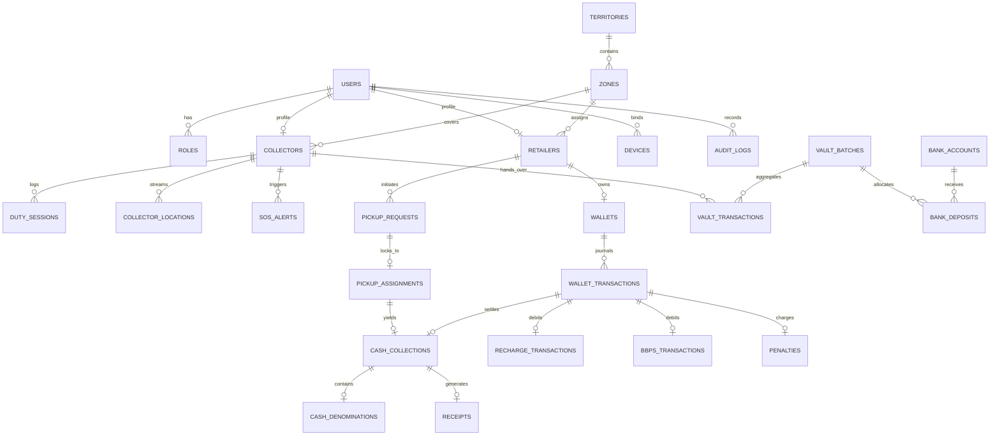

# Master System Architecture & Technical Specification
## Distributor Cash Collection & Retailer Operations Platform
**Document Reference:** CMS-ARCH-2026-V1  
**Project:** Cash Logistics & Retailer Operations Management Platform  
**Target Deployment:** Hostinger Cloud (PHP 8.2+, MySQL 8.0, Native LAMP, Zero Docker)  
**Roles:** Strictly 3 Roles (`ADMIN`, `COLLECTOR`, `RETAILER`) — Zero Distributor Entities.

---

### Table of Contents
1. [Final System Architecture](#1-final-system-architecture)
2. [Component Architecture](#2-component-architecture)
3. [Database ERD](#3-database-erd)
4. [Database Tables & Schemas](#4-database-tables--schemas)
5. [API Architecture & Standards](#5-api-architecture--standards)
6. [Role & Permission Matrix](#6-role--permission-matrix)
7. [Admin Panel Sitemap & Light-Theme Fintech UI](#7-admin-panel-sitemap--light-theme-fintech-ui)
8. [Collector App Sitemap (Flutter)](#8-collector-app-sitemap-flutter)
9. [Retailer App Sitemap (Flutter)](#9-retailer-app-sitemap-flutter)
10. [Pickup State Machine & First-to-Accept Lock](#10-pickup-state-machine--first-to-accept-lock)
11. [Geofence Architecture (Server-Side 100m Lock)](#11-geofence-architecture-server-side-100m-lock)
12. [Wallet & Double-Entry Ledger Architecture](#12-wallet--double-entry-ledger-architecture)
13. [Collector Float Architecture (₹1,00,000 Safety Cap)](#13-collector-float-architecture-100000-safety-cap)
14. [Vault Architecture (Evening Closing Desk)](#14-vault-architecture-evening-closing-desk)
15. [Bank & 360° Reconciliation Architecture](#15-bank--360-reconciliation-architecture)
16. [Notification Architecture & 24h Anti-Spam Cron](#16-notification-architecture--24h-anti-spam-cron)
17. [GPS Telemetry & Anti-Mock Architecture](#17-gps-telemetry--anti-mock-architecture)
18. [Cybersecurity Architecture (OWASP Hardening)](#18-cybersecurity-architecture-owasp-hardening)
19. [Hostinger Cloud Deployment Architecture](#19-hostinger-cloud-deployment-architecture)
20. [24-Phase Development Roadmap](#20-24-phase-development-roadmap)
21. [Analysis of Ambiguities & Risks in the Specification](#21-analysis-of-ambiguities--risks-in-the-specification)

---

### 1. Final System Architecture
The platform is organized into three primary client layers served by a unified, authoritative Laravel 11 backend running on Hostinger Cloud.
- **Admin Web Panel:** Embedded within the Laravel application using Blade, Tailwind CSS, and Alpine.js (with Livewire for reactive tables and real-time radar desks). Light, high-contrast, professional fintech UI.
- **Collector Mobile App:** High-performance Android Flutter app with Keystore device binding, GPS background telemetry (10s pings), 90s countdown siren receiver, 100m geofence unlocker, note denomination calculator, and Bluetooth ESC/POS thermal printing.
- **Retailer Mobile App:** Flutter Android app for merchants with 1-click cash pickup dispatch, live collector radar tracking, zero-OTP `[ACCEPT & CONFIRM]` wallet reload, daily 09:00 AM outstanding alerts, passbook ledger, and utility/recharge modules.
- **Real-Time Communication:** Hybrid dual-mode layer utilizing Laravel Reverb WebSockets where persistent connections are supported, paired with an intelligent 5-to-10 second AJAX polling fallback. The backend database is always authoritative for all financial and assignment states.

---

### 2. Component Architecture
```
[Laravel 11 Application]
 ├── Presentation Layer: Blade Views, Tailwind UI Components, Alpine.js Handlers, Livewire Components
 ├── API Layer: REST Endpoints (/api/v1/...), FormRequests, API Resources, Sanctum Tokens
 ├── Domain Service Layer:
 │    ├── PickupDispatchEngine (90s broadcast, race lock)
 │    ├── GeofenceVerificationService (ST_Distance_Sphere <= 100m, Anti-Mock GPS)
 │    ├── CashDenominationEngine (Currency note calculator & bundle tally)
 │    ├── DoubleEntryWalletLedgerService (Paise-level accounting, atomic locks)
 │    ├── CollectorFloatManager (Real-time bag tracking, hard limit lock at ₹1 Lakh)
 │    ├── VaultHandoverService (Evening note count verification, multi-bank split)
 │    ├── MasterReconciliationService (360-degree cash vs wallet vs bank reconciliation)
 │    └── NotificationService (FCM push, high-priority audio sirens, WhatsApp PDF)
 └── Infrastructure Layer:
      ├── MySQL 8.0 (InnoDB, Spatial Indexes, Row-level Locks)
      ├── Firebase Cloud Messaging API
      ├── Google Maps Directions & Distance Matrix API
      └── Recharge & BBPS Provider Interfaces (Mock & Live)
```

---

### 3. Database ERD


---

### 4. Database Tables & Schemas
- **Financial Units:** Stored in **integer paise** (`BIGINT UNSIGNED`, where ₹1.00 = 100 paise) to prevent floating-point inaccuracies.
- **Geographic Data:** Native MySQL 8.0 `POINT` with spatial index `SPATIAL INDEX(location_point)` and `ST_Distance_Sphere` functions.
- **Core Entities:** `users`, `roles`, `permissions`, `devices`, `collectors`, `retailers`, `territories`, `zones`, `duty_sessions`, `collector_locations`, `pickup_requests`, `pickup_assignments`, `cash_collections`, `cash_denominations`, `wallets`, `wallet_transactions`, `recharge_transactions`, `bbps_transactions`, `penalties`, `penalty_waivers`, `vaults`, `vault_batches`, `vault_transactions`, `bank_accounts`, `bank_deposits`, `notifications`, `broadcasts`, `receipts`, `sos_alerts`, `documents`, `audit_logs`, `settings`.

---

### 5. API Architecture & Standards
- Prefix: `/api/v1`
- Standard Response Envelope:
  ```json
  {
      "success": true,
      "message": "Status description",
      "data": {},
      "errors": []
  }
  ```
- Strict Idempotency: `X-Idempotency-Key: <UUID>` enforced on all financial transactions and state modifications.
- Rate Limiting: 60 requests/min for general endpoints; 5 requests/min for login and device binding.

---

### 6. Role & Permission Matrix
Strictly enforces separation of duties:
- `ADMIN`: Complete administrative control, manual reassignment, dispute resolution, multi-bank management, digital sign-off, penalty waiver, and system audit.
- `COLLECTOR`: Bound to single hardware device, restricted to assigned zone broadcasts, geofenced actions, note counting calculator, thermal receipt generation, and vault handover.
- `RETAILER`: Single active pickup constraint, live collector tracking, instant 1-tap `[ACCEPT & CONFIRM]` for balance credit, passbook review, and utility payments.

---

### 7. Admin Panel Sitemap & Light-Theme Fintech UI
Designed for high visibility and rapid action:
- **Palette:** Light slate `#F8FAFC`, pure white `#FFFFFF` surface cards, slate `#1E293B` text, emerald `#059669` financial indicators, amber `#D97706` in-transit alerts, rose `#E11D48` SOS and geofence indicators.
- **Key Modules:** 360° Live Ledger Desk, Visual Fleet Radar Map (10s pings, battery %, bag cash), Evening Vault Closing Station, Bank Deposit Split Engine, Bulk Excel Importer, Emergency Red Alert SOS Command Center.

---

### 8. Collector App Sitemap (Flutter)
- Device Binding Screen (Keystore hardware handshake)
- Geofenced Duty Punch-In/Out Desk (with bike odometer logging)
- Live Bag Float Meter (₹82,500 / ₹1,00,000 progress bar with safety cap auto-lock)
- 90s Countdown Siren Race Alert Screen
- In-App Google Maps Turn-by-Turn Navigation with 1-Tap Masked Direct Call
- 100m Geofenced Collection Desk (Smart Denomination Calculator for ₹500, ₹200, ₹100, ₹50, ₹20, ₹10)
- `[ADD WALLET & APPROVE]` Zero-OTP submission button
- Bluetooth Thermal Printer Integration (ESC/POS 58mm/80mm)
- Silent Panic Shield (3-tap power button SOS trigger)

---

### 9. Retailer App Sitemap (Flutter)
- Merchant Liquidity Dashboard with 1-Click Pickup Request Desk (Anti-Duplicate Locked)
- Live Collector Proximity Radar (Name, Mobile, Photo, Distance in meters, ETA)
- Zero-OTP Collection Acceptance Desk with prominent `[ACCEPT & CONFIRM]` button
- All-Operator Prepaid Mobile Recharge (Jio, Airtel, Vi, BSNL)
- BBPS Utilities Desk (Electricity, Water, Gas, DTH, FASTag)
- Real-Time Khata & Passbook Statement with instant WhatsApp PDF delivery status
- Daily 09:00 AM Outstanding Notice Card (Strict 24-hr anti-spam guard)
- Emergency Admin Flash Pop-up Announcement Modal

---

### 10. Pickup State Machine & First-to-Accept Lock
Transitions:
`PENDING` $\rightarrow$ `BROADCASTING` (90s countdown) $\rightarrow$ `ACCEPTED` (via atomic `lockForUpdate()`) $\rightarrow$ `EN_ROUTE` $\rightarrow$ `ARRIVED` $\rightarrow$ `GEOFENCE_UNLOCKED` ($\le 100\text{m}$) $\rightarrow$ `CASH_COUNTING` $\rightarrow$ `SUBMITTED` $\rightarrow$ `RETAILER_PENDING_CONFIRMATION` $\rightarrow$ `CONFIRMED` $\rightarrow$ `COMPLETED`.

**Single Winner Guarantee:**
The backend acquires a pessimistic row lock (`SELECT ... FOR UPDATE`) on the `pickup_requests` record during acceptance. The first collector to successfully lock the row transitions the state to `ACCEPTED` and binds a `pickup_assignments` record. All subsequent concurrent requests are rejected with a clean `HTTP 409 Conflict`.

---

### 11. Geofence Architecture (Server-Side 100m Lock)
- **Calculation:** Evaluated on the server via `ST_Distance_Sphere(POINT(col_lng, col_lat), POINT(ret_lng, ret_lat))`.
- **Threshold:** Cash collection submission is strictly prohibited if distance $> 100.00\text{ meters}$.
- **Anti-Spoofing:** Validates GPS timestamp freshness ($\le 30\text{s}$ old), accuracy ($\le 35\text{m}$), and flags Android mock provider flags.

---

### 12. Wallet & Double-Entry Ledger Architecture
- Implements strict double-entry ledger bookkeeping.
- Stored in minor units (integer paise).
- Materialized balances are never altered without an accompanying immutable `WalletTransaction` row with opening and closing balances.
- Retailer balances remain locked in escrow until the merchant taps `[ACCEPT & CONFIRM]`.

---

### 13. Collector Float Architecture (₹1,00,000 Safety Cap)
- Collector bag capacity is capped at ₹1,00,000 (10,000,000 paise).
- If current float + incoming job value exceeds the threshold, the collector is locked out from accepting new broadcasts.
- The lockout is cleared only upon verified cash deposit at the Central Vault Desk.

---

### 14. Vault Architecture (Evening Closing Desk)
- Central Vault Hub physical note verification against currency counting machines.
- Admin allocates collected cash across company bank accounts (e.g., ₹3,00,000 to HDFC Current Account + ₹1,85,000 to SBI Current Account).
- Digital sign-off by Admin executes an atomic reset of the collector's bag float to **₹0.00**, unlocking duty punch-out.

---

### 15. Bank & 360° Reconciliation Architecture
- **360° Khata Desk:** Audits the continuous equation:
  $$\text{Cash Requested} = \text{Cash Collected} + \text{Pending Collections} + \text{Cancelled Pickups}$$
  $$\text{Cash Collected} = \text{Cash In Transit (Bags)} + \text{Vault Cash} + \text{Bank Deposited Cash}$$
- **Discrepancy Engine:** Flagged in real-time on the Admin dashboard with linked transaction references and audit trail entries.
- **Bank UTR Tracker:** Reconciles uploaded bank statement CSVs against internal bank deposit allocations.

---

### 16. Notification Architecture & 24h Anti-Spam Cron
- **FCM Channels:** High-priority channel with custom `siren_alert.mp3` for the 90-second collector race.
- **Daily Outstanding Reminder:** Triggered at 09:00 AM IST daily via Laravel scheduler. Enforces a strict 24-hour anti-spam check on `retailers.last_outstanding_alert_at`.
- **WhatsApp PDF Delivery:** Asynchronous queued job delivering digital tax invoice and collection slips.

---

### 17. GPS Telemetry & Anti-Mock Architecture
- 10-second telemetry pings streamed while collector is on duty.
- Server validates velocity vectors to detect impossible jumps (teleportation $> 130\text{ km/h}$).
- Android mock location detection rejects mock provider coordinates.

---

### 18. Cybersecurity Architecture (OWASP Hardening)
- Laravel Sanctum authentication with hardware device fingerprinting.
- Strict authorization policies preventing Insecure Direct Object References (IDOR).
- Private document storage for KYC/GST with signed, expiring download URLs.
- Idempotency key validation caching write requests for 120 seconds to prevent double taps and replay attacks.

---

### 19. Hostinger Cloud Deployment Architecture
- Deployable on standard Hostinger Cloud / Linux cPanel / hPanel environment.
- Document root maps strictly to `public/` directory; application source and `.env` are shielded above web root.
- Scheduled tasks run via standard cPanel cron: `* * * * * php /home/uXXXXX/guruji-backend/artisan schedule:run >> /dev/null 2>&1`.
- Queue worker managed via cron watchdog runner. Zero Docker, zero Node backend required.

---

### 20. 24-Phase Development Roadmap
Phased implementation plan covering Project Scaffolding, Database Migrations, RBAC, Admin Blade Panel, Mobile Flutter Apps, 90s Race Locking, 100m Geofencing, Note Calculator, Wallet Ledger, Float Management, Vault Handover, 360° Reconciliation, Notifications, Thermal Printing, Utility/BBPS Abstraction, Reports, and Security Hardening.

---

### 21. Analysis of Ambiguities & Risks in the Specification
- **Distributor Terminology in PDF:** Absorbed completely into `ADMIN` role.
- **PostGIS vs MySQL 8.0:** Fully unified on MySQL 8.0 native spatial GIS functions (`ST_Distance_Sphere`).
- **Basement Zero-Network Handshake:** Cryptographically signed local queue with deferred server validation upon network recovery.
- **Thermal Printer ESC/POS:** Standardized byte generator supporting both 58mm (32 chars) and 80mm (48 chars) formats.
